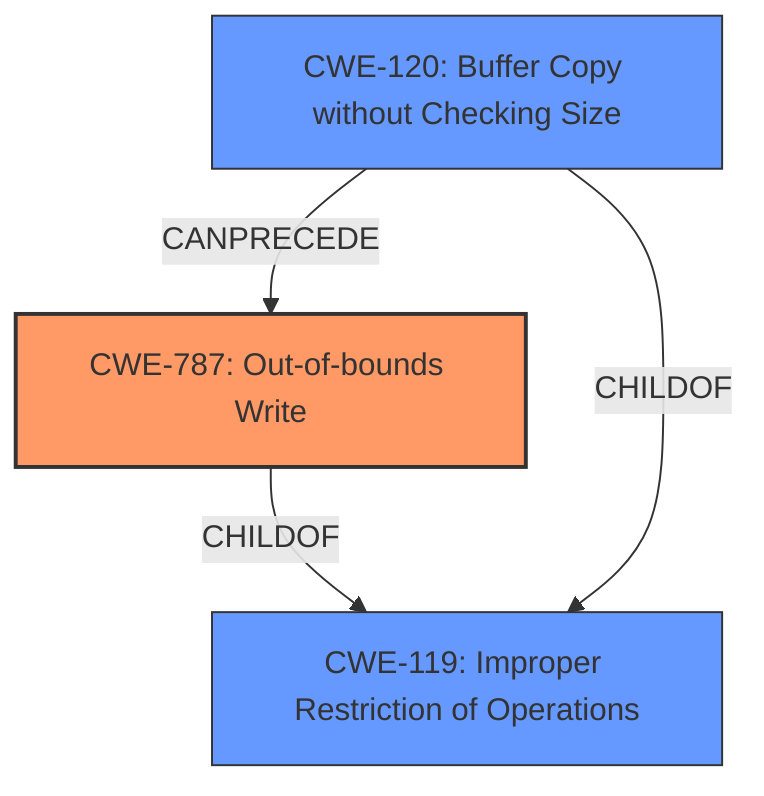

# Analysis Report for CVE-2022-3972

# Vulnerability Analysis Report: CVE-2022-3972

## Description


## Analysis (with Relationship Data)

# Summary
| CWE ID | CWE Name | Confidence | CWE Abstraction Level | CWE Vulnerability Mapping Label | CWE-Vulnerability Mapping Notes |
|---|---|---|---|---|---|
| CWE-89 | Improper Neutralization of Special Elements used in an SQL Command ('SQL Injection') | 1.0 | Base | Allowed | Primary CWE |

## Evidence and Confidence

*   **Confidence Score:** 1.0
*   **Evidence Strength:** HIGH

## Relationship Analysis
The primary relationship that influenced the decision was the ChildOf relationship between CWE-89 and CWE-74, where CWE-89 is a more specific case of CWE-74. However, due to the strong evidence for SQL Injection, the more specific CWE-89 was chosen. The graph does not include the selected CWE.



## Vulnerability Chain
The vulnerability chain starts with **insufficient input sanitization** which leads to SQL injection.
  - **Root Cause:** Insufficient Input Sanitization
  - **Weakness:** CWE-89: Improper Neutralization of Special Elements used in an SQL Command ('SQL Injection')
  - **Impact:** Data exfiltration, Data modification, Privilege escalation, Full database compromise, Possible Remote code execution

## Summary of Analysis
The analysis is based on the provided evidence from the vulnerability description and CVE reference links. The key phrase "manipulation of uname/pass leads to sql injection" and the statement "Improper sanitization of user-supplied input. The application directly uses the `uname` and `pass` parameters from POST requests in SQL queries without any form of sanitization" clearly indicate an SQL injection vulnerability.

The Retriever Results also support this, with CWE-89 being the top-ranked CWE.

The selection of CWE-89 is at the optimal level of specificity because the evidence explicitly states that user-supplied input is directly used in SQL queries without sanitization, which is the defining characteristic of SQL injection.

Relevant CWE Information:

# Enhanced Context (25 CWEs)

## CWE-89: Improper Neutralization of Special Elements used in an SQL Command ('SQL Injection')
**Abstraction:** Base
**Status:** Stable

### Description
The product constructs all or part of an SQL command using externally-influenced input from an upstream component, but it does not neutralize or incorrectly neutralizes special elements that could modify the intended SQL command when it is sent to a downstream component. Without sufficient removal or quoting of SQL syntax in user-controllable inputs, the generated SQL query can cause those inputs to be interpreted as SQL instead of ordinary user data.

### Extended Description
Not provided

### Alternative Terms
SQL injection: a common attack-oriented phrase
SQLi: a common abbreviation for "SQL injection"

### Relationships
ChildOf -> CWE-943
ChildOf -> CWE-74

### Mapping Guidance
**Usage:** Allowed
**Rationale:** This CWE entry is at the Base level of abstraction, which is a preferred level of abstraction for mapping to the root causes of vulnerabilities.
**Comments:** Carefully read both the name and description to ensure that this mapping is an appropriate fit. Do not try to 'force' a mapping to a lower-level Base/Variant simply to comply with this preferred level of abstraction.
**Reasons:**
- Acceptable-Use

### Additional Notes
**[Relationship]** SQL injection can be resultant from special character mismanagement, MAID, or denylist/allowlist problems. It can be primary to authentication errors.

### Observed Examples
- **CVE-2023-32530:** SQL injection in security product dashboard using crafted certificate fields
- **CVE-2021-42258:** SQL injection in time and billing software, as exploited in the wild per CISA KEV.
- **CVE-2021-27101:** SQL injection in file-transfer system via a crafted Host header, as exploited in the wild per CISA KEV.

### Other CWEs Considered and Rejected:

*   **CWE-79: Improper Neutralization of Input During Web Page Generation ('Cross-site Scripting')**: While **insufficient input sanitization** is a common factor in many vulnerabilities, the description specifically mentions SQL injection, making CWE-89 a more accurate and specific classification.

*   **CWE-78: Improper Neutralization of Special Elements used in an OS Command ('OS Command Injection')**: This was not selected because the vulnerability involves SQL commands, not OS commands.

*   **CWE-1336: Improper Neutralization of Special Elements Used in a Template Engine**: This was not selected because the vulnerability does not involve the use of a template engine. The problem is with the SQL query itself.

*   **CWE-94: Improper Control of Generation of Code ('Code Injection')**: This is a more general case of code injection. Since the vulnerability is specifically SQL injection, CWE-89 is more appropriate.

*   **CWE-99: Improper Control of Resource Identifiers ('Resource Injection')**: This is a broader category and SQL injection is a more specific type of **resource injection**.

*   **CWE-74: Improper Neutralization of Special Elements in Output Used by a Downstream Component ('Injection')**: CWE-74 is a class-level CWE. CWE-89 is a child of CWE-74 and more specific.

Therefore, CWE-89 is the most accurate and specific CWE for this vulnerability.


## CWE Relationship Analysis

Current CWEs represent these abstraction levels: .


### Vulnerability Chain Analysis

**Chain starting from CWE-89:**
- 89 (Improper Neutralization of Special Elements used in an SQL Command ('SQL Injection')) - ROOT


**Chain starting from CWE-99:**
- 99 (Improper Control of Resource Identifiers ('Resource Injection')) - ROOT


### CWE Relationship Diagram

```mermaid
graph TD
    classDef primary fill:#f96,stroke:#333,stroke-width:2px
    classDef secondary fill:#69f,stroke:#333
    classDef tertiary fill:#9e9,stroke:#333
```


*Report generated on 2025-03-30 22:55:21*
