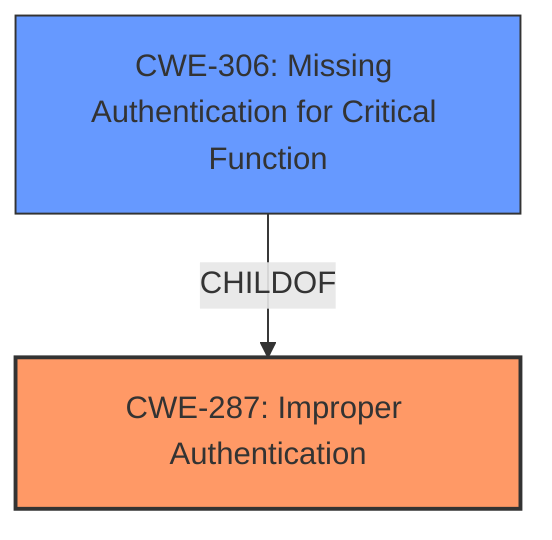

# Raw Analyzer Response for CVE-2022-39801

# Summary
| CWE ID | CWE Name | Confidence | CWE Abstraction Level | CWE Vulnerability Mapping Label | CWE-Vulnerability Mapping Notes |
|---|---|---|---|---|---|
| CWE-287 | Improper Authentication | 0.8 | Class | Primary | Discouraged |
| CWE-306 | Missing Authentication for Critical Function | 0.7 | Base | Secondary | Allowed |

## Evidence and Confidence

*   **Confidence Score:** 0.8
*   **Evidence Strength:** MEDIUM

## Relationship Analysis
The primary CWE considered is CWE-287, "Improper Authentication," a Class-level CWE. A more specific Base-level CWE to consider is CWE-306, "Missing Authentication for Critical Function," which is a child of CWE-287. Since the vulnerability description states that an attacker can access a Firefighter session even after it is closed, this implies that the authentication mechanism is either bypassed or insufficient, suggesting a problem with authentication.

## Vulnerability Chain
The chain of events is as follows:
1.  **Root Cause:** **Improper Authentication** (CWE-287): The application **allows an authenticated attacker to access a Firefighter session even after it is closed in Firefighter Logon Pad**.
2.  **Impact:** Gain access to admin session and completely compromise the application.

## Summary of Analysis
The initial analysis identified CWE-287 as a potential candidate due to the mention of accessing a session when it should be closed. However, CWE-287 is a Class-level CWE and the guidance recommends considering more specific children. CWE-306, "Missing Authentication for Critical Function," is a child of CWE-287 and a Base-level CWE.

The **Vulnerability Description** states: "**SAP GRC Access control Emergency Access Management allows an authenticated attacker to access a Firefighter session even after it is closed in Firefighter Logon Pad**".
This description suggests that once a Firefighter session is closed, it should require authentication to re-access. The vulnerability allows an authenticated attacker to bypass this. This points towards a problem with authentication, making CWE-287 a reasonable, although not perfect, fit. However, the fact that the session can be accessed even after it is closed strongly suggests that a critical function (re-accessing the session) is missing authentication, making CWE-306 also applicable. The fact that the description states an *authenticated* user can bypass the closed session points to something other than a total lack of authentication (CWE-306).

CWE-287 and CWE-306 were chosen because the vulnerability description explicitly mentions an authenticated attacker gaining unauthorized access, indicating an authentication flaw. CWE-287 is the primary because the attacker is authenticated at some point. However, the attacker is bypassing the authentication required to re-access a *closed* session. Thus, CWE-306 is also applicable.

Based on the evidence, relationship analysis, and mapping guidance, CWE-287 is selected as the primary CWE with a confidence of 0.8. CWE-306 is included as a secondary CWE with a confidence of 0.7.

Relevant CWE Information:

# Enhanced Context (25 CWEs)

## CWE-538: Insertion of Sensitive Information into Externally-Accessible File or Directory
**Abstraction Level**: Base
**Similarity Score**: 0.79
**Source**: dense

**Description**:
The product places sensitive information into files or directories that are accessible to actors who are allowed to have access to the files, but not to the sensitive information.

**Mapping Guidance**:
- Usage: Allowed
- Rationale: This CWE entry is at the Base level of abstraction, which is a preferred level of abstraction for mapping to the root causes of vulnerabilities.

This CWE is not selected because the vulnerability does not involve sensitive information being placed in accessible files or directories.

## CWE-497: Exposure of Sensitive System Information to an Unauthorized Control Sphere
**Abstraction Level**: Base
**Similarity Score**: 0.78
**Source**: dense

**Description**:
The product does not properly prevent sensitive system-level information from being accessed by unauthorized actors who do not have the same level of access to the underlying system as the product does.

**Mapping Guidance**:
- Usage: Allowed
- Rationale: This CWE entry is at the Base level of abstraction, which is a preferred level of abstraction for mapping to the root causes of vulnerabilities.

This CWE is not selected because it does not directly relate to the authentication bypass in the vulnerability description. The issue is not primarily about the exposure of system-level information, but about the ability to access a closed session without proper authentication.

## CWE-807: Reliance on Untrusted Inputs in a Security Decision
**Abstraction Level**: Base
**Similarity Score**: 0.78
**Source**: dense

**Description**:
The product uses a protection mechanism that relies on the existence or values of an input, but the input can be modified by an untrusted actor in a way that bypasses the protection mechanism.

**Mapping Guidance**:
- Usage: Allowed
- Rationale: This CWE entry is at the Base level of abstraction, which is a preferred level of abstraction for mapping to the root causes of vulnerabilities.

This CWE is not selected because the vulnerability does not explicitly state that the protection mechanism relies on untrusted inputs that can be modified by the attacker. The core issue is the ability to access a closed session without proper authentication, not necessarily the manipulation of inputs.

## CWE-226: Sensitive Information in Resource Not Removed Before Reuse
**Abstraction Level**: Base
**Similarity Score**: 0.78
**Source**: dense

**Description**:
The product releases a resource such as memory or a file so that it can be made available for reuse, but it does not clear or "zeroize" the information contained in the resource before the product performs a critical state transition or makes the resource available for reuse by other entities.

**Mapping Guidance**:
- Usage: Allowed
- Rationale: This CWE entry is at the Base level of abstraction, which is a preferred level of abstraction for mapping to the root causes of vulnerabilities.

This CWE is not selected because the vulnerability does not involve the reuse of resources containing sensitive information.

## CWE-668: Exposure of Resource to Wrong Sphere
**Abstraction Level**: Class
**Similarity Score**: 0.77
**Source**: dense

**Description**:
The product exposes a resource to the wrong control sphere, providing unintended actors with inappropriate access to the resource.

**Mapping Guidance**:
- Usage: Discouraged
- Rationale: CWE-668 is high-level and is often misused as a catch-all when lower-level CWE IDs might be applicable. It is sometimes used for low-information vulnerability reports [REF-1287]. It is a level-1 Class (i.e., a child of a Pillar). It is not useful for trend analysis.

This CWE is not selected because it is a high-level Class and there are more specific CWEs available. While the vulnerability results in unauthorized access to a resource, the root cause is related to authentication, not general resource exposure.

## CWE-212: Improper Removal of Sensitive Information Before Storage or Transfer
**Abstraction Level**: Base
**Similarity Score**: 0.77
**Source**: dense

**Description**:
The product stores, transfers, or shares a resource that contains sensitive information, but it does not properly remove that information before the product makes the resource available to unauthorized actors.

**Mapping Guidance**:
- Usage: Allowed
- Rationale: This CWE entry is at the Base level of abstraction, which is a preferred level of abstraction for mapping to the root causes of vulnerabilities.

This CWE is not selected because the vulnerability does not involve the storage or transfer of sensitive information.

## CWE-213: Exposure of Sensitive Information Due to Incompatible Policies
**Abstraction Level**: Base
**Similarity Score**: 0.76
**Source**: dense

**Description**:
The product's intended functionality exposes information to certain actors in accordance with the developer's security policy, but this information is regarded as sensitive according to the intended security policies of other stakeholders such as the product's administrator, users, or others whose information is being processed.

**Mapping Guidance**:
- Usage: Allowed
- Rationale: This CWE entry is at the Base level of abstraction, which is a preferred level of abstraction for mapping to the root causes of vulnerabilities.

This CWE is not selected because it does not relate to incompatible policies.

## CWE-552: Files or Directories Accessible to External Parties
**Abstraction Level**: Base
**Similarity Score**: 0.76
**Source**: dense

**Description**:
The product makes files or directories accessible to unauthorized actors, even though they should not be.

**Mapping Guidance**:
- Usage: Allowed
- Rationale: This CWE entry is at the Base level of abstraction, which is a preferred level of abstraction for mapping to the root causes of vulnerabilities