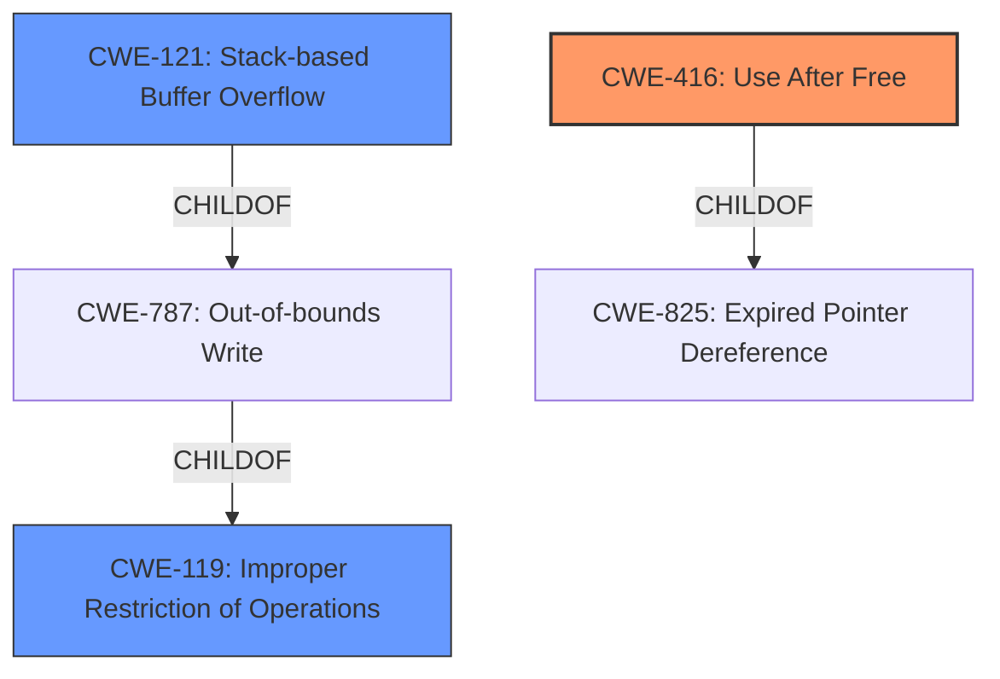

# Enhanced Analysis for CVE-2022-39804

# Summary
| CWE ID  | CWE Name                                                                                | Confidence | CWE Abstraction Level | CWE Vulnerability Mapping Label | CWE-Vulnerability Mapping Notes |
| :-------- | :--------------------------------------------------------------------------------------- | :---------- | :----------------------- | :------------------------------ | :------------------------------ |
| CWE-416 | Use After Free                                                                         | 0.85       | Variant                 | Primary                         | Allowed                         |
| CWE-121 | Stack-based Buffer Overflow                                                              | 0.75       | Variant                 | Secondary                         | Allowed                         |
| CWE-119 | Improper Restriction of Operations within the Bounds of a Memory Buffer                | 0.60       | Class                   | Secondary                         | Discouraged                     |

## Evidence and Confidence

*   **Confidence Score:** 0.80
*   **Evidence Strength:** MEDIUM

## Relationship Analysis
The primary weakness identified is a **use-after-free** condition (CWE-416), which can arise from **lack of proper memory management**, and leads to a potential **stack-based overflow**. CWE-416 is a variant of CWE-825 (Expired Pointer Dereference). A stack-based buffer overflow (CWE-121) is a specific type of out-of-bounds write (CWE-787), and both are children of CWE-119. The vulnerability description indicates a potential for both a **use-after-free** and a **stack-based overflow**, suggesting that either could be triggered depending on the specific attack vector.



## Vulnerability Chain
The vulnerability chain starts with **lack of proper memory management**, which leads to either a **use-after-free** (CWE-416) or a **stack-based overflow** (CWE-121). The **use-after-free** can occur when a dangling pointer is re-used. The **stack-based overflow** occurs when data is written beyond the bounds of a stack-allocated buffer. Both of these can lead to remote code execution.

## Summary of Analysis
Initially, the primary CWE match was identified as CWE-119. However, after analyzing the vulnerability description and considering the retriever results, a more specific identification was needed. The vulnerability description mentions "**lack of proper memory management**" leading to "**stack-based overflow or a re-use of dangling pointer**". The presence of both the possibility of a **stack-based overflow** and a **use-after-free** condition suggests two potential attack vectors originating from the same root cause.

The retriever results list CWE-416 (Use After Free) and CWE-121 (Stack-based Buffer Overflow) as high-ranking candidates. Given the vulnerability description explicitly mentions "re-use of dangling pointer", CWE-416 is a strong candidate. Also given the description explicitly mentions a "stack-based overflow", then CWE-121 is also a strong candidate.

CWE-416 (Use After Free) describes the condition where memory is re-used after it has been freed, which aligns with the "re-use of dangling pointer" aspect of the vulnerability description. CWE-121 (Stack-based Buffer Overflow) describes a condition where a buffer allocated on the stack is overwritten, aligning with the "stack-based overflow" aspect. CWE-119 is a more general class, and the description recommends using more specific child CWEs when possible.

Therefore, the primary CWE is CWE-416 because the **use-after-free** is explicitly called out in the description as being caused by a **lack of proper memory management**, and a secondary CWE of CWE-121 because the **stack-based overflow** is also explicitly called out.

Relevant CWE Information:

# Enhanced Context (25 CWEs)

## CWE-416: Use After Free
**Abstraction:** Variant
**Status:** Stable

### Description
The product reuses or references memory after it has been freed. At some point afterward, the memory may be allocated again and saved in another pointer, while the original pointer references a location somewhere within the new allocation. Any operations using the original pointer are no longer valid because the memory "belongs" to the code that operates on the new pointer.

### Observed Examples
- **CVE-2022-20141:** Chain: an operating system kernel has insufficent resource locking (CWE-413) leading to a use after free (CWE-416).
- **CVE-2022-2621:** Chain: two threads in a web browser use the same resource (CWE-366), but one of those threads can destroy the resource before the other has completed (CWE-416).
- **CVE-2021-0920:** Chain: mobile platform race condition (CWE-362) leading to use-after-free (CWE-416), as exploited in the wild per CISA KEV.

## CWE-121: Stack-based Buffer Overflow
**Abstraction:** Variant
**Status:** Draft

### Description
A stack-based buffer overflow condition is a condition where the buffer being overwritten is allocated on the stack (i.e., is a local variable or, rarely, a parameter to a function).

### Observed Examples
- **CVE-2021-35395:** Stack-based buffer overflows in SFK for wifi chipset used for IoT/embedded devices, as exploited in the wild per CISA KEV.

## CWE-119: Improper Restriction of Operations within the Bounds of a Memory Buffer
**Abstraction:** Class
**Status:** Stable

### Description
The product performs operations on a memory buffer, but it reads from or writes to a memory location outside the buffer's intended boundary. This may result in read or write operations on unexpected memory locations that could be linked to other variables, data structures, or internal program data.

### Observed Examples
- **CVE-2021-22991:** Incorrect URI normalization in application traffic product leads to buffer overflow, as exploited in the wild per CISA KEV.
- **CVE-2020-29557:** Buffer overflow in Wi-Fi router web interface, as exploited in the wild per CISA KEV.
- **CVE-2009-2550:** Classic stack-based buffer overflow in media player using a long entry in a playlist


## CWE Relationship Analysis

Current CWEs represent these abstraction levels: .


### Vulnerability Chain Analysis

**Chain starting from CWE-413:**
- 413 (Improper Resource Locking) - ROOT


**Chain starting from CWE-825:**
- 825 (Expired Pointer Dereference) - ROOT


### CWE Relationship Diagram

```mermaid
graph TD
    classDef primary fill:#f96,stroke:#333,stroke-width:2px
    classDef secondary fill:#69f,stroke:#333
    classDef tertiary fill:#9e9,stroke:#333
```