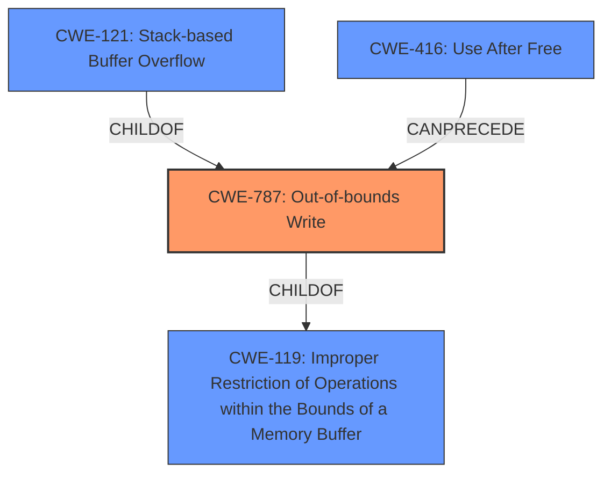

# Raw Analyzer Response for CVE-2022-39805

# Summary
| CWE ID | CWE Name | Confidence | CWE Abstraction Level | CWE Vulnerability Mapping Label | CWE-Vulnerability Mapping Notes |
|---|---|---|---|---|---|
| CWE-787 | Out-of-bounds Write | 0.9 | Base | Primary | Allowed |
| CWE-416 | Use After Free | 0.8 | Variant | Secondary | Allowed |
| CWE-121 | Stack-based Buffer Overflow | 0.7 | Variant | Secondary | Allowed |

## Evidence and Confidence

*   **Confidence Score:** 0.85
*   **Evidence Strength:** MEDIUM

## Relationship Analysis
The primary weakness is identified as CWE-787 **Out-of-bounds Write**, which can occur due to a stack-based buffer overflow (CWE-121) or a use-after-free condition (CWE-416).
CWE-787 is a base CWE, and has parent CWE of CWE-119. CWE-121 and CWE-416 are variants that can lead to CWE-787.

## Vulnerability Chain
The vulnerability chain starts with a **lack of proper memory management**, leading to either a **stack-based overflow** (CWE-121) or a **re-use of a dangling pointer** (CWE-416), which ultimately results in an **out-of-bounds write** (CWE-787) and potential Remote Code Execution.

## Summary of Analysis
The initial analysis focused on identifying the most accurate CWE for the vulnerability description, which clearly points to a memory corruption issue. The description mentions a **stack-based overflow** or a **re-use of a dangling pointer**, both of which can lead to an **out-of-bounds write**.

The vulnerability description states: "Due to **lack of proper memory management**, when a victim opens a manipulated Computer Graphics Metafile (.cgm, CgmTranslator.exe) file received from untrusted sources in SAP 3D Visual Enterprise Author - version 9, it is possible that a Remote Code Execution can be triggered when payload forces a **stack-based overflow or a re-use of dangling pointer** which refers to overwritten space in memory."

The retriever results and similar CVE descriptions suggested CWE-119 **Improper Restriction of Operations within the Bounds of a Memory Buffer**. However, CWE-119 is a Class-level CWE and is discouraged when more specific CWEs are available. The description specifically mentions a **stack-based overflow** and **re-use of dangling pointer**, which aligns well with CWE-121 and CWE-416, respectively. The ultimate outcome is an out-of-bounds write, making CWE-787 the most accurate primary CWE.

CWE-121 **Stack-based Buffer Overflow** is a variant of CWE-787 and represents the case where the buffer overflow occurs on the stack. CWE-416 **Use After Free** represents the case where a dangling pointer is reused, also leading to an out-of-bounds write.

Therefore, the final assessment identifies CWE-787 as the primary CWE, with CWE-121 and CWE-416 as contributing factors that specify how the out-of-bounds write occurs.

Relevant CWE Information:

# Enhanced Context (25 CWEs)

## CWE-131: Incorrect Calculation of Buffer Size
**Abstraction Level**: Base
**Similarity Score**: 0.77
**Source**: dense

**Description**:
The product does not correctly calculate the size to be used when allocating a buffer, which could lead to a buffer overflow.
*Not Selected*: While a buffer overflow is possible, the root cause in the description is not related to buffer size calculation, but rather the use of dangling pointers or stack overflow.

## CWE-805: Buffer Access with Incorrect Length Value
**Abstraction Level**: Base
**Similarity Score**: 0.77
**Source**: dense

**Description**:
The product uses a sequential operation to read or write a buffer, but it uses an incorrect length value that causes it to access memory that is outside of the bounds of the buffer.
*Not Selected*: The root cause is not related to incorrect length values in buffer access operations, but rather the use of dangling pointers or stack overflow.

## CWE-125: Out-of-bounds Read
**Abstraction Level**: Base
**Similarity Score**: 0.77
**Source**: dense

**Description**:
The product reads data past the end, or before the beginning, of the intended buffer.
*Not Selected*: The vulnerability description focuses on write operations (**stack-based overflow**) and reuse of dangling pointers, not out-of-bounds reads.

## CWE-191: Integer Underflow (Wrap or Wraparound)
**Abstraction Level**: Base
**Similarity Score**: 0.77
**Source**: dense

**Description**:
The product subtracts one value from another, such that the result is less than the minimum allowable integer value, which produces a value that is not equal to the correct result.
*Not Selected*: Integer underflow is not mentioned or implied in the vulnerability description.

## CWE-126: Buffer Over-read
**Abstraction Level**: Variant
**Similarity Score**: 0.77
**Source**: dense

**Description**:
The product reads from a buffer using buffer access mechanisms such as indexes or pointers that reference memory locations after the targeted buffer.
*Not Selected*: The vulnerability description focuses on write operations (**stack-based overflow**) and reuse of dangling pointers, not out-of-bounds reads.

## CWE-124: Buffer Underwrite ('Buffer Underflow')
**Abstraction Level**: Base
**Similarity Score**: 0.76
**Source**: dense

**Description**:
The product writes to a buffer using an index or pointer that references a memory location prior to the beginning of the buffer.
*Not Selected*: The description describes a stack overflow or reuse of a dangling pointer, not necessarily an underwrite.

## CWE-127: Buffer Under-read
**Abstraction Level**: Variant
**Similarity Score**: 0.76
**Source**: dense

**Description**:
The product reads from a buffer using buffer access mechanisms such as indexes or pointers that reference memory locations prior to the targeted buffer.
*Not Selected*: The vulnerability description focuses on write operations (**stack-based overflow**) and reuse of dangling pointers, not out-of-bounds reads.

## CWE-1289: Improper Validation of Unsafe Equivalence in Input
**Abstraction Level**: Base
**Similarity Score**: 0.76
**Source**: dense

**Description**:
The product receives an input value that is used as a resource identifier or other type of reference, but it does not validate or incorrectly validates that the input is equivalent to a potentially-unsafe value.
*Not Selected*: This CWE is not relevant to the described vulnerability, which involves memory corruption due to dangling pointers or stack overflows, not input validation issues related to resource identifiers.

## CWE-681: Incorrect Conversion between Numeric Types
**Abstraction Level**: Base
**Similarity Score**: 0.76
**Source**: dense

**Description**:
When converting from one data type to another, such as long to integer, data can be omitted or translated in a way that produces unexpected values. If the resulting values are used in a sensitive context, then dangerous behaviors may occur.
*Not Selected*: Incorrect conversion between numeric types is not mentioned or implied in the vulnerability description.

## CWE-197: Numeric Truncation Error
**Abstraction Level**: Base
**Similarity Score**: 0.76
**Source**: dense

**Description**:
Truncation errors occur when a primitive is cast to a primitive of a smaller size and data is lost in the conversion.
*Not Selected*: Numeric truncation errors are not mentioned or implied in the vulnerability description.

## CWE-190: Integer Overflow or Wraparound
**Abstraction Level**: Base
**Similarity Score**: 7580.61
**Source**: sparse

**Description**:
The product performs a calculation that can
         produce an integer overflow or wraparound when the logic
         assumes that the resulting value will always be larger than
         the original value. This occurs when an integer value is
         incremented to a value that is too large to store in the
         associated representation. When