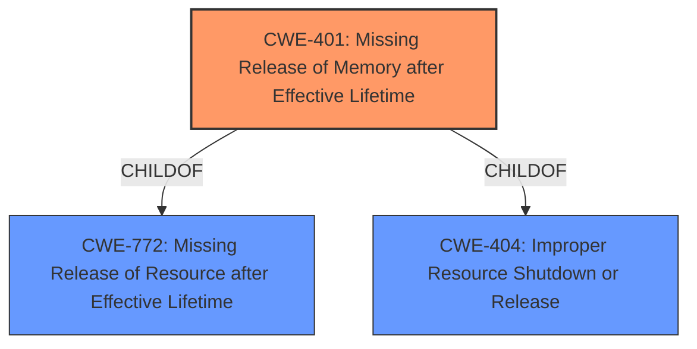

# Analysis Report for CVE-2022-39807

# Vulnerability Analysis Report: CVE-2022-39807

## Description


## Analysis (with Relationship Data)

# Summary

| CWE ID | CWE Name | Confidence | CWE Abstraction Level | CWE Vulnerability Mapping Label | CWE-Vulnerability Mapping Notes |
|---|---|---|---|---|---|
| CWE-401 | Missing Release of Memory after Effective Lifetime | 0.75 | Variant | Allowed | Primary CWE |

## Evidence and Confidence

*   **Confidence Score:** 0.75
*   **Evidence Strength:** MEDIUM

## Relationship Analysis
The primary relationship that influenced the decision was the ChildOf relationship between CWE-401 and CWE-404 (Improper Resource Shutdown or Release) and CWE-772 (Missing Release of Resource after Effective Lifetime). While the description is not detailed, it is specific enough to map to the variant CWE-401 rather than its parents.



## Vulnerability Chain
The chain starts with the **lack of proper memory management**, leading to a missing release of memory, which results in the application crashing. The chain is: **Lack of proper memory management** -> CWE-401 -> Crash.

## Summary of Analysis
The initial analysis focused on identifying the root cause of the vulnerability, which is the **lack of proper memory management**. The vulnerability description indicates that when a manipulated SolidWorks Drawing file is opened, the application crashes due to this **lack of proper memory management**. The phrase "**lack of proper memory management**" in the "Vulnerability Description Key Phrases" helps to narrow down the possible CWEs.

The Retriever Results list several potential CWEs, including CWE-119 (Improper Restriction of Operations within the Bounds of a Memory Buffer), CWE-121 (Stack-based Buffer Overflow), and CWE-20 (Improper Input Validation). However, none of these directly address the **lack of proper memory management**.

CWE-401 (Missing Release of Memory after Effective Lifetime) is a better fit because it describes a scenario where the product does not sufficiently track and release allocated memory after it has been used, which aligns with the **lack of proper memory management** described in the vulnerability. While there is not explicit mention of allocated memory not being freed, it is implied, and it is a reasonable conclusion given the **lack of proper memory management** root cause.

The decision to select CWE-401 is based on the evidence from the vulnerability description, specifically the phrase "**lack of proper memory management**". The hierarchical relationships and mapping guidance support this decision, as CWE-401 is a Variant-level CWE and has a direct relationship with memory management issues.

The abstraction level of CWE-401 (Variant) is optimal because it provides a specific classification of the memory management issue, rather than a more general category like CWE-404 (Improper Resource Shutdown or Release).

Relevant CWE Information:

## CWE-226: Sensitive Information in Resource Not Removed Before Reuse
**Abstraction Level**: Base
**Similarity Score**: 0.78
**Source**: dense

**Description**:
The product releases a resource such as memory or a file so that it can be made available for reuse, but it does not clear or "zeroize" the information contained in the resource before the product performs a critical state transition or makes the resource available for reuse by other entities.

**Mapping Guidance**:
- Usage: Allowed
- Rationale: This CWE entry is at the Base level of abstraction, which is a preferred level of abstraction for mapping to the root causes of vulnerabilities.

*Not Used:* This CWE is not applicable because the vulnerability does not involve sensitive information being left in memory.

## CWE-404: Improper Resource Shutdown or Release
**Abstraction Level**: Class
**Similarity Score**: 0.77
**Source**: dense

**Description**:
The product does not release or incorrectly releases a resource before it is made available for re-use.

**Mapping Guidance**:
- Usage: Allowed-with-Review
- Rationale: This CWE entry is a Class and might have Base-level children that would be more appropriate

*Not Used:* This is a class level CWE and is too general. CWE-401 is more specific.

## CWE-789: Memory Allocation with Excessive Size Value
**Abstraction Level**: Variant
**Similarity Score**: 0.77
**Source**: dense

**Description**:
The product allocates memory based on an untrusted, large size value, but it does not ensure that the size is within expected limits, allowing arbitrary amounts of memory to be allocated.

**Mapping Guidance**:
- Usage: Allowed
- Rationale: This CWE entry is at the Variant level of abstraction, which is a preferred level of abstraction for mapping to the root causes of vulnerabilities.

*Not Used:* This CWE is not applicable because the vulnerability is related to a **lack of proper memory management** rather than excessive memory allocation.

## CWE-131: Incorrect Calculation of Buffer Size
**Abstraction Level**: Base
**Similarity Score**: 0.76
**Source**: dense

**Description**:
The product does not correctly calculate the size to be used when allocating a buffer, which could lead to a buffer overflow.

**Mapping Guidance**:
- Usage: Allowed
- Rationale: This CWE entry is at the Base level of abstraction, which is a preferred level of abstraction for mapping to the root causes of vulnerabilities.

*Not Used:* This CWE is not applicable because the vulnerability is related to a **lack of proper memory management** rather than incorrect calculation of buffer size.

## CWE-1325: Improperly Controlled Sequential Memory Allocation
**Abstraction Level**: Base
**Similarity Score**: 0.76
**Source**: dense

**Description**:
The product manages a group of objects or resources and performs a separate memory allocation for each object, but it does not properly limit the total amount of memory that is consumed by all of the combined objects.

**Mapping Guidance**:
- Usage: Allowed
- Rationale: This CWE entry is at the Base level of abstraction, which is a preferred level of abstraction for mapping to the root causes of vulnerabilities.

*Not Used:* This CWE is not applicable because the vulnerability is related to a **lack of proper memory management** rather than improperly controlled sequential memory allocation.

## CWE-667: Improper Locking
**Abstraction Level**: Class
**Similarity Score**: 0.75
**Source**: dense

**Description**:
The product does not properly acquire or release a lock on a resource, leading to unexpected resource state changes and behaviors.

**Mapping Guidance**:
- Usage: Allowed-with-Review
- Rationale: This CWE entry is a Class and might have Base-level children that would be more appropriate

*Not Used:* This CWE is not applicable because the vulnerability is related to a **lack of proper memory management** rather than improper locking.

## CWE-665: Improper Initialization
**Abstraction Level**: Class
**Similarity Score**: 0.75
**Source**: dense

**Description**:
The product does not initialize or incorrectly initializes a resource, which might leave the resource in an unexpected state when it is accessed or used.

**Mapping Guidance**:
- Usage: Discouraged
- Rationale: This CWE entry is a level-1 Class (i.e., a child of a Pillar). It might have lower-level children that would be more appropriate

*Not Used:* This CWE is not applicable because the vulnerability is related to a **lack of proper memory management** rather than improper initialization.

## CWE-909: Missing Initialization of Resource
**Abstraction Level**: Class
**Similarity Score**: 0.75
**Source**: dense

**Description**:
The product does not initialize a critical resource.

**Mapping Guidance**:
- Usage: Allowed-with-Review
- Rationale: This CWE entry is a Class and might have Base-level children that would be more appropriate

*Not Used:* This CWE is not applicable because the vulnerability is related to a **lack of proper memory management** rather than missing initialization of a resource.

## CWE-125: Out-of-bounds Read
**Abstraction Level**: Base
**Similarity Score**: 0.75
**Source**: dense

**Description**:
The product reads data past the end, or before the beginning, of the intended buffer.

**Mapping Guidance**:
- Usage: Allowed
- Rationale: This CWE entry is at the Base level of abstraction, which is a preferred level of abstraction for mapping to the root causes of vulnerabilities.

*Not Used:* This CWE is not applicable because the vulnerability is related to a **lack of proper memory management** rather than out-of-bounds read.

## CWE-824: Access of Uninitialized Pointer
**Abstraction Level**: Base
**Similarity Score**: 0.75
**Source**: dense

**Description**:
The product accesses or uses a pointer that


## CWE Relationship Analysis

Current CWEs represent these abstraction levels: .


### Vulnerability Chain Analysis

**Chain starting from CWE-131:**
- 131 (Incorrect Calculation of Buffer Size) - ROOT


**Chain starting from CWE-1325:**
- 1325 (Improperly Controlled Sequential Memory Allocation) - ROOT


### CWE Relationship Diagram

```mermaid
graph TD
    classDef primary fill:#f96,stroke:#333,stroke-width:2px
    classDef secondary fill:#69f,stroke:#333
    classDef tertiary fill:#9e9,stroke:#333
```


*Report generated on 2025-03-30 19:44:00*
