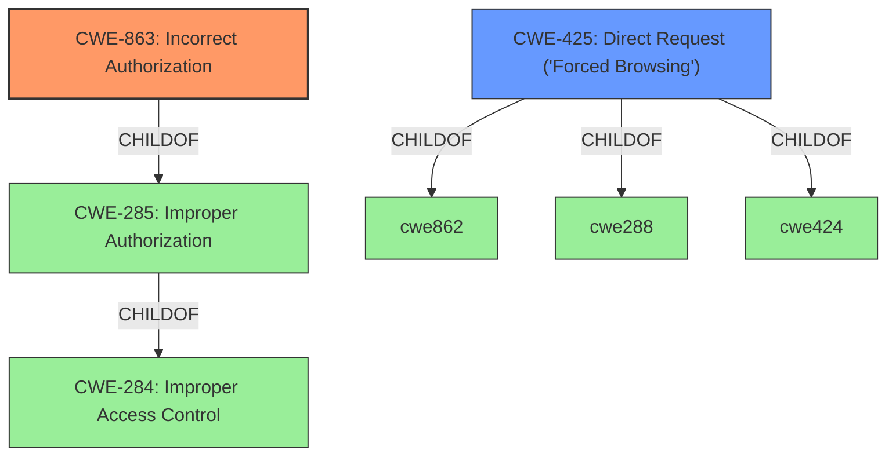

# Analysis Report for CVE-2022-39811

# Vulnerability Analysis Report: CVE-2022-39811

## Description


## Analysis (with Relationship Data)

# Summary
| CWE ID | CWE Name | Confidence | CWE Abstraction Level | CWE Vulnerability Mapping Label | CWE-Vulnerability Mapping Notes |
|---|---|---|---|---|---|
| CWE-863 | Incorrect Authorization | 0.9 | Class | Primary | Allowed-with-Review |
| CWE-425 | Direct Request ('Forced Browsing') | 0.7 | Base | Secondary | Allowed |

## Evidence and Confidence

*   **Confidence Score:** 0.8
*   **Evidence Strength:** HIGH

## Relationship Analysis
The primary relationship that influenced the selection was the ChildOf relationship between CWE-863 **CWE-863: Incorrect Authorization** and CWE-285 **CWE-285: Improper Authorization**. While CWE-285 is a parent class, the description specifically mentions an authorization check that is performed *incorrectly*, making CWE-863 a more precise fit. CWE-425 **CWE-425: Direct Request ('Forced Browsing')** was considered a secondary CWE because the vulnerability allows direct access to restricted URLs due to **incorrect access control**.



## Vulnerability Chain
The chain of weaknesses starts with the **incorrect access control**, leading to the ability to bypass controls and modify system configuration. The root cause is the **failure to properly verify permissions when accessing resources**, which allows an attacker to view pages and modify the system.

## Summary of Analysis
The initial assessment, based on the vulnerability description and CVE reference, pointed towards a problem with access control. The description clearly states "**incorrect Access Control**" and that the application "fails to properly verify permissions when accessing resources." The retriever results also highlighted CWE-863 **CWE-863: Incorrect Authorization** and CWE-425 **CWE-425: Direct Request ('Forced Browsing')** as relevant.

The final decision to map to CWE-863 **CWE-863: Incorrect Authorization** as the primary CWE is justified by the fact that the vulnerability involves an authorization check that is performed incorrectly. The description states that the application allows an attacker to "view pages that are not allowed, and modify the system configuration, bypassing all controls." This indicates that there is an attempt to authorize access, but it is flawed. The MITRE mapping guidance for CWE-863 suggests reviewing child entries for a more specific fit, which in this case is not necessary as CWE-863 directly addresses the **incorrect authorization**. CWE-425 **CWE-425: Direct Request ('Forced Browsing')** is a secondary issue, since the **incorrect authorization** allows direct access to the resources.

CWE-284 **CWE-284: Improper Access Control** was considered but not selected because it is a very high-level (Pillar) CWE. The MITRE mapping guidance explicitly discourages using CWE-284 due to its broad nature and suggests using more specific descendants. CWE-285 **CWE-285: Improper Authorization** was also considered, but CWE-863 **CWE-863: Incorrect Authorization** is a more precise fit. CWE-306 **CWE-306: Missing Authentication for Critical Function** was not selected because the vulnerability is about **incorrect authorization**, not a complete lack of authentication. CWE-668 **CWE-668: Exposure of Resource to Wrong Sphere** was deemed too generic and not as directly relevant as CWE-863 **CWE-863: Incorrect Authorization**.


## CWE Relationship Analysis

Current CWEs represent these abstraction levels: .


### Vulnerability Chain Analysis

**Chain starting from CWE-425:**
- 425 (Direct Request ('Forced Browsing')) - ROOT


**Chain starting from CWE-668:**
- 668 (Exposure of Resource to Wrong Sphere) - ROOT


### CWE Relationship Diagram

```mermaid
graph TD
    classDef primary fill:#f96,stroke:#333,stroke-width:2px
    classDef secondary fill:#69f,stroke:#333
    classDef tertiary fill:#9e9,stroke:#333
```


*Report generated on 2025-03-30 18:28:49*
