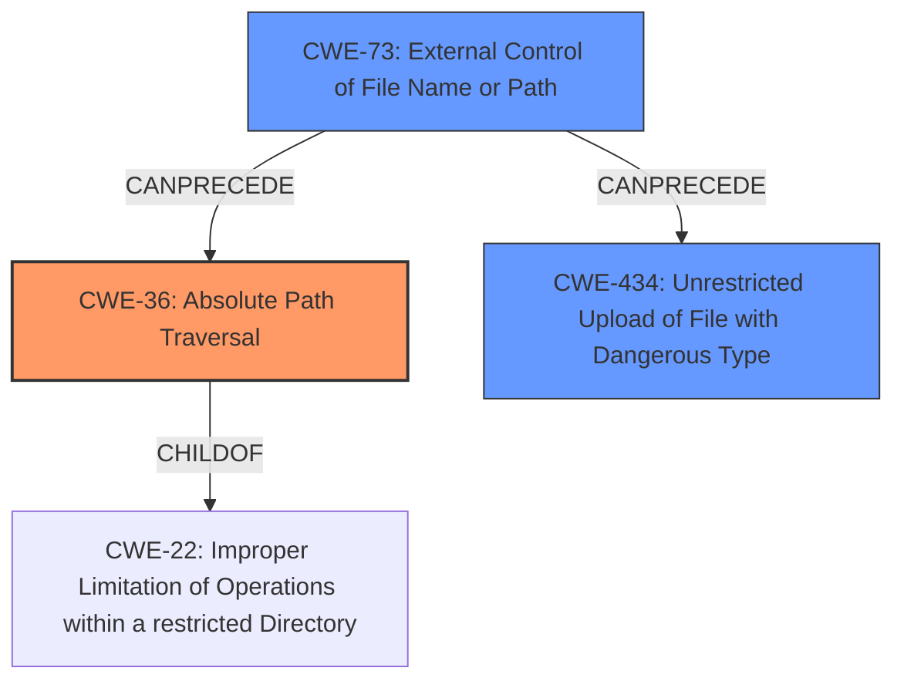

# Analysis Report for CVE-2022-39812

# Vulnerability Analysis Report: CVE-2022-39812

## Description


## Analysis (with Relationship Data)

# Summary
| CWE ID | CWE Name | Confidence | CWE Abstraction Level | CWE Vulnerability Mapping Label | CWE-Vulnerability Mapping Notes |
|---|---|---|---|---|---|
| CWE-36 | Absolute Path Traversal | 1.0 | Base | Allowed | Primary CWE |
| CWE-73 | External Control of File Name or Path | 0.7 | Base | Allowed | Secondary Candidate |
| CWE-434 | Unrestricted Upload of File with Dangerous Type | 0.6 | Base | Allowed | Secondary Candidate |

## Evidence and Confidence

*   **Confidence Score:** 0.85
*   **Evidence Strength:** HIGH

## Relationship Analysis
The primary CWE is CWE-36 (Absolute Path Traversal), which is a child of CWE-22 (Improper Limitation of a Pathname to a Restricted Directory). CWE-73 (External Control of File Name or Path) can precede CWE-36, and CWE-434 (Unrestricted Upload of File with Dangerous Type) can be a consequence of CWE-73. The relationship analysis suggests that the vulnerability involves external control of a file path leading to absolute path traversal, potentially allowing the upload of dangerous file types.



## Vulnerability Chain
The vulnerability chain starts with external control of the file path (CWE-73) via the `uploadDir` parameter, leading to absolute path traversal (CWE-36), and potentially allowing the upload of dangerous file types (CWE-434).

## Summary of Analysis
The initial analysis identified **absolute path traversal** as the root cause, which aligns with the vulnerability description and CVE reference links. The final conclusion is that CWE-36 (Absolute Path Traversal) is the most appropriate primary CWE, supported by the evidence that the `uploadDir` parameter allows writing to arbitrary paths. CWE-73 is a contributing factor (external control of file path), and CWE-434 represents a potential consequence.

The analysis is primarily based on the provided evidence, specifically the vulnerability description stating that "Italtel NetMatch-S CI 5.2.0-20211008 allows **Absolute Path Traversal** under NMSCI-WebGui/SaveFileUploader. An unauthenticated user can upload files to an arbitrary path. An attacker can change the uploadDir parameter in a POST request (not possible using the GUI) to an arbitrary directory." and the CVE Reference Links Content Summary stating "**Root Cause:** Absolute Path Traversal" and "**Weaknesses/Vulnerabilities:** The web application fails to sanitize the `uploadDir` parameter in a POST request, allowing an unauthenticated user to upload files to an arbitrary path on the server's filesystem."

The graph relationships influenced the decision by highlighting how external control of the path can lead to absolute path traversal and subsequently to unrestricted file upload.

The selected CWEs are at the optimal level of specificity, with CWE-36 being a Base-level CWE that directly addresses the identified weakness.

Relevant CWE Information:

# Enhanced Context (25 CWEs)
The following CWEs were identified as potentially relevant to this vulnerability:

## CWE-23: Relative Path Traversal
CWE-23 was considered but not selected as the primary CWE because the vulnerability description specifically mentions **absolute path traversal**, making CWE-36 a more direct match.

## CWE-22: Improper Limitation of a Pathname to a Restricted Directory ('Path Traversal')
CWE-22 was considered as a more general form of path traversal, but CWE-36 provides more specific information about the vulnerability (absolute path).

## CWE-73: External Control of File Name or Path
CWE-73 was considered as a secondary CWE because the vulnerability involves external control of the `uploadDir` parameter, which influences the file path.

## CWE-434: Unrestricted Upload of File with Dangerous Type
CWE-434 was considered as a potential consequence of the absolute path traversal, where an attacker could upload dangerous files to arbitrary locations.

## CWE-59: Improper Link Resolution Before File Access ('Link Following')
CWE-59 was considered, but it does not directly apply to this vulnerability because the issue is not related to link following.

## CWE-306: Missing Authentication for Critical Function
CWE-306 was not selected because, while the vulnerability is exploitable by an unauthenticated user, the primary weakness is the path traversal issue, not the missing authentication.

## CWE-639: Authorization Bypass Through User-Controlled Key
CWE-639 was not selected because it does not apply. The weakness is not related to a user being able to modify a key to access another user's data.


## CWE Relationship Analysis

Current CWEs represent these abstraction levels: .


### Vulnerability Chain Analysis

**Chain starting from CWE-434:**
- 434 (Unrestricted Upload of File with Dangerous Type) - ROOT


**Chain starting from CWE-36:**
- 36 (Absolute Path Traversal) - ROOT


### CWE Relationship Diagram

```mermaid
graph TD
    classDef primary fill:#f96,stroke:#333,stroke-width:2px
    classDef secondary fill:#69f,stroke:#333
    classDef tertiary fill:#9e9,stroke:#333
```


*Report generated on 2025-03-30 13:47:05*
