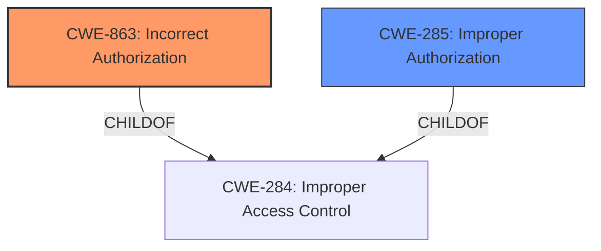

# Analysis for CVE-2022-39851

# Summary
| CWE ID | CWE Name | Confidence | CWE Abstraction Level | CWE Vulnerability Mapping Label | CWE-Vulnerability Mapping Notes |
|---|---|---|---|---|---|
| CWE-863 | Incorrect Authorization | 0.9 | Class | Primary | Allowed-with-Review |
| CWE-285 | Improper Authorization | 0.7 | Class | Secondary | Discouraged |

## Evidence and Confidence

*   **Confidence Score:** 0.9
*   **Evidence Strength:** HIGH

## Relationship Analysis
The primary CWE selected is CWE-863 (Incorrect Authorization), a child of CWE-284 (Improper Access Control). Although CWE-863 is a Class-level CWE, its description closely aligns with the vulnerability details, making it a more specific and appropriate choice than its parent. CWE-285 (Improper Authorization) was also considered, as it is also a child of CWE-284, but it is less specific. The vulnerability does not involve authentication bypass (ruling out CWE-306) or privilege management issues (ruling out CWE-269).

## Vulnerability Chain
The vulnerability chain starts with **improper access control** in the CocktailBarService, which leads to an attacker being able to bind a service that requires `BIND_REMOTEVIEWS` permission, resulting in potential unauthorized access to sensitive information or capabilities.

## Summary of Analysis
The initial assessment, based on the **rootcause** "**Improper access control**" and the ability of a local attacker to bind a service without proper privileges, pointed to issues within the authorization mechanisms of the CocktailBarService. The "CVE Reference Links Content Summary" explicitly mentions "**Improper access control** in `CocktailBarService`" and that "The fix involves adding the correct permissions to prevent improper access."

The Retriever Results suggest CWE-285 (Improper Authorization) and CWE-284 (Improper Access Control) as potential candidates, but the mapping guidance for both discourages their use due to their high-level abstraction. It suggests considering their children, such as CWE-863 (Incorrect Authorization).

CWE-863 (Incorrect Authorization) is selected because the vulnerability lies in *how* the authorization check is performed (incorrectly), rather than a complete lack of authorization (CWE-862) or missing authentication (CWE-306). The confidence in this assessment is high due to the explicit mention of **improper access control** and the details provided in the CVE summary. While CWE-863 is a Class level CWE, it provides a more accurate description of the vulnerability than the Pillar level CWE-284.

CWE-285 (Improper Authorization) was considered as a secondary candidate, but CWE-863 is more specific.

Relevant CWE Information:

# Enhanced Context (25 CWEs)

## CWE-404: Improper Resource Shutdown or Release
**Abstraction Level**: Class
**Similarity Score**: 0.75
**Source**: dense

**Description**:
The product does not release or incorrectly releases a resource before it is made available for re-use.
*Not Selected*: This vulnerability is not about resource management, but about access control.

## CWE-667: Improper Locking
**Abstraction Level**: Class
**Similarity Score**: 0.74
**Source**: dense

**Description**:
The product does not properly acquire or release a lock on a resource, leading to unexpected resource state changes and behaviors.
*Not Selected*: This vulnerability is not about locking mechanisms.

## CWE-476: NULL Pointer Dereference
**Abstraction Level**: Base
**Similarity Score**: 0.74
**Source**: dense

**Description**:
The product dereferences a pointer that it expects to be valid but is NULL.
*Not Selected*: This vulnerability is not about null pointer dereferences.

## CWE-274: Improper Handling of Insufficient Privileges
**Abstraction Level**: Base
**Similarity Score**: 0.74
**Source**: dense

**Description**:
The product does not handle or incorrectly handles when it has insufficient privileges to perform an operation, leading to resultant weaknesses.
*Not Selected*: This is related to access control, but CWE-863 is a better fit.

## CWE-754: Improper Check for Unusual or Exceptional Conditions
**Abstraction Level**: Class
**Similarity Score**: 0.74
**Source**: dense

**Description**:
The product does not check or incorrectly checks for unusual or exceptional conditions that are not expected to occur frequently during day to day operation of the product.
*Not Selected*: This is not the core issue.

## CWE-280: Improper Handling of Insufficient Permissions or Privileges 
**Abstraction Level**: Base
**Similarity Score**: 0.74
**Source**: dense

**Description**:
The product does not handle or incorrectly handles when it has insufficient privileges to access resources or functionality as specified by their permissions. This may cause it to follow unexpected code paths that may leave the product in an invalid state.
*Not Selected*: This is related to access control, but CWE-863 is a better fit.

## CWE-226: Sensitive Information in Resource Not Removed Before Reuse
**Abstraction Level**: Base
**Similarity Score**: 0.74
**Source**: dense

**Description**:
The product releases a resource such as memory or a file so that it can be made available for reuse, but it does not clear or "zeroize" the information contained in the resource before the product performs a critical state transition or makes the resource available for reuse by other entities.
*Not Selected*: This vulnerability is not about resource reuse.

## CWE-252: Unchecked Return Value
**Abstraction Level**: Base
**Similarity Score**: 0.73
**Source**: dense

**Description**:
The product does not check the return value from a method or function, which can prevent it from detecting unexpected states and conditions.
*Not Selected*: This vulnerability is not about unchecked return values.

## CWE-703: Improper Check or Handling of Exceptional Conditions
**Abstraction Level**: Pillar
**Similarity Score**: 0.73
**Source**: dense

**Description**:
The product does not properly anticipate or handle exceptional conditions that rarely occur during normal operation of the product.
*Not Selected*: This is too general and not the core issue.

## CWE-665: Improper Initialization
**Abstraction Level**: Class
**Similarity Score**: 0.73
**Source**: dense

**Description**:
The product does not initialize or incorrectly initializes a resource, which might leave the resource in an unexpected state when it is accessed or used.
*Not Selected*: This vulnerability is not about improper initialization.

## CWE-863: Incorrect Authorization
**Abstraction Level**: Class
**Similarity Score**: 5887.24
**Source**: sparse

**Description**:
The product performs an authorization check when an actor attempts to access a resource or perform an action, but it does not correctly perform the check.
*Selected*: The **rootcause** is "**Improper access control**" so this is the best fit since the authorization check is performed *incorrectly*.

## CWE-285: Improper Authorization
**Abstraction Level**: Class
**Similarity Score**: 5809.77
**Source**: sparse

**Description**:
The product does not perform or incorrectly performs an authorization check when an actor attempts to access a resource or perform an action.
*Selected*: While this is a possibility given the high level **Improper access control**, it isn't the best fit since CWE-863 describes the mechanism more specifically.

## CWE-639: Authorization Bypass Through User-Controlled Key
**Abstraction Level**: Base
**Similarity Score**: 5676.29
**Source**: sparse

**Description**:
The system's authorization functionality does not prevent one user from gaining access to another user's data or record by modifying the key value identifying the data.
*Not Selected*: This vulnerability is not specifically about user-controlled keys.

## CWE-927: Use of Implicit Intent for Sensitive Communication
**Abstraction Level**: Variant
**Similarity Score**: 5661.10
**Source**: sparse

**Description**:
The Android application uses an implicit intent for transmitting sensitive data to other applications.
*Not Selected*: This is Android specific and this vulnerability is not specifically about intents, but about access control.

## CWE-287: Improper Authentication
**Abstraction Level**: Class
**Similarity Score**: 5637.43
**Source**: sparse

**Description**:
When an actor claims to have a given identity, the product does not prove or insufficiently proves that the claim is correct.