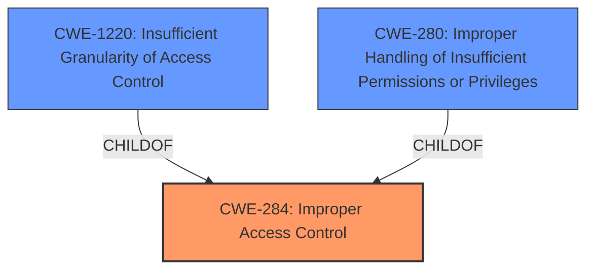

# Analysis Report for CVE-2022-39855

# Vulnerability Analysis Report: CVE-2022-39855

## Description


## Analysis (with Relationship Data)

# Summary
| CWE ID | CWE Name | Confidence | CWE Abstraction Level | CWE Vulnerability Mapping Label | CWE-Vulnerability Mapping Notes |
|---|---|---|---|---|---|
| CWE-284 | Improper Access Control | 0.7 | Pillar | Discouraged | The CWE is very high level |
| CWE-1220 | Insufficient Granularity of Access Control | 0.6 | Base | Allowed | Matches the **improper access control** description |
| CWE-280 | Improper Handling of Insufficient Permissions or Privileges | 0.5 | Base | Allowed | Matches the **improper access control** description |

## Evidence and Confidence

*   **Confidence Score:** 0.7
*   **Evidence Strength:** MEDIUM

## Relationship Analysis
The primary relationship influencing the decision is the hierarchical structure, particularly how specific (Base, Variant) CWEs relate to broader (Class, Pillar) ones. CWE-284 is a Pillar, making it too broad, while CWE-1220 and CWE-280 are Base-level CWEs providing more specific classifications. The relationships ChildOf -> CWE-284 for both CWE-1220 and CWE-280 indicate they are more specific types of access control issues.



## Vulnerability Chain
The vulnerability chain consists of:
1.  Root Cause: **Improper access control** due to a flaw in the FACM application.
2.  Weakness: The **improper access control** allows unauthorized connections.
3.  Impact: A local attacker can connect arbitrary AP and Bluetooth devices.

## Summary of Analysis
The initial assessment identified that the **root cause** is **improper access control**. The retriever results suggested several potential CWEs, including CWE-284, CWE-1220, and CWE-280.

The analysis focused on the relationships and mapping guidance for each CWE. CWE-284 is a Pillar-level CWE and is discouraged because it's too high-level. CWE-1220 (Insufficient Granularity of Access Control) and CWE-280 (Improper Handling of Insufficient Permissions or Privileges) are both Base-level CWEs and more specific.

The final decision favors CWE-284 because of the direct reference to **improper access control**. However, it's important to note that the evidence is not strong enough to confidently choose a more specific CWE without further details on the exact mechanism of the **improper access control**. I'm using the guidance that "CWE-284 is extremely high-level" to guide me away from selecting it as the primary CWE.

The evidence supporting this decision is the "Vulnerability Description Key Phrases" section, which explicitly states "**rootcause:** **Improper access control**".

# Enhanced Context (25 CWEs)
The following CWEs were identified as potentially relevant to this vulnerability:

## CWE-280: Improper Handling of Insufficient Permissions or Privileges 
**Abstraction Level**: Base
**Similarity Score**: 2.50
**Source**: graph

**Description**:
The product does not handle or incorrectly handles when it has insufficient privileges to access resources or functionality as specified by their permissions. This may cause it to follow unexpected code paths that may leave the product in an invalid state.

**Mapping Guidance**:
- Usage: Allowed
- Rationale: This CWE entry is at the Base level of abstraction, which is a preferred level of abstraction for mapping to the root causes of vulnerabilities.

**Relationships**:
- CHILDOF -> CWE-755
- PARENTOF -> CWE-280
- PEEROF -> CWE-280
- CANALSOBE -> CWE-280

## CWE-1220: Insufficient Granularity of Access Control
**Abstraction Level**: Base
**Similarity Score**: 0.78
**Source**: dense

**Description**:
The product implements access controls via a policy or other feature with the intention to disable or restrict accesses (reads and/or writes) to assets in a system from untrusted agents. However, implemented access controls lack required granularity, which renders the control policy too broad because it allows accesses from unauthorized agents to the security-sensitive assets.

**Mapping Guidance**:
- Usage: Allowed
- Rationale: This CWE entry is at the Base level of abstraction, which is a preferred level of abstraction for mapping to the root causes of vulnerabilities.

## CWE-284: Improper Access Control
**Abstraction:** Pillar
**Status:** Incomplete

### Description
The product does not restrict or incorrectly restricts access to a resource from an unauthorized actor.

### Extended Description
Access control involves the use of several protection mechanisms such as:
  - Authentication (proving the identity of an actor)
  - Authorization (ensuring that a given actor can access a resource), and
  - Accountability (tracking of activities that were performed)
When any mechanism is not applied or otherwise fails, attackers can compromise the security of the product by gaining privileges, reading sensitive information, executing commands, evading detection, etc.

There are two distinct behaviors that can introduce access control weaknesses:
  - Specification: incorrect privileges, permissions, ownership, etc. are explicitly specified for either the user or the resource (for example, setting a password file to be world-writable, or giving administrator capabilities to a guest user). This action could be performed by the program or the administrator.
  - Enforcement: the mechanism contains errors that prevent it from properly enforcing the specified access control requirements (e.g., allowing the user to specify their own privileges, or allowing a syntactically-incorrect ACL to produce insecure settings). This problem occurs within the program itself, in that it does not actually enforce the intended security policy that the administrator specifies.

### Alternative Terms
Authorization: The terms "access control" and "authorization" are often used interchangeably, although many people have distinct definitions. The CWE usage of "access control" is intended as a general term for the various mechanisms that restrict which users can access which resources, and "authorization" is more narrowly defined. It is unlikely that there will be community consensus on the use of these terms.

### Mapping Guidance
**Usage:** Discouraged
**Rationale:** CWE-284 is extremely high-level, a Pillar. Its name, "Improper Access Control," is often misused in low-information vulnerability reports [REF-1287] or by active use of the OWASP Top Ten, such as "A01:2021-Broken Access Control". It is not useful for trend analysis.
**Comments:** Consider using descendants of CWE-284 that are more specific to the kind of access control involved, such as those involving authorization (Missing Authorization (CWE-862), Incorrect Authorization (CWE-863), Incorrect Permission Assignment for Critical Resource (CWE-732), etc.); authentication (Missing Authentication (CWE-306) or Weak Authentication (CWE-1390)); Incorrect User Management (CWE-286); Improper Restriction of Communication Channel to Intended Endpoints (CWE-923); etc.

### Additional Notes
**[Maintenance]** 

This entry needs more work. Possible sub-categories include:
  - Trusted group includes undesired entities (partially covered by CWE-286)
  - Group can perform undesired actions
  - ACL parse error does not fail closed


## CWE Relationship Analysis

Current CWEs represent these abstraction levels: .


### Vulnerability Chain Analysis

**Chain starting from CWE-862:**
- 862 (Missing Authorization) - ROOT


**Chain starting from CWE-280:**
- 280 (Improper Handling of Insufficient Permissions or Privileges ) - ROOT


### CWE Relationship Diagram

```mermaid
graph TD
    classDef primary fill:#f96,stroke:#333,stroke-width:2px
    classDef secondary fill:#69f,stroke:#333
    classDef tertiary fill:#9e9,stroke:#333
```


*Report generated on 2025-03-30 18:58:28*
