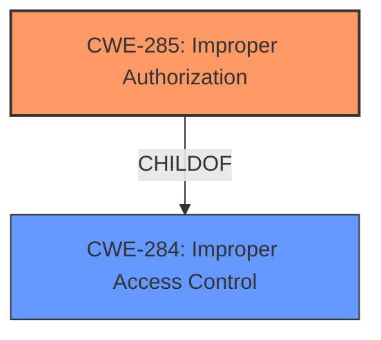

# Analysis Report for CVE-2022-39856

# Vulnerability Analysis Report: CVE-2022-39856

## Description


## Analysis (with Relationship Data)

# Summary
| CWE ID | CWE Name | Confidence | CWE Abstraction Level | CWE Vulnerability Mapping Label | CWE-Vulnerability Mapping Notes |
|---|---|---|---|---|---|
| CWE-285 | Improper Authorization | 0.8 | Class | Primary | Allowed-with-Review |
| CWE-284 | Improper Access Control | 0.6 | Pillar | Secondary | Discouraged |

## Evidence and Confidence

*   **Confidence Score:** 0.8
*   **Evidence Strength:** HIGH

## Relationship Analysis
The primary CWE, CWE-285 (Improper Authorization), is a child of CWE-284 (Improper Access Control). This indicates a hierarchical relationship where CWE-285 is a more specific type of access control issue. The vulnerability description focuses on the incorrect performance of an authorization check, making CWE-285 a more precise classification than the broader CWE-284. We choose the Class CWE-285 as the primary because there is no mention of authentication.



## Vulnerability Chain
The chain of events is as follows:

1.  **Root Cause:** **Improper Access Control/Authorization** within the `imsservice` application.
2.  **Weakness:** Failure to correctly perform authorization checks.
3.  **Impact:** Local attackers can access call information.

The vulnerability chain is relatively direct, with the **improper access control** leading directly to unauthorized access.

## Summary of Analysis
The initial assessment identified **improper access control** as the root cause, with the impact being access to call information by local attackers. The retriever results suggested several CWEs, including CWE-213, CWE-927, CWE-284, CWE-285, and CWE-926.

The final decision favored CWE-285 (Improper Authorization) because the vulnerability description explicitly mentions **improper access control**, which, in this context, directly translates to an authorization failure, meaning the product doesn't perform the authorization check correctly. CWE-285 is a class level CWE.

CWE-284 (Improper Access Control) is considered as a secondary CWE due to it being a broader category that encompasses authorization. Given the specificity of the vulnerability description, CWE-285 is a more precise fit, despite CWE-284 being related.

The evidence from the vulnerability description key phrases "rootcause: **improper access control**" and CVE Reference Links Content Summary "**Root cause of vulnerability:** Improper access control in the `imsservice` application" strongly supports this classification.

Relevant CWE Information:

# Enhanced Context (25 CWEs)

## CWE-213: Exposure of Sensitive Information Due to Incompatible Policies
**Abstraction:** Base
**Similarity Score**: 0.143
**Source**: sparse

**Description**:
The product's intended functionality exposes information to certain actors in accordance with the developer's security policy, but this information is regarded as sensitive according to the intended security policies of other stakeholders such as the product's administrator, users, or others whose information is being processed.
**Rationale for not selecting:** While the impact involves sensitive information (call information), the root cause is more directly related to authorization than policy incompatibility.

## CWE-927: Use of Implicit Intent for Sensitive Communication
**Abstraction:** Variant
**Similarity Score**: 0.142
**Source**: sparse

**Description**:
The Android application uses an implicit intent for transmitting sensitive data to other applications.
**Rationale for not selecting:** This CWE is specific to Android applications using implicit intents, which is not explicitly mentioned in the vulnerability description.

## CWE-284: Improper Access Control
**Abstraction:** Pillar
**Similarity Score**: 0.140
**Source**: sparse

**Description**:
The product does not restrict or incorrectly restricts access to a resource from an unauthorized actor.
**Rationale for selecting as secondary:** CWE-284 is a parent of CWE-285 and represents the broader category of the access control issue.

## CWE-285: Improper Authorization
**Abstraction:** Class
**Similarity Score**: 0.139
**Source**: sparse

**Description**:
The product does not perform or incorrectly performs an authorization check when an actor attempts to access a resource or perform an action.
**Rationale for selecting as primary:** This CWE aligns directly with the vulnerability description, which explicitly states "improper access control" leading to unauthorized access to call information.

## CWE-926: Improper Export of Android Application Components
**Abstraction:** Variant
**Similarity Score**: 0.131
**Source**: sparse

**Description**:
The Android application exports a component for use by other applications, but does not properly restrict which applications can launch the component or access the data it contains.
**Rationale for not selecting:** This CWE is specific to exported Android application components, which is not explicitly mentioned in the vulnerability description.

## CWE-269: Improper Privilege Management
**Abstraction:** Class
**Similarity Score**: 0.607
**Source**: dense

**Description**:
The product does not properly assign, modify, track, or check privileges for an actor, creating an unintended sphere of control for that actor.
**Rationale for not selecting:** While related to access control, this CWE focuses on privilege management rather than the authorization process itself.

## CWE-613: Insufficient Session Expiration
**Abstraction:** Base
**Similarity Score**: 0.002
**Source**: graph

**Description**:
According to WASC, "Insufficient Session Expiration is when a web site permits an attacker to reuse old session credentials or session IDs for authorization."
**Rationale for not selecting:** This CWE is about session expiration, which is not relevant to the vulnerability description.

## CWE-280: Improper Handling of Insufficient Permissions or Privileges
**Abstraction:** Base
**Similarity Score**: 0.125
**Source**: sparse

**Description**:
The product does not handle or incorrectly handles when it has insufficient privileges to access resources or functionality as specified by their permissions. This may cause it to follow unexpected code paths that may leave the product in an invalid state.
**Rationale for not selecting:** The vulnerability description focuses on the improper authorization, not the handling of insufficient privileges.

## CWE-287: Improper Authentication
**Abstraction:** Class
**Similarity Score**: 0.124
**Source**: sparse

**Description**:
When an actor claims to have a given identity, the product does not prove or insufficiently proves that the claim is correct.
**Rationale for not selecting:** This CWE focuses on authentication, which is not mentioned as a root cause in the vulnerability description.

## CWE-703: Improper Check or Handling of Exceptional Conditions
**Abstraction:** Pillar
**Similarity Score**: 0.121
**Source**: sparse

**Description**:
The product does not properly anticipate or handle exceptional conditions that rarely occur during normal operation of the product.
**Rationale for not selecting:** This CWE is too general and doesn't accurately describe the root cause of the vulnerability.


## CWE Relationship Analysis

Current CWEs represent these abstraction levels: .


### Vulnerability Chain Analysis

**Chain starting from CWE-613:**
- 613 (Insufficient Session Expiration) - ROOT


**Chain starting from CWE-280:**
- 280 (Improper Handling of Insufficient Permissions or Privileges ) - ROOT


### CWE Relationship Diagram

```mermaid
graph TD
    classDef primary fill:#f96,stroke:#333,stroke-width:2px
    classDef secondary fill:#69f,stroke:#333
    classDef tertiary fill:#9e9,stroke:#333
```


*Report generated on 2025-03-30 13:31:40*
