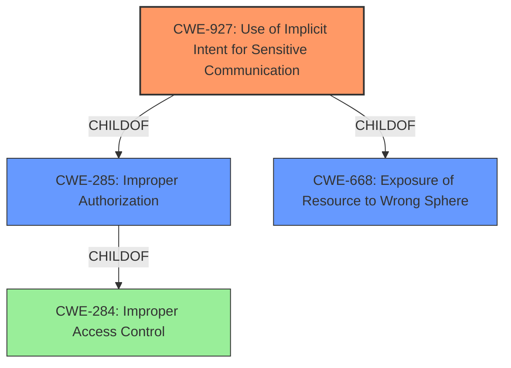

# Enhanced Analysis for CVE-2022-39860

# Summary
| CWE ID | CWE Name | Confidence | CWE Abstraction Level | CWE Vulnerability Mapping Label | CWE-Vulnerability Mapping Notes |
|---|---|---|---|---|---|
| CWE-927 | Use of Implicit Intent for Sensitive Communication | 0.9 | Variant | Allowed | Primary CWE: Addresses the specific mechanism of the vulnerability. |
| CWE-284 | Improper Access Control | 0.6 | Pillar | Discouraged | Secondary Candidate: A high-level description of the problem. |

## Evidence and Confidence

*   **Confidence Score:** 0.9
*   **Evidence Strength:** HIGH

## Relationship Analysis
The primary relationship that influenced the selection was that CWE-927 `CHILDOF` CWE-285 and `CHILDOF` CWE-668. This indicates that CWE-927 is a more specific type of improper authorization related to the exposure of a resource to the wrong sphere. The vulnerability involves using an implicit intent, which any application can receive if it registers an Intent Filter for the intent.



## Vulnerability Chain
The vulnerability chain starts with **improper access control**, leading to the exposure of sensitive information via implicit broadcast.
  - **Root Cause:** **Improper access control** in the QuickShare application.
  - **Weakness:** Lack of proper access control mechanisms when handling implicit broadcasts.
  - **Impact:** Attackers can access sensitive information via implicit broadcast.

## Summary of Analysis
Initially, the description points to **improper access control**, but the details about implicit broadcast help refine the CWE selection.

The vulnerability description states: "**Improper access control** vulnerability in QuickShare prior to version 13.2.3.5 allows attackers to access sensitive information via implicit broadcast."

The CVE Reference Links Content Summary" states: "The vulnerability stems from a lack of proper access control mechanisms when handling implicit broadcasts within the Quick Share application. This allows unauthorized access to sensitive information."

Based on the Retriever Results and Complete CWE Specifications, CWE-927 (Use of Implicit Intent for Sensitive Communication) is the most appropriate mapping. The vulnerability specifically involves the use of implicit intents for transmitting sensitive data, which aligns perfectly with the description of CWE-927. CWE-284 (Improper Access Control) is too high-level and generic. While it describes the general problem, it does not capture the specific mechanism of the vulnerability.

CWE-927 is at the Variant level of abstraction, which is a preferred level of abstraction.

**Other CWEs Considered:**

*   CWE-284 (Improper Access Control): This was considered but deemed too general. The description mentions "Discouraged" usage.
*   CWE-285 (Improper Authorization): This was considered, but the use of implicit intent is more specific.
*   CWE-639 (Authorization Bypass Through User-Controlled Key): Not applicable since the vulnerability doesn't involve user-controlled keys.
*   CWE-287 (Improper Authentication): Not relevant as the issue is with access control, not authentication.
*   CWE-269 (Improper Privilege Management): The root cause is not about privilege management.
*   CWE-613 (Insufficient Session Expiration): Not applicable as the issue is about the use of implicit intents.
*   CWE-425 (Direct Request ('Forced Browsing')): Not relevant since there are no direct requests involved.
*   CWE-863 (Incorrect Authorization): This is a more general class, but the use of implicit intents makes CWE-927 a better fit.
*   CWE-732 (Incorrect Permission Assignment for Critical Resource): Not applicable since the problem is not about permission assignments.


## CWE Relationship Analysis

Current CWEs represent these abstraction levels: .


### Vulnerability Chain Analysis

**Chain starting from CWE-613:**
- 613 (Insufficient Session Expiration) - ROOT


**Chain starting from CWE-425:**
- 425 (Direct Request ('Forced Browsing')) - ROOT


### CWE Relationship Diagram

```mermaid
graph TD
    classDef primary fill:#f96,stroke:#333,stroke-width:2px
    classDef secondary fill:#69f,stroke:#333
    classDef tertiary fill:#9e9,stroke:#333
```