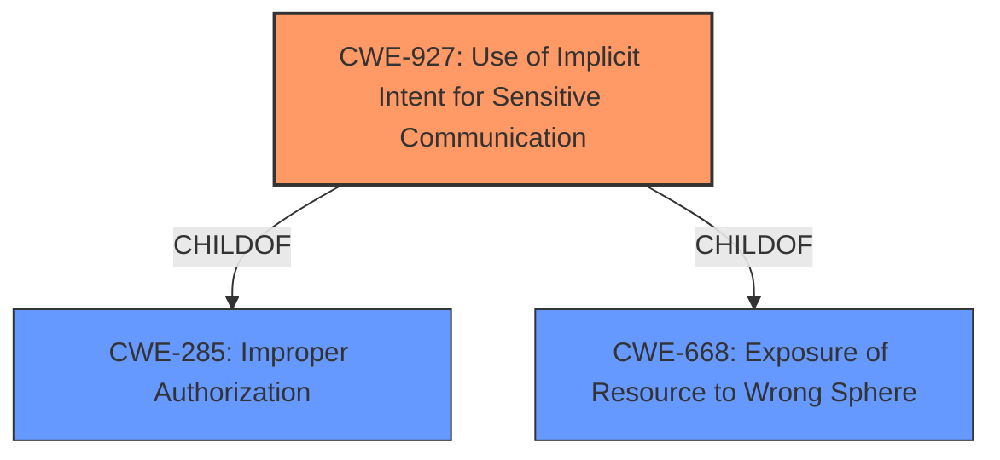

# Enhanced Analysis for CVE-2022-39866

# Summary
| CWE ID | CWE Name | Confidence | CWE Abstraction Level | CWE Vulnerability Mapping Label | CWE-Vulnerability Mapping Notes |
|---|---|---|---|---|---|
| CWE-927 | Use of Implicit Intent for Sensitive Communication | 0.9 | Variant | Allowed | Primary CWE |
| CWE-284 | Improper Access Control | 0.5 | Pillar | Discouraged | Secondary CWE |

## Evidence and Confidence

*   **Confidence Score:** 0.9
*   **Evidence Strength:** HIGH

## Relationship Analysis
The primary CWE, CWE-927, is a Variant of CWE-285 (Improper Authorization) and CWE-668 (Exposure of Resource to Wrong Sphere). This hierarchical relationship indicates that CWE-927 is a more specific type of authorization issue, which aligns with the vulnerability description that specifies the use of implicit intents for sensitive communication. The relationship helps refine the classification from a general access control issue to a specific Android-related vulnerability.



## Vulnerability Chain
The chain of events starts with the **improper access control** in the SmartThings application, which leads to the use of implicit broadcasts for sensitive information, ultimately allowing attackers to access sensitive information.

Root Cause: **Improper Access Control**
Weakness: Use of Implicit Intent for Sensitive Communication
Impact: Attackers access sensitive information

## Summary of Analysis
The initial analysis focused on the **improper access control** vulnerability that led to attackers gaining access to sensitive information via implicit broadcast. The provided evidence strongly supports the selection of CWE-927 (Use of Implicit Intent for Sensitive Communication) as the primary CWE. The vulnerability description mentions "improper access control" and "implicit broadcast," both of which are key aspects of CWE-927. The CVE reference summary further reinforces this by stating the root cause is "Improper access control" and the weakness is that "The SmartThings application allows attackers to access sensitive information via implicit broadcasts due to improper access control."

The retriever results also listed CWE-927 as the top combined result, reinforcing its relevance. The relationship analysis showed that CWE-927 is a variant of CWE-285 (Improper Authorization) and CWE-668 (Exposure of Resource to Wrong Sphere), making it a more specific and appropriate choice than its parent classes.

The MITRE mapping guidance for CWE-927 allows its usage and states that it is at the Variant level of abstraction, which is preferred.

While CWE-284 (Improper Access Control) was considered, it was deemed too general. The evidence explicitly points to the use of implicit intents, making CWE-927 the more precise and fitting classification.

Therefore, based on the evidence and the relationship analysis, CWE-927 is the most appropriate CWE for this vulnerability, capturing the specific weakness related to the use of implicit intents in Android applications.

Relevant CWE Information:

# Enhanced Context (25 CWEs)
The following CWEs were identified as potentially relevant to this vulnerability:

## CWE-941: Incorrectly Specified Destination in a Communication Channel
**Abstraction Level**: Base
**Similarity Score**: 0.75

## CWE-280: Improper Handling of Insufficient Permissions or Privileges 
**Abstraction Level**: Base
**Similarity Score**: 0.74

## CWE-639: Authorization Bypass Through User-Controlled Key
**Abstraction Level**: Base
**Similarity Score**: 0.74

## CWE-807: Reliance on Untrusted Inputs in a Security Decision
**Abstraction Level**: Base
**Similarity Score**: 0.74

## CWE-1220: Insufficient Granularity of Access Control
**Abstraction Level**: Base
**Similarity Score**: 0.74

## CWE-274: Improper Handling of Insufficient Privileges
**Abstraction Level**: Base
**Similarity Score**: 0.74

## CWE-472: External Control of Assumed-Immutable Web Parameter
**Abstraction Level**: Base
**Similarity Score**: 0.73

## CWE-799: Improper Control of Interaction Frequency
**Abstraction Level**: Class
**Similarity Score**: 0.73

## CWE-668: Exposure of Resource to Wrong Sphere
**Abstraction Level**: Class
**Similarity Score**: 0.73

## CWE-267: Privilege Defined With Unsafe Actions
**Abstraction Level**: Base
**Similarity Score**: 0.73

## CWE-927: Use of Implicit Intent for Sensitive Communication
**Abstraction Level**: Variant
**Similarity Score**: 5758.01

## CWE-863: Incorrect Authorization
**Abstraction Level**: Class
**Similarity Score**: 5699.81

## CWE-285: Improper Authorization
**Abstraction Level**: Class
**Similarity Score**: 5645.72

## CWE-425: Direct Request ('Forced Browsing')
**Abstraction Level**: Base
**Similarity Score**: 5549.40

## CWE-639: Authorization Bypass Through User-Controlled Key
**Abstraction Level**: Base
**Similarity Score**: 5540.36

## CWE-471: Modification of Assumed-Immutable Data (MAID)
**Abstraction Level**: base
**Similarity Score**: 4.33

## CWE-613: Insufficient Session Expiration
**Abstraction Level**: base
**Similarity Score**: 4.33

## CWE-178: Improper Handling of Case Sensitivity
**Abstraction Level**: base
**Similarity Score**: 3.76

## CWE-98: Improper Control of Filename for Include/Require Statement in PHP Program ('PHP Remote File Inclusion')
**Abstraction Level**: variant
**Similarity Score**: 3.75

## CWE-1289: Improper Validation of Unsafe Equivalence in Input
**Abstraction Level**: base
**Similarity Score**: 3.64

## CWE-457: Use of Uninitialized Variable
**Abstraction Level**: variant
**Similarity Score**: 3.34

## CWE-41: Improper Resolution of Path Equivalence
**Abstraction Level**: base
**Similarity Score**: 2.99

## CWE-425: Direct Request ('Forced Browsing')
**Abstraction Level**: Base
**Similarity Score**: 2.89

## CWE-1282: Assumed-Immutable Data is Stored in Writable Memory
**Abstraction Level**: base
**Similarity Score**: 2.87

## CWE-911: Improper Update of Reference Count
**Abstraction Level**: base
**Similarity Score**: 2.87

CWE-285 (Improper Authorization) and CWE-668 (Exposure of Resource to Wrong Sphere) were considered as parent classes of CWE-927, but were ultimately deemed less specific. Other CWEs like CWE-863 (Incorrect Authorization) and CWE-425 (Direct Request ('Forced Browsing')) were also considered but did not directly relate to the Android-specific vulnerability described. The focus on implicit intents and sensitive communication made CWE-927 the most appropriate choice.


## CWE Relationship Analysis

Current CWEs represent these abstraction levels: .


### Vulnerability Chain Analysis

**Chain starting from CWE-41:**
- 41 (Improper Resolution of Path Equivalence) - ROOT


**Chain starting from CWE-807:**
- 807 (Reliance on Untrusted Inputs in a Security Decision) - ROOT


### CWE Relationship Diagram

```mermaid
graph TD
    classDef primary fill:#f96,stroke:#333,stroke-width:2px
    classDef secondary fill:#69f,stroke:#333
    classDef tertiary fill:#9e9,stroke:#333
```