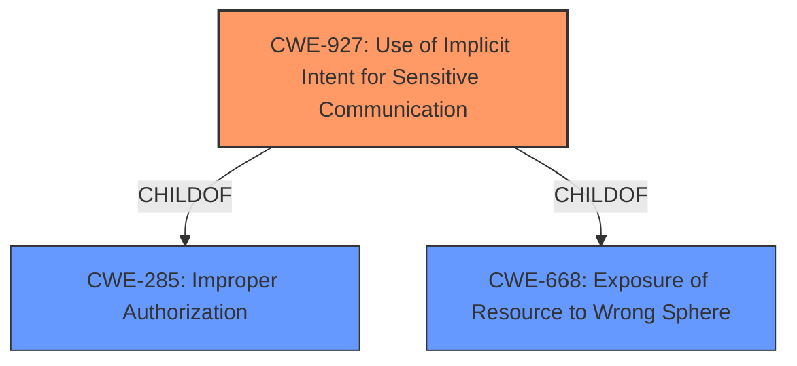

# Analysis Report for CVE-2022-39871

# Vulnerability Analysis Report: CVE-2022-39871

## Description


## Analysis (with Relationship Data)

# Summary
| CWE ID | CWE Name | Confidence | CWE Abstraction Level | CWE Vulnerability Mapping Label | CWE-Vulnerability Mapping Notes |
|---|---|---|---|---|---|
| CWE-927 | Use of Implicit Intent for Sensitive Communication | 0.9 | Variant | Allowed | Primary CWE |
| CWE-284 | Improper Access Control | 0.6 | Pillar | Discouraged | Secondary Candidate |

## Evidence and Confidence

*   **Confidence Score:** 0.9
*   **Evidence Strength:** HIGH

## Relationship Analysis
The primary CWE, CWE-927, is a Variant of both CWE-285 (Improper Authorization) and CWE-668 (Exposure of Resource to Wrong Sphere). The vulnerability description explicitly mentions "implicit broadcasts" as the vector and "improper access control" as the root cause, strongly suggesting CWE-927. The higher-level CWE-284 is considered but ultimately rejected due to its high level of abstraction (Pillar) and the availability of a more specific Variant (CWE-927).



## Vulnerability Chain
The vulnerability chain starts with **improper access control**, leading to the use of implicit intents for sensitive communication, which allows attackers to access sensitive information.

Root Cause: **Improper Access Control**
Weakness: Use of Implicit Intent for Sensitive Communication
Impact: Access to sensitive information

## Summary of Analysis
The initial analysis focused on identifying the **root cause** and specific attack vector. The description highlights **"Improper access control"** as the core issue and "implicit broadcasts" as the means of exploitation. This information, combined with the "CVE Reference Links Content Summary," strongly points to CWE-927 (Use of Implicit Intent for Sensitive Communication).

The vulnerability description explicitly states: "Improper access control vulnerability... allows attackers to access sensitive information via implicit broadcasts."

The Retriever Results listed CWE-927 with the highest score. The description of CWE-927 aligns perfectly with the vulnerability: "The Android application uses an implicit intent for transmitting sensitive data to other applications."

CWE-284 (Improper Access Control) was considered but is too general. The availability of CWE-927, a more specific Variant, makes it the better choice. The abstraction level is appropriate as it is at the Variant level of abstraction.

Relevant CWE Information:

# Enhanced Context (25 CWEs)

## CWE-73: External Control of File Name or Path
Was not selected because the vulnerability is about improper access control via implicit intents, not file paths.

## CWE-41: Improper Resolution of Path Equivalence
Was not selected because the vulnerability is about improper access control via implicit intents, not file path equivalence.

## CWE-23: Relative Path Traversal
Was not selected because the vulnerability is about improper access control via implicit intents, not path traversal.

## CWE-59: Improper Link Resolution Before File Access ('Link Following')
Was not selected because the vulnerability is about improper access control via implicit intents, not link following.

## CWE-29: Path Traversal: '\..\filename'
Was not selected because the vulnerability is about improper access control via implicit intents, not path traversal with specific characters.

## CWE-668: Exposure of Resource to Wrong Sphere
Was not selected because while it is related, CWE-927 is a more specific child.

## CWE-24: Path Traversal: '../filedir'
Was not selected because the vulnerability is about improper access control via implicit intents, not path traversal.

## CWE-36: Absolute Path Traversal
Was not selected because the vulnerability is about improper access control via implicit intents, not path traversal.

## CWE-25: Path Traversal: '/../filedir'
Was not selected because the vulnerability is about improper access control via implicit intents, not path traversal.

## CWE-552: Files or Directories Accessible to External Parties
Was not selected because the vulnerability is about improper access control via implicit intents, not file accessibility.

## CWE-927: Use of Implicit Intent for Sensitive Communication
**CWE-927** is selected as the primary CWE because it directly addresses the **weakness** described in the vulnerability: the use of implicit intents for transmitting sensitive data. This is a Variant level CWE, providing a specific and accurate representation of the vulnerability. The official MITRE mapping guidance ALLOWS this CWE.

## CWE-863: Incorrect Authorization
Was not selected because the description indicates that the authorization check isn't the issue, it is that implicit intents are being used.

## CWE-639: Authorization Bypass Through User-Controlled Key
Was not selected because the vulnerability is about improper access control via implicit intents, not authorization bypass through user-controlled keys.

## CWE-285: Improper Authorization
Was not selected because while it is related, CWE-927 is a more specific child.

## CWE-22: Improper Limitation of a Pathname to a Restricted Directory ('Path Traversal')
Was not selected because the vulnerability is about improper access control via implicit intents, not path traversal.

## CWE-613: Insufficient Session Expiration
Was not selected because the vulnerability is about improper access control via implicit intents, not session expiration.

## CWE-434: Unrestricted Upload of File with Dangerous Type
Was not selected because the vulnerability is about improper access control via implicit intents, not file uploads.

## CWE-178: Improper Handling of Case Sensitivity
Was not selected because the vulnerability is about improper access control via implicit intents, not case sensitivity.

## CWE-98: Improper Control of Filename for Include/Require Statement in PHP Program ('PHP Remote File Inclusion')
Was not selected because the vulnerability is about improper access control via implicit intents, not PHP file inclusion.

## CWE-266: Incorrect Privilege Assignment
Was not selected because the vulnerability is about improper access control via implicit intents, not privilege assignment.

## CWE-1289: Improper Validation of Unsafe Equivalence in Input
Was not selected because the vulnerability is about improper access control via implicit intents, not input validation.

## CWE-41: Improper Resolution of Path Equivalence
Was not selected because the vulnerability is about improper access control via implicit intents, not path equivalence.

## CWE-73: External Control of File Name or Path
Was not selected because the vulnerability is about improper access control via implicit intents, not file name/path control.

## CWE-59: Improper Link Resolution Before File Access ('Link Following')
Was not selected because the vulnerability is about improper access control via implicit intents, not link following.


## CWE Relationship Analysis

Current CWEs represent these abstraction levels: .


### Vulnerability Chain Analysis

**Chain starting from CWE-41:**
- 41 (Improper Resolution of Path Equivalence) - ROOT


**Chain starting from CWE-668:**
- 668 (Exposure of Resource to Wrong Sphere) - ROOT


### CWE Relationship Diagram

```mermaid
graph TD
    classDef primary fill:#f96,stroke:#333,stroke-width:2px
    classDef secondary fill:#69f,stroke:#333
    classDef tertiary fill:#9e9,stroke:#333
```


*Report generated on 2025-03-31 01:02:22*
