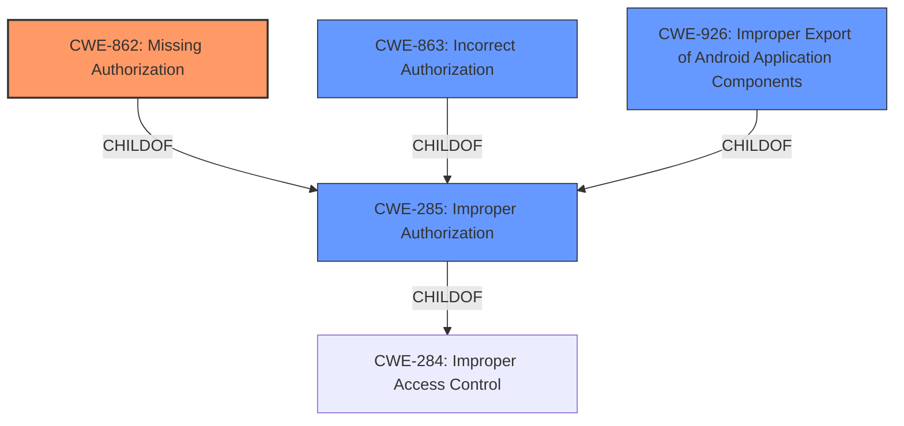

# Enhanced Analysis for CVE-2022-39883

# Summary
| CWE ID  | CWE Name | Confidence | CWE Abstraction Level | CWE Vulnerability Mapping Label | CWE-Vulnerability Mapping Notes |
|--------------|-----------------------------------------|-------------------|--------------------------|-----------------------------------|------------------------------------------------------------------------|
| **CWE-862** | **Missing Authorization** | 0.9 | Class | Primary | Allowed-with-Review |
| CWE-285 | Improper Authorization | 0.6 | Class | Secondary | Discouraged |
| CWE-863 | Incorrect Authorization | 0.5 | Class | Secondary | Allowed-with-Review |
| CWE-926 | Improper Export of Android Application Components | 0.4 | Variant | Secondary | Allowed |

## Evidence and Confidence

*   **Confidence Score:** 0.9
*   **Evidence Strength:** HIGH

## Relationship Analysis
The primary CWE is CWE-862, **Missing Authorization**, which is a child of CWE-285, **Improper Authorization**. CWE-863, **Incorrect Authorization**, is a peer of CWE-862, both being children of CWE-285. The choice of CWE-862 is based on the evidence that no authorization check was performed, rather than an incorrect one. CWE-926, **Improper Export of Android Application Components** is another child of CWE-285 which is specific to Android applications. The abstraction levels influenced the selection by favoring the most specific Class level CWE that accurately represents the weakness.



## Vulnerability Chain
The vulnerability chain starts with the **improper authorization** (**ROOT CAUSE**), leading to the ability for a local attacker to call privileged APIs (**IMPACT**). The missing authorization check is the core issue.

## Summary of Analysis
The initial assessment identified **improper authorization** as the root cause. The evidence from the vulnerability description and CVE reference link summary points to a failure in authorization within the `StorageManagerService`. The service does not properly restrict access to privileged APIs, which allows a local attacker to call these APIs without proper authorization.

The primary CWE selected is CWE-862 **Missing Authorization**, with a confidence score of 0.9. This is based on the evidence that the `StorageManagerService` **does not perform an authorization check** when an actor attempts to call a privileged API. The **Vulnerability Description** states "**Improper authorization** vulnerability... allows local attacker to call privileged API," and the **CVE Reference Links Content Summary** confirms that the root cause is "**Improper authorization in `StorageManagerService`**" and that the "`StorageManagerService` **does not properly restrict access to privileged APIs**".

CWE-285 **Improper Authorization** was considered but not chosen as the primary CWE because it is a more general class. CWE-862 is a child of CWE-285 and provides more specificity by explicitly stating that the authorization check is missing. The mapping guidance for CWE-285 recommends considering its children, such as CWE-862, for a more precise mapping.

CWE-863 **Incorrect Authorization** was also considered, but it describes scenarios where an authorization check is performed but is done incorrectly. In this case, the evidence suggests that there is no authorization check at all, making CWE-862 a more accurate fit.

CWE-926 **Improper Export of Android Application Components** was also considered since the vulnerable code is in Android. However, it is very specific to exported components and the description doesn't give enough information to know if it is or is not an exported component.

The final selection of CWE-862 is at the optimal level of specificity, as it accurately reflects the **missing authorization** check that leads to the vulnerability. This decision is supported by the vulnerability description, CVE reference links content summary, and the mapping guidance provided by MITRE.


## CWE Relationship Analysis

Current CWEs represent these abstraction levels: .


### Vulnerability Chain Analysis

**Chain starting from CWE-862:**
- 862 (Missing Authorization) - ROOT


**Chain starting from CWE-926:**
- 926 (Improper Export of Android Application Components) - ROOT


### CWE Relationship Diagram

```mermaid
graph TD
    classDef primary fill:#f96,stroke:#333,stroke-width:2px
    classDef secondary fill:#69f,stroke:#333
    classDef tertiary fill:#9e9,stroke:#333
```