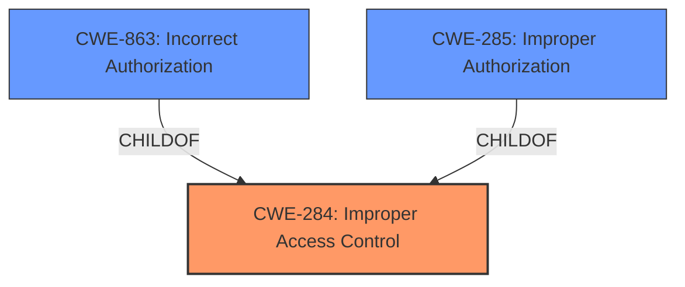

# Raw Analyzer Response for CVE-2022-39889

# Summary
| CWE ID | CWE Name | Confidence | CWE Abstraction Level | CWE Vulnerability Mapping Label | CWE-Vulnerability Mapping Notes |
|---|---|---|---|---|---|
| CWE-284 | Improper Access Control | 0.8 | Pillar | Primary | Discouraged |
| CWE-863 | Incorrect Authorization | 0.7 | Class | Secondary | Allowed-with-Review |
| CWE-285 | Improper Authorization | 0.6 | Class | Secondary | Discouraged |

## Evidence and Confidence

*   **Confidence Score:** 0.8
*   **Evidence Strength:** HIGH

## Relationship Analysis
The primary CWE chosen is CWE-284, **Improper Access Control**, which is a high-level Pillar. However, given the limited information, a more specific CWE is difficult to pinpoint. CWE-863, **Incorrect Authorization**, and CWE-285, **Improper Authorization**, are children of CWE-284 and represent more specific authorization issues. These two offer more granularity but are still at the Class level. The relationship analysis shows a hierarchical structure where CWE-284 is the parent, and CWE-863 and CWE-285 are its children. While the description points to an access control issue, the lack of details about the mechanism makes it hard to choose a base or variant level CWE.

## Vulnerability Chain
The vulnerability chain involves an initial **improper access control** (**ROOTCAUSE**) which leads to attackers being able to **access wearable device information** (**IMPACT**). There isn't sufficient information to extend this chain further.

## Summary of Analysis
The initial analysis pointed towards **improper access control** as the root cause, supported by the vulnerability description key phrases and the CVE reference summary. The retriever results also highlighted CWE-284, CWE-863, and CWE-285 as potential candidates.

CWE-284 is chosen as the primary CWE because the vulnerability description explicitly mentions "**Improper access control**". The description states that this **improper access control** allows attackers to access wearable device information.

CWE-863 and CWE-285 were considered as secondary options due to their relationship to CWE-284 and their relevance to the concept of authorization. However, the lack of specifics about the authorization mechanism involved makes them less suitable as the primary CWE.

The selection is based on the provided evidence, emphasizing the explicit mention of "**improper access control**". While a more specific CWE at the Base or Variant level would be ideal, the available information is insufficient to make a confident determination. CWE-284 is at the optimal level of specificity given the limited details.

Relevant CWE Information:

# Enhanced Context (25 CWEs)
The following CWEs were identified as potentially relevant to this vulnerability:

## CWE-280: Improper Handling of Insufficient Permissions or Privileges 
**Abstraction Level**: Base
**Similarity Score**: 0.80
**Source**: dense

**Description**:
The product does not handle or incorrectly handles when it has insufficient privileges to access resources or functionality as specified by their permissions. This may cause it to follow unexpected code paths that may leave the product in an invalid state.

**Mapping Guidance**:
- Usage: Allowed
- Rationale: This CWE entry is at the Base level of abstraction, which is a preferred level of abstraction for mapping to the root causes of vulnerabilities.

CWE-280 was considered but not chosen because the vulnerability description focuses on **improper access control** rather than specifically handling insufficient permissions.

## CWE-274: Improper Handling of Insufficient Privileges
**Abstraction Level**: Base
**Similarity Score**: 0.80
**Source**: dense

**Description**:
The product does not handle or incorrectly handles when it has insufficient privileges to perform an operation, leading to resultant weaknesses.

**Mapping Guidance**:
- Usage: Discouraged
- Rationale: This CWE entry could be deprecated in a future version of CWE.

CWE-274 was considered but not chosen because the vulnerability description focuses on **improper access control** rather than specifically handling insufficient privileges. Also the usage is discouraged.

## CWE-266: Incorrect Privilege Assignment
**Abstraction Level**: Base
**Similarity Score**: 0.78
**Source**: dense

**Description**:
A product incorrectly assigns a privilege to a particular actor, creating an unintended sphere of control for that actor.

**Mapping Guidance**:
- Usage: Allowed
- Rationale: This CWE entry is at the Base level of abstraction, which is a preferred level of abstraction for mapping to the root causes of vulnerabilities.

CWE-266 was considered but not chosen because the description doesn't suggest an incorrect assignment of privileges, only that access control is **improper**.

## CWE-267: Privilege Defined With Unsafe Actions
**Abstraction Level**: Base
**Similarity Score**: 0.78
**Source**: dense

**Description**:
A particular privilege, role, capability, or right can be used to perform unsafe actions that were not intended, even when it is assigned to the correct entity.

**Mapping Guidance**:
- Usage: Allowed
- Rationale: This CWE entry is at the Base level of abstraction, which is a preferred level of abstraction for mapping to the root causes of vulnerabilities.

CWE-267 was considered but not chosen because the description doesn't suggest that a privilege is defined with unsafe actions, only that access control is **improper**.

## CWE-23: Relative Path Traversal
**Abstraction Level**: Base
**Similarity Score**: 0.77
**Source**: dense

**Description**:
The product uses external input to construct a pathname that should be within a restricted directory, but it does not properly neutralize sequences such as ".." that can resolve to a location that is outside of that directory.

**Mapping Guidance**:
- Usage: Allowed
- Rationale: This CWE entry is at the Base level of abstraction, which is a preferred level of abstraction for mapping to the root causes of vulnerabilities.

CWE-23 was considered but not chosen because the vulnerability is not related to path traversal. The description suggests a more general access control issue.

## CWE-59: Improper Link Resolution Before File Access ('Link Following')
**Abstraction Level**: Base
**Similarity Score**: 0.77
**Source**: dense

**Description**:
The product attempts to access a file based on the filename, but it does not properly prevent that filename from identifying a link or shortcut that resolves to an unintended resource.

**Mapping Guidance**:
- Usage: Allowed
- Rationale: This CWE entry is at the Base level of abstraction, which is a preferred level of abstraction for mapping to the root causes of vulnerabilities.

CWE-59 was considered but not chosen because the vulnerability is not related to link following. The description suggests a more general access control issue.

## CWE-668: Exposure of Resource to Wrong Sphere
**Abstraction Level**: Class
**Similarity Score**: 0.77
**Source**: dense

**Description**:
The product exposes a resource to the wrong control sphere, providing unintended actors with inappropriate access to the resource.

**Mapping Guidance**:
- Usage: Discouraged
- Rationale: CWE-668 is high-level and is often misused as a catch-all when lower-level CWE IDs might be applicable. It is sometimes used for low-information vulnerability reports [REF-1287]. It is a level-1 Class (i.e., a child of a Pillar). It is not useful for trend analysis.

CWE-668 was considered but not chosen because the vulnerability description does not specifically mention exposing a resource to the wrong sphere, although this could be implied. Also, the usage is discouraged.

## CWE-41: Improper Resolution of Path Equivalence
**Abstraction Level**: Base
**Similarity Score**: 0.77
**Source**: dense

**Description**:
The product is vulnerable to file system contents disclosure through path equivalence. Path equivalence involves the use of special characters in file and directory names. The associated manipulations are intended to generate multiple names for the same object.

**Mapping Guidance**:
- Usage: Allowed
- Rationale: This CWE entry is at the Base level of abstraction, which is a preferred level of abstraction for mapping to the root causes of vulnerabilities.

CWE-41 was considered but not chosen because the vulnerability is not related to path equivalence. The description suggests a more general access control issue.

## CWE-281: Improper Preservation of Permissions
**Abstraction Level**: Base
**Similarity Score**: 0.77
**Source**: dense

**Description**:
The product does not preserve permissions or incorrectly preserves permissions when copying, restoring, or sharing objects,