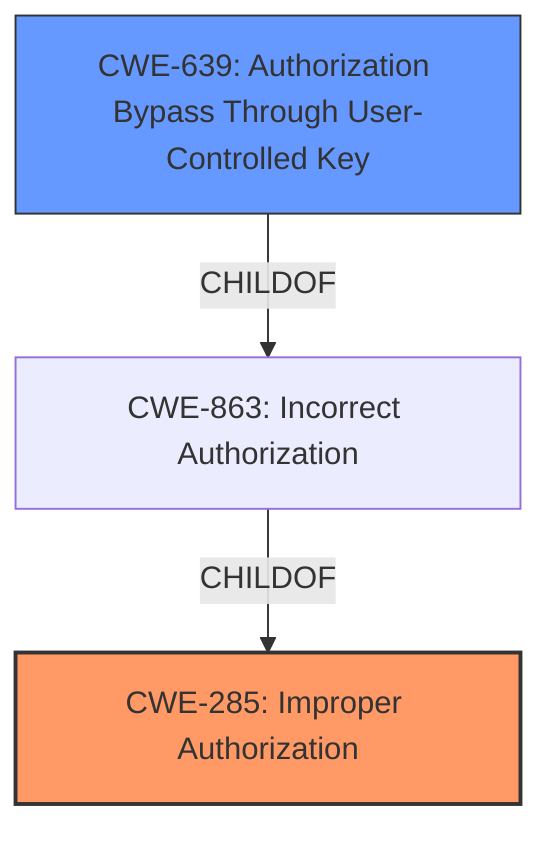

# Raw Analyzer Response for CVE-2022-39890

# Summary
| CWE ID | CWE Name | Confidence | CWE Abstraction Level | CWE Vulnerability Mapping Label | CWE-Vulnerability Mapping Notes |
|---|---|---|---|---|---|
| CWE-285 | Improper Authorization | 0.9 | Class | Primary | Discouraged |
| CWE-639 | Authorization Bypass Through User-Controlled Key | 0.7 | Base | Secondary | Allowed |

## Evidence and Confidence

*   **Confidence Score:** 0.9
*   **Evidence Strength:** HIGH

## Relationship Analysis
The primary CWE chosen is CWE-285 (**Improper Authorization**), which is a Class-level CWE. While the description directly matches the vulnerability, it's a high-level classification. A more specific Base CWE, CWE-639 (**Authorization Bypass Through User-Controlled Key**), was considered as a secondary candidate. CWE-639 is a child of CWE-863 (**Incorrect Authorization**), which in turn is a child of CWE-285. Selecting both CWE-285 and CWE-639 allows for capturing the general authorization issue, as well as the potential for user-controlled keys to bypass authorization.

## Vulnerability Chain
The vulnerability chain starts with **Improper Authorization** (CWE-285) which may lead to an attacker gaining unauthorized access to sensitive information. The specific mechanism for this is not described but CWE-639 suggests that the **Improper Authorization** may be due to a user-controlled key.

## Summary of Analysis
The initial analysis identified **Improper Authorization** as the root cause, directly based on the "Vulnerability Description Key Phrases" and "CVE Reference Links Content Summary":

*   "**rootcause:** **Improper Authorization**"
*   "**weaknesses:** [ "Improper Authorization" ]"

However, CWE-285 is a Class-level CWE, and the guidance suggests considering more specific child CWEs. CWE-639 (**Authorization Bypass Through User-Controlled Key**) was considered, because the description mentions "the system's authorization functionality does not prevent one user from gaining access to another user's data or record by modifying the key value identifying the data."

The final decision was to include both CWE-285 and CWE-639 because the information given did not rule out the possibility that the authorization bypass occurred through a user-controlled key, as well as allow for any other type of authorization bypass.

Relevant CWE Information: