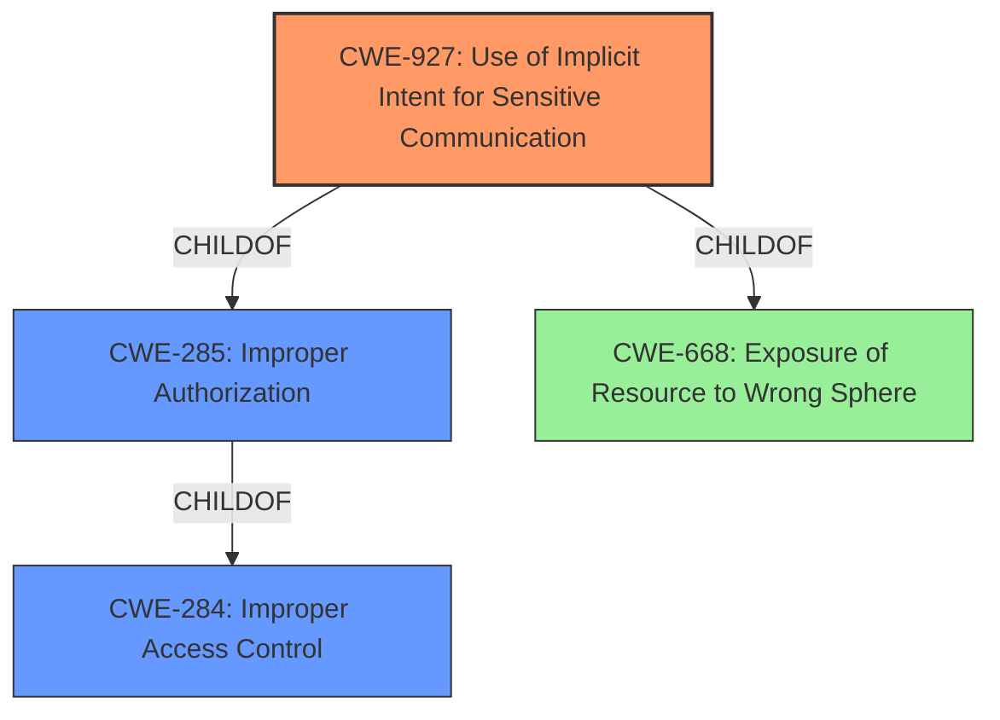

# Enhanced Analysis for CVE-2022-39894

# Summary
| CWE ID | CWE Name | Confidence | CWE Abstraction Level | CWE Vulnerability Mapping Label | CWE-Vulnerability Mapping Notes |
|---|---|---|---|---|---|
| CWE-927 | Use of Implicit Intent for Sensitive Communication | 0.9 | Variant | Allowed | Primary CWE |
| CWE-285 | Improper Authorization | 0.6 | Class | Discouraged | Secondary Candidate |
| CWE-284 | Improper Access Control | 0.5 | Pillar | Discouraged | Secondary Candidate |

## Evidence and Confidence

*   **Confidence Score:** 0.9
*   **Evidence Strength:** MEDIUM

## Relationship Analysis
The primary CWE, CWE-927, is a Variant of CWE-285 (Improper Authorization) and CWE-668 (Exposure of Resource to Wrong Sphere). CWE-285 is a child of CWE-284 (Improper Access Control). The vulnerability involves the use of an implicit intent to access sensitive information, which aligns directly with CWE-927. CWE-285 and CWE-284 are higher-level classifications that, while relevant, do not capture the specific mechanism of the vulnerability as accurately as CWE-927. Therefore, CWE-927 is the most specific and appropriate choice.



## Vulnerability Chain
The vulnerability chain involves **improper access control** leading to access of **sensitive information** via **implicit intent**.

## Summary of Analysis
The initial analysis identified several potential CWEs, but CWE-927 stands out as the most accurate due to its direct relevance to the use of implicit intents for sensitive communication. The vulnerability description explicitly mentions "improper access control vulnerability" and "access sensitive information via implicit intent."
The Retriever Results also support this, listing CWE-927 as the top combined result. While CWE-285 and CWE-284 are related and represent broader categories of access control issues, CWE-927 provides the necessary specificity to capture the technical details of the vulnerability.
The evidence supporting this decision comes directly from the "**Vulnerability Description Key Phrases**," which include "**rootcause:** **improper access control**," "**impact:** access sensitive information," and "**vector:** implicit intent." The "**CWE Reference Links Content Summary**" provides no additional information about the rootcause or weakness mechanisms, but the vulnerability description provides adequate evidence.

Relevant CWE Information:
* CWE-927: Use of Implicit Intent for Sensitive Communication
  - This CWE is a Variant level of abstraction, which is preferred.
  - It directly addresses the use of implicit intents, aligning with the vulnerability description.
  - The description matches the vulnerability almost exactly.
* CWE-285: Improper Authorization
  - This CWE is a Class level of abstraction, which is less specific than CWE-927.
  - It is a parent of CWE-927 but does not fully capture the specific weakness.
  - The mapping guidance discourages its use when lower-level CWEs are applicable.
* CWE-284: Improper Access Control
  - This CWE is a Pillar level of abstraction, making it too general for this vulnerability.
  - It is a parent of CWE-285 and, therefore, a grandparent of CWE-927, further distancing it from the specific details.
  - The mapping guidance strongly discourages its use due to its high-level nature.


## CWE Relationship Analysis

Current CWEs represent these abstraction levels: .


### Vulnerability Chain Analysis

**Chain starting from CWE-285:**
- 285 (Improper Authorization) - ROOT


**Chain starting from CWE-668:**
- 668 (Exposure of Resource to Wrong Sphere) - ROOT


### CWE Relationship Diagram

```mermaid
graph TD
    classDef primary fill:#f96,stroke:#333,stroke-width:2px
    classDef secondary fill:#69f,stroke:#333
    classDef tertiary fill:#9e9,stroke:#333
```