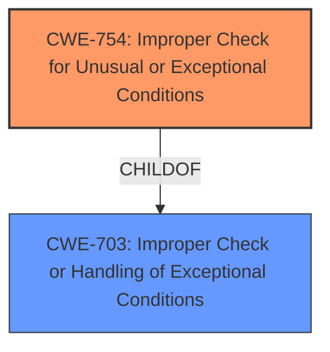

# Analysis for CVE-2022-39911

# Summary
| CWE ID | CWE Name | Confidence | CWE Abstraction Level | CWE Vulnerability Mapping Label | CWE-Vulnerability Mapping Notes |
|---|---|---|---|---|---|
| CWE-754 | Improper Check for Unusual or Exceptional Conditions | 0.8 | Class | Allowed-with-Review | Primary CWE |
| CWE-703 | Improper Check or Handling of Exceptional Conditions | 0.6 | Pillar | Discouraged | Secondary Candidate |

## Evidence and Confidence

*   **Confidence Score:** 0.8
*   **Evidence Strength:** MEDIUM

## Relationship Analysis
The primary CWE is CWE-754, which is a child of CWE-703. While CWE-703 is a more general category, CWE-754 is more specific and aligned with the provided vulnerability description.

## Vulnerability Chain
The vulnerability chain starts with an **improper check or handling of exceptional conditions** (CWE-754), leading to unauthorized access to Samsung Pass.

## Summary of Analysis
The initial assessment, focusing on the **rootcause**, identifies "**Improper check or handling of exceptional conditions**" as the primary weakness.

The provided evidence directly states "**Improper check or handling of exceptional conditions** vulnerability in Samsung Pass prior to version 4.0.06.1 allows attacker to access Samsung Pass."

CWE-754 (Improper Check for Unusual or Exceptional Conditions) is a Class-level CWE that accurately represents the vulnerability. The retriever results also lists this CWE with a high score. The description of CWE-754 states: "The product does not check or incorrectly checks for unusual or exceptional conditions that are not expected to occur frequently during day to day operation of the product." This aligns well with the vulnerability description.

CWE-703 (Improper Check or Handling of Exceptional Conditions) is a Pillar-level CWE. While the vulnerability description includes the exact phrase for this CWE, it is too general. CWE-754 is a child of CWE-703 and provides a more specific classification. The mapping guidance for CWE-703 discourages its use because it is "extremely high-level, a Pillar."

I am selecting CWE-754 at the optimal level of specificity because it directly reflects the **rootcause** described in the vulnerability description. The "Improper check or handling of exceptional conditions" is a coding error that leads to the security vulnerability.

Relevant CWE Information:

# Enhanced Context (25 CWEs)
The following CWEs were identified as potentially relevant to this vulnerability:

## CWE-754: Improper Check for Unusual or Exceptional Conditions
**Abstraction Level**: Class
**Similarity Score**: 0.77
**Source**: dense

**Description**:
The product does not check or incorrectly checks for unusual or exceptional conditions that are not expected to occur frequently during day to day operation of the product.

**Mapping Guidance**:
- Usage: Allowed-with-Review
- Rationale: This CWE entry is a Class and might have Base-level children that would be more appropriate

## CWE-703: Improper Check or Handling of Exceptional Conditions
**Abstraction Level**: Pillar
**Similarity Score**: 0.75
**Source**: dense

**Description**:
The product does not properly anticipate or handle exceptional conditions that rarely occur during normal operation of the product.

**Mapping Guidance**:
- Usage: Discouraged
- Rationale: This CWE entry is extremely high-level, a Pillar.