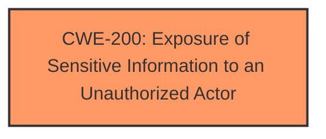

# Enhanced Analysis for CVE-2022-39913

# Summary
| CWE ID  | CWE Name | Confidence | CWE Abstraction Level | CWE Vulnerability Mapping Label | CWE-Vulnerability Mapping Notes |
|-----------------|----------------------------------------------------------------|------------|-------------------------|------------------------------------|--------------------------------------------------|
| **CWE-200** (Primary) | Exposure of Sensitive Information to an Unauthorized Actor | 0.9 | Class | Discouraged | The **rootcause** is **Exposure of Sensitive Information to an Unauthorized Actor**. |

## Evidence and Confidence

*   **Confidence Score:** 0.9
*   **Evidence Strength:** HIGH

## Relationship Analysis
The primary relationship is that CWE-200 [Exposure of Sensitive Information to an Unauthorized Actor] is a high-level Class that could have more specific children. However, in this case, the provided information is very limited and only states that there is **Exposure of Sensitive Information to an Unauthorized Actor**. There are more specific CWEs, such as CWE-359 [Exposure of Private Personal Information to an Unauthorized Actor], but there isn't enough information to say that this vulnerability specifically exposed private personal information.



## Vulnerability Chain
The vulnerability chain is simply the **rootcause** leading to the impact:
  - **Root Cause:** **Exposure of Sensitive Information to an Unauthorized Actor**
  - **Impact:** Access to user profiles information

## Summary of Analysis
The initial analysis identified CWE-200 [Exposure of Sensitive Information to an Unauthorized Actor] as the most likely candidate, based on the vulnerability description which explicitly states **Exposure of Sensitive Information to an Unauthorized Actor**. The retriever results also list CWE-200 as the top result.

The MITRE mapping guidance for CWE-200 [Exposure of Sensitive Information to an Unauthorized Actor] discourages its use, stating that it's often misused and that other options are often available. However, given the limited information provided in the vulnerability description and the lack of specific details about *how* the information is exposed, CWE-200 [Exposure of Sensitive Information to an Unauthorized Actor] remains the most appropriate choice, as it directly reflects the described weakness. It's a Class level CWE, and it would be more ideal to have a Base or Variant CWE to map to. However, in this case it is the best match.

Relevant CWE Information:
- Vulnerability Description: **Exposure of Sensitive Information to an Unauthorized Actor** in Persona Manager prior to Android T(13) allows local attacker to access user profiles information.
- Vulnerability Description Key Phrases: **rootcause:** **Exposure of Sensitive Information to an Unauthorized Actor**


## CWE Relationship Analysis

Current CWEs represent these abstraction levels: .


### Vulnerability Chain Analysis

**Chain starting from CWE-200:**
- 200 (Exposure of Sensitive Information to an Unauthorized Actor) - ROOT


**Chain starting from CWE-359:**
- 359 (Exposure of Private Personal Information to an Unauthorized Actor) - ROOT


### CWE Relationship Diagram

```mermaid
graph TD
    classDef primary fill:#f96,stroke:#333,stroke-width:2px
    classDef secondary fill:#69f,stroke:#333
    classDef tertiary fill:#9e9,stroke:#333
```