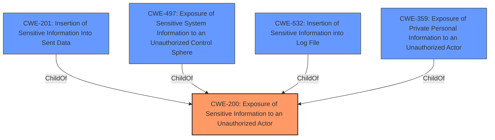

# Analysis Report for CVE-2022-39914

# Vulnerability Analysis Report: CVE-2022-39914

## Description


## Analysis (with Relationship Data)

# Summary
| CWE ID | CWE Name | Confidence | CWE Abstraction Level | CWE Vulnerability Mapping Label | CWE-Vulnerability Mapping Notes |
|---|---|---|---|---|---|
| CWE-200 | Exposure of Sensitive Information to an Unauthorized Actor | 0.9 | Class | Primary | Discouraged because it's a high-level class, but appropriate given available information. |

## Evidence and Confidence

*   **Confidence Score:** 0.9
*   **Evidence Strength:** MEDIUM

## Relationship Analysis
The primary relationship that influenced my decision was the ChildOf relationship between several more specific CWEs (e.g., CWE-201, CWE-497, CWE-532) and the broader CWE-200. While ideally, a more specific CWE would be chosen, the information provided does not give enough detail to select a more precise classification. The Retriever results and the explicit mention of "**Exposure of Sensitive Information from an Unauthorized Actor**" in the Vulnerability Description Key Phrases make CWE-200 the most suitable, albeit general, option.



## Vulnerability Chain
The vulnerability chain appears to be:

1.  **ROOT CAUSE:** **Exposure of Sensitive Information from an Unauthorized Actor**
2.  IMPACT: Access to connected DLNA device information.

The chain is relatively short, with the **exposure** leading directly to unauthorized access.

## Summary of Analysis
The initial analysis strongly suggests CWE-200 as the primary weakness, given the explicit mention in the vulnerability description and the retriever results.

The vulnerability description explicitly mentions "**Exposure of Sensitive Information from an Unauthorized Actor**" as the root cause. The impact is that a local attacker can access connected DLNA device information. This directly aligns with the description of CWE-200, which states: "The product exposes sensitive information to an actor that is not explicitly authorized to have access to that information."

While CWE-200 is a Class-level CWE and discouraged for direct mapping, the provided information lacks the specificity needed to choose a more detailed Base or Variant level CWE. The retriever results list several more specific CWEs (e.g., CWE-201, CWE-497, CWE-532), but without knowing *how* the sensitive information is being exposed, it's impossible to select one of these more specific options with confidence.

Therefore, I am assigning CWE-200 as the primary CWE, with the understanding that more information could lead to a more precise classification.


## CWE Relationship Analysis

Current CWEs represent these abstraction levels: .


### Vulnerability Chain Analysis

**Chain starting from CWE-201:**
- 201 (Insertion of Sensitive Information Into Sent Data) - ROOT


**Chain starting from CWE-200:**
- 200 (Exposure of Sensitive Information to an Unauthorized Actor) - ROOT


### CWE Relationship Diagram

```mermaid
graph TD
    classDef primary fill:#f96,stroke:#333,stroke-width:2px
    classDef secondary fill:#69f,stroke:#333
    classDef tertiary fill:#9e9,stroke:#333
```


*Report generated on 2025-03-30 20:11:55*
