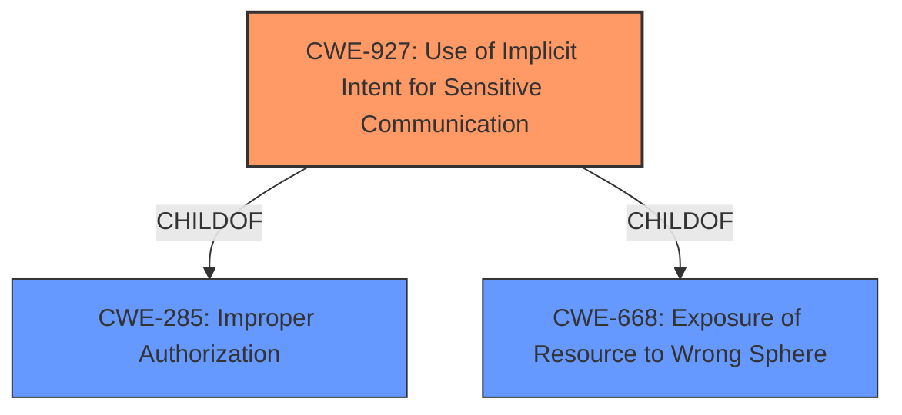

# Enhanced Analysis for CVE-2022-39915

# Summary
| CWE ID | CWE Name | Confidence | CWE Abstraction Level | CWE Vulnerability Mapping Label | CWE-Vulnerability Mapping Notes |
|---|---|---|---|---|---|
| CWE-927 | Use of Implicit Intent for Sensitive Communication | 0.9 | Variant | Allowed | Primary CWE |
| CWE-285 | Improper Authorization | 0.6 | Class | Discouraged | Secondary Candidate |

## Evidence and Confidence

*   **Confidence Score:** 0.9
*   **Evidence Strength:** HIGH

## Relationship Analysis
The primary relationship influencing my decision is that CWE-927 is a child of CWE-285. CWE-927 is at the Variant level of abstraction, which is a preferred level for mapping. CWE-285 is a Class, which is discouraged, and is a parent of CWE-927. I selected the child because it was more specific, based on the description.



## Vulnerability Chain
The vulnerability chain starts with **improper access control** leading to the exposure of sensitive information via implicit intent.

## Summary of Analysis
The initial analysis focused on the **improper access control** combined with the use of implicit intents. The description explicitly mentions "attackers to access sensitive information via implicit intent". This points directly to CWE-927, Use of Implicit Intent for Sensitive Communication, as the primary weakness.

The relationship graph shows that CWE-927 is a child of CWE-285, Improper Authorization, and CWE-668, Exposure of Resource to Wrong Sphere. While **improper access control** might initially suggest CWE-285, the specific use of implicit intent for sensitive communication makes CWE-927 a more precise and appropriate classification.

The evidence for this decision is found in the Vulnerability Description Key Phrases, specifically:

*   **rootcause:** **Improper access control**
*   **impact:** access sensitive information
*   **vector:** implicit intent

These phrases align perfectly with the description of CWE-927, which focuses on the use of implicit intents for transmitting sensitive data.

I have chosen CWE-927 because it is the most specific CWE based on the provided evidence.

Relevant CWE Information:

# Enhanced Context (25 CWEs)
The following CWEs were identified as potentially relevant to this vulnerability:

## CWE-927: Use of Implicit Intent for Sensitive Communication
**Abstraction Level**: Variant
**Similarity Score**: 5511.44
**Source**: sparse

**Description**:
The Android application uses an implicit intent for transmitting sensitive data to other applications.

**Mapping Guidance**:
- Usage: Allowed
- Rationale: This CWE entry is at the Variant level of abstraction, which is a preferred level of abstraction for mapping to the root causes of vulnerabilities.

## CWE-285: Improper Authorization
**Abstraction Level**: Class
**Similarity Score**: 5573.53
**Source**: sparse

**Description**:
The product does not perform or incorrectly performs an authorization check when an actor attempts to access a resource or perform an action.

**Mapping Guidance**:
- Usage: Discouraged
- Rationale: CWE-285 is high-level and lower-level CWEs can frequently be used instead. It is a level-1 Class (i.e., a child of a Pillar).

## CWE-927: Use of Implicit Intent for Sensitive Communication

**CWE-927: Use of Implicit Intent for Sensitive Communication** is the primary CWE. The vulnerability description clearly states that the issue is related to **improper access control** and the use of implicit intents, which directly matches the description of CWE-927. This CWE is at the Variant level of abstraction, which is preferred. The security implication is that untrusted applications could potentially obtain sensitive data. The mapping guidance allows for this CWE.

## CWE-285: Improper Authorization

**CWE-285: Improper Authorization** was considered as a candidate, but it is less specific than CWE-927. While the vulnerability description mentions **improper access control**, which aligns with CWE-285, the use of implicit intents provides a more precise classification with CWE-927. Also the Mapping Guidance is Discouraged.


## CWE Relationship Analysis

Current CWEs represent these abstraction levels: .


### Vulnerability Chain Analysis

**Chain starting from CWE-285:**
- 285 (Improper Authorization) - ROOT


**Chain starting from CWE-668:**
- 668 (Exposure of Resource to Wrong Sphere) - ROOT


### CWE Relationship Diagram

```mermaid
graph TD
    classDef primary fill:#f96,stroke:#333,stroke-width:2px
    classDef secondary fill:#69f,stroke:#333
    classDef tertiary fill:#9e9,stroke:#333
```