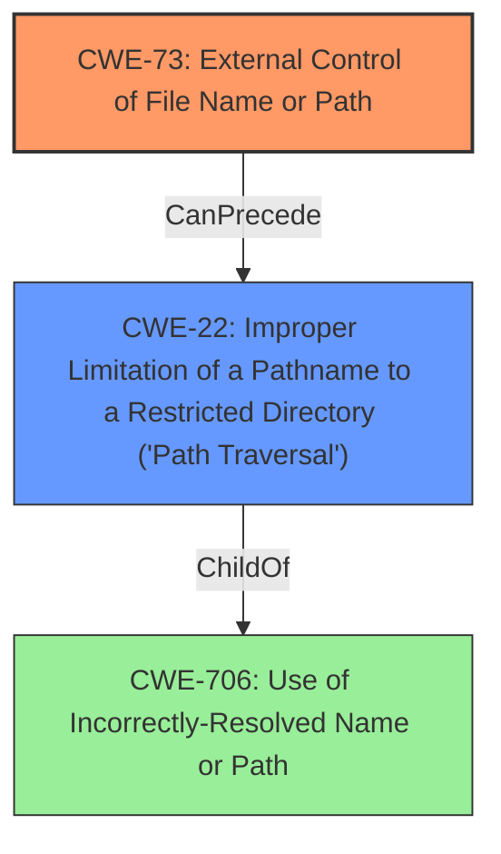

# Enhanced Analysis for CVE-2022-39952

# Summary
| CWE ID | CWE Name | Confidence | CWE Abstraction Level | CWE Vulnerability Mapping Label | CWE-Vulnerability Mapping Notes |
|---|---|---|---|---|---|
| CWE-73 | External Control of File Name or Path | 1 | Base | Allowed | Primary CWE |
| CWE-22 | Improper Limitation of a Pathname to a Restricted Directory ('Path Traversal') | 0.7 | Base | Allowed | Secondary Candidate |

## Evidence and Confidence

*   **Confidence Score:** 0.9
*   **Evidence Strength:** HIGH

## Relationship Analysis
The primary CWE is CWE-73, which represents the **external control of file name or path**. CWE-73 can precede CWE-22 (Improper Limitation of a Pathname to a Restricted Directory). CWE-22 is a child of CWE-706 (Use of Incorrectly-Resolved Name or Path).



## Vulnerability Chain
The vulnerability chain starts with the **external control of the file name or path** (CWE-73). This can then lead to path traversal (CWE-22) if the application doesn't properly limit the pathname to a restricted directory. The final impact is the execution of unauthorized code or commands.

## Summary of Analysis
The analysis indicates that the primary weakness is **external control of the file name or path** (CWE-73), which allows an unauthenticated attacker to execute unauthorized code or commands. This is supported by the vulnerability description, which states "**external control of file name or path**" as the root cause, and the CVE Reference Links Content Summary, which confirms that the root cause is an **external control of file name or path** vulnerability in the FortiNAC webserver. The attacker can control the file name or path during a file upload process, leading to arbitrary file write and subsequent execution of unauthorized code.

The selection of CWE-73 is based on the explicit mention of "**external control of file name or path**" in both the vulnerability description and the CVE reference. This direct evidence supports the choice of CWE-73 as the primary weakness.

CWE-22 (Improper Limitation of a Pathname to a Restricted Directory) is considered as a secondary candidate because the **external control of the file name or path** could lead to path traversal if the application doesn't properly validate the path. However, the provided description focuses primarily on the **external control** aspect.

The selected CWEs are at the optimal level of specificity. CWE-73 is a Base level CWE, which is preferred, and it directly represents the root cause described in the vulnerability.
# Relevant CWE Information:
## CWE-113: Improper Neutralization of CRLF Sequences in HTTP Headers ('HTTP Request/Response Splitting')
**Abstraction Level**: Variant
**Similarity Score**: 0.78

This CWE is not relevant as there is no mention of HTTP header manipulation in the vulnerability description.

## CWE-41: Improper Resolution of Path Equivalence
**Abstraction Level**: Base
**Similarity Score**: 0.75

This CWE is not relevant as the vulnerability description does not indicate path equivalence issues.

## CWE-23: Relative Path Traversal
**Abstraction Level**: Base
**Similarity Score**: 0.75

CWE-23 is considered a secondary candidate as the **external control of file name or path** (CWE-73) could potentially lead to relative path traversal if the application doesn't properly sanitize the input. However, the primary issue is the ability to control the file name or path.

## CWE-73: External Control of File Name or Path
**Abstraction Level**: Base
**Similarity Score**: 0.75

This is the primary CWE as the vulnerability description explicitly states "**external control of file name or path**" as the root cause.

## CWE-74: Improper Neutralization of Special Elements in Output Used by a Downstream Component ('Injection')
**Abstraction Level**: Class
**Similarity Score**: 0.75

This CWE is too generic. While the vulnerability involves injection, a more specific CWE is available (CWE-73).

## CWE-59: Improper Link Resolution Before File Access ('Link Following')
**Abstraction Level**: Base
**Similarity Score**: 0.74

This CWE is not relevant as the vulnerability description doesn't mention link following.

## CWE-93: Improper Neutralization of CRLF Sequences ('CRLF Injection')
**Abstraction Level**: Base
**Similarity Score**: 0.73

This CWE is not relevant as the vulnerability description doesn't mention CRLF injection.

## CWE-184: Incomplete List of Disallowed Inputs
**Abstraction Level**: Base
**Similarity Score**: 0.73

This CWE is not relevant as the vulnerability description doesn't suggest an incomplete list of disallowed inputs is the cause.

## CWE-1289: Improper Validation of Unsafe Equivalence in Input
**Abstraction Level**: Base
**Similarity Score**: 0.73

This CWE is not relevant as the vulnerability description doesn't suggest unsafe equivalence in input.

## CWE-36: Absolute Path Traversal
**Abstraction Level**: Base
**Similarity Score**: 0.72

This CWE is not relevant as the vulnerability description doesn't specifically mention absolute path traversal.

## CWE-427: Uncontrolled Search Path Element
**Abstraction Level**: Base
**Similarity Score**: 7095.58

This CWE is not relevant as the vulnerability description doesn't involve uncontrolled search paths.

## CWE-78: Improper Neutralization of Special Elements used in an OS Command ('OS Command Injection')
**Abstraction Level**: base
**Similarity Score**: 5.03

This CWE is not relevant as the primary issue is the **external control of the file name or path**, rather than direct OS command injection. The OS command execution is a consequence of the arbitrary file write.

## CWE-98: Improper Control of Filename for Include/Require Statement in PHP Program ('PHP Remote File Inclusion')
**Abstraction Level**: variant
**Similarity Score**: 4.53

This CWE is specific to PHP and doesn't directly align with the vulnerability described.

## CWE-434: Unrestricted Upload of File with Dangerous Type
**Abstraction Level**: base
**Similarity Score**: 4.33

This CWE is relevant as it is related to file uploads but the root cause of the vulnerability isn't the dangerous file type but rather the ability to control the file name and path, hence CWE-73 is more specific.

## CWE-94: Improper Control of Generation of Code ('Code Injection')
**Abstraction Level**: base
**Similarity Score**: 4.33

This CWE is related to code injection. While the impact includes the execution of unauthorized code, the root cause isn't directly related to code injection but to the control of file names and paths.

## CWE-117: Improper Output Neutralization for Logs
**Abstraction Level**: base
**Similarity Score**: 4.33

This CWE is not relevant as there is no mention of improper output neutralization for logs.

## CWE-426: Untrusted Search Path
**Abstraction Level**: base
**Similarity Score**: 3.64

This CWE is not relevant as the vulnerability doesn't involve untrusted search paths.

## CWE-428: Unquoted Search Path or Element
**Abstraction Level**: base
**Similarity Score**: 3.64

This CWE is not relevant as the vulnerability doesn't involve unquoted search paths.

## CWE-88: Improper Neutralization of Argument Delimiters in a Command ('Argument Injection')
**Abstraction Level**: base
**Similarity Score**: 3.64

This CWE is not relevant as the vulnerability isn't directly related to argument injection.

## CWE-843: Access of Resource Using Incompatible Type ('Type Confusion')
**Abstraction Level**: base
**Similarity Score**: 3.44

This CWE is not relevant as the vulnerability doesn't involve type confusion.


## CWE Relationship Analysis

Current CWEs represent these abstraction levels: .


### Vulnerability Chain Analysis

**Chain starting from CWE-41:**
- 41 (Improper Resolution of Path Equivalence) - ROOT


**Chain starting from CWE-78:**
- 78 (Improper Neutralization of Special Elements used in an OS Command ('OS Command Injection')) - ROOT


### CWE Relationship Diagram

```mermaid
graph TD
    classDef primary fill:#f96,stroke:#333,stroke-width:2px
    classDef secondary fill:#69f,stroke:#333
    classDef tertiary fill:#9e9,stroke:#333
```