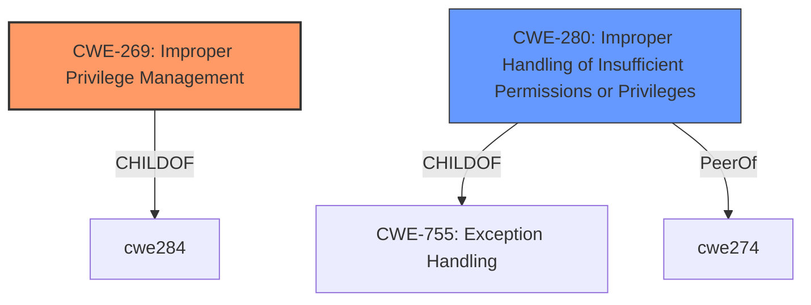

# Raw Analyzer Response for CVE-2022-39953

# Summary
| CWE ID  | CWE Name                                                      | Confidence | CWE Abstraction Level | CWE Vulnerability Mapping Label | CWE-Vulnerability Mapping Notes |
| :-------- | :------------------------------------------------------------ | :---------- | :---------------------- | :------------------------------ | :-------------------------------- |
| CWE-269   | Improper Privilege Management                                 | 1          | Class                   | Primary                         | Discouraged                       |
| CWE-280   | Improper Handling of Insufficient Permissions or Privileges   | 0.75       | Base                    | Secondary                       | Allowed                           |

## Evidence and Confidence

*   **Confidence Score:** 0.88
*   **Evidence Strength:** HIGH

## Relationship Analysis
The primary CWE identified is CWE-269, which is a Class-level CWE. While discouraged for direct mapping, it accurately reflects the high-level nature of the **improper privilege management** described in the vulnerability. The secondary CWE, CWE-280, a Base-level CWE, describes the scenario where the system doesn't properly handle insufficient privileges, which can lead to unexpected code paths.

## Vulnerability Chain
The chain starts with **improper privilege management** (CWE-269), leading to a low-privilege user being able to execute arbitrary commands as root. This leads to privilege escalation and full system control.

## Summary of Analysis
The initial assessment focused on the description of **improper privilege management** leading to privilege escalation. The CVE Reference Links Content Summary confirms this, stating that "a low privilege local user with shell access can execute arbitrary commands as root due to a flaw in how FortiNAC manages privileges. This is identified as CWE-269 (Improper Privilege Management)."

CWE-269 is a Class-level CWE and is discouraged for direct mapping according to MITRE's guidance. However, in this case, the description focuses on the high-level problem of **improper privilege management**. While more specific CWEs exist, such as those related to incorrect permission assignments (e.g., CWE-732), the provided information doesn't offer enough detail to pinpoint the exact mechanism of the privilege management failure. Therefore, CWE-269 is the most appropriate primary mapping, despite being a Class.

CWE-280 was considered as a secondary mapping because the FortiNAC system doesn't handle the scenario where a user has insufficient privileges. This can be viewed as the system not properly handling the lack of necessary permissions, leading to the vulnerability.

The selection of CWE-269 is justified by the explicit mention of **improper privilege management** as the root cause in both the vulnerability description and the CVE Reference Links Content Summary. The confidence score is high (0.88) due to the clear and direct evidence supporting this classification.

Relevant CWE Information:

# Enhanced Context (25 CWEs)
The following CWEs were identified as potentially relevant to this vulnerability:

## CWE-269: Improper Privilege Management
**Abstraction:** Class
**Status:** Draft

### Description
The product does not properly assign, modify, track, or check privileges for an actor, creating an unintended sphere of control for that actor.

### Extended Description
Not provided

### Alternative Terms
None

### Relationships
ChildOf -> CWE-284

### Mapping Guidance
**Usage:** Discouraged
**Rationale:** CWE-269 is commonly misused. It can be conflated with "privilege escalation," which is a technical impact that is listed in many low-information vulnerability reports [REF-1287]. It is not useful for trend analysis.
**Comments:** If an error or mistake allows privilege escalation, then use the CWE ID for that mistake. Avoid using CWE-269 when only phrases such as "privilege escalation" or "gain privileges" are available, as these indicate technical impact of the vulnerability - not the root cause weakness. If the root cause seems to be directly related to privileges, then examine the children of CWE-269 for additional hints, such as Execution with Unnecessary Privileges (CWE-250) or Incorrect Privilege Assignment (CWE-266).
**Reasons:**
- Frequent Misuse

### Additional Notes
**[Maintenance]** The relationships between privileges, permissions, and actors (e.g. users and groups) need further refinement within the Research view. One complication is that these concepts apply to two different pillars, related to control of resources (CWE-664) and protection mechanism failures (CWE-693).

### Observed Examples
- **CVE-2001-1555:** Terminal privileges are not reset when a user logs out.
- **CVE-2001-1514:** Does not properly pass security context to child processes in certain cases, allows privilege escalation.
- **CVE-2001-0128:** Does not properly compute roles.