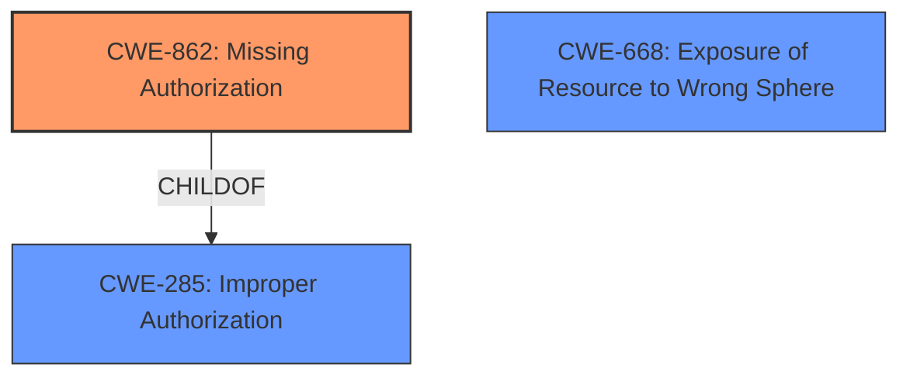

# Analysis for CVE-2022-39975

# Summary
| CWE ID  | CWE Name                      | Confidence | CWE Abstraction Level | CWE Vulnerability Mapping Label | CWE-Vulnerability Mapping Notes |
|---------|-------------------------------|------------|-----------------------|---------------------------------|---------------------------------|
| CWE-862 | Missing Authorization         | 1.0        | Class                 | Primary                          | Allowed-with-Review              |
| CWE-668 | Exposure of Resource to Wrong Sphere | 0.75     | Class                | Secondary                       | Discouraged          |

## Evidence and Confidence

*   **Confidence Score:** 0.9
*   **Evidence Strength:** HIGH

## Relationship Analysis
The primary relationship influencing the CWE selection is that CWE-862 **Missing Authorization** is a child of the higher-level CWE-285 **Improper Authorization**. However, since the description explicitly states that the system **does not check user permission**, CWE-862 is a more accurate and specific classification than its parent. CWE-863 **Incorrect Authorization** was also considered but not selected as the system **does not check** which indicates a missing check, rather than an incorrect check. CWE-668 was added as a secondary mapping candidate, with the rationale that the unpublished content pages are being exposed to the wrong sphere (unauthorized users).

## Vulnerability Chain
The vulnerability chain consists of the following:
1.  **Root Cause:** **Missing Authorization** (CWE-862) - The Layout module **does not check user permission** before showing the preview.
2.  **Impact:** Information Disclosure - Attackers can view unpublished Content Page pages.
The chain is relatively direct, with the missing authorization leading directly to information disclosure.

## Summary of Analysis
The initial analysis focused on the **root cause** identified in the vulnerability description: the Layout module **does not check user permission** before showing the preview. This immediately suggested CWE-862 **Missing Authorization**. The retriever results and complete CWE specifications were then reviewed to validate this choice.

The primary CWE is based on the evidence that the system **does not check** permissions:
> The Layout module in Liferay Portal v7.3.3 through v7.4.3.34, and Liferay DXP 7.3 before update 10, and 7.4 before update 35 **does not check user permission before showing the preview of a Content Page type page**

The relationship analysis confirmed that CWE-862 is a child of CWE-285 **Improper Authorization**, but the more specific **Missing Authorization** is more appropriate.

The selected CWE is at the optimal level of specificity because it directly reflects the **root cause** of the vulnerability as described.
The additional CWE-668 reflects the impact of the vulnerability, with the unpublished content pages being exposed to unauthorized users.

Relevant CWE Information:

# Enhanced Context (25 CWEs)
The following CWEs were identified as potentially relevant to this vulnerability:

## CWE-639: Authorization Bypass Through User-Controlled Key
**Abstraction Level**: Base
**Similarity Score**: 0.77
**Source**: dense

**Description**:
The system's authorization functionality does not prevent one user from gaining access to another user's data or record by modifying the key value identifying the data.

**Mapping Guidance**:
- Usage: Allowed
- Rationale: This CWE entry is at the Base level of abstraction, which is a preferred level of abstraction for mapping to the root causes of vulnerabilities.

## CWE-862: Missing Authorization
**Abstraction Level**: Class
**Similarity Score**: 0.392
**Source**: sparse

**Description**:
The product does not perform an authorization check when an actor attempts to access a resource or perform an action.

**Mapping Guidance**:
- Usage: Allowed-with-Review
- Rationale: This CWE entry is a Class and might have Base-level children that would be more appropriate

## CWE-668: Exposure of Resource to Wrong Sphere
**Abstraction Level**: Class
**Similarity Score**: 0.75
**Source**: dense

**Description**:
The product exposes a resource to the wrong control sphere, providing unintended actors with inappropriate access to the resource.

**Mapping Guidance**:
- Usage: Discouraged
- Rationale: CWE-668 is high-level and is often misused as a catch-all when lower-level CWE IDs might be applicable. It is sometimes used for low-information vulnerability reports [REF-1287]. It is a level-1 Class (i.e., a child of a Pillar). It is not useful for trend analysis.