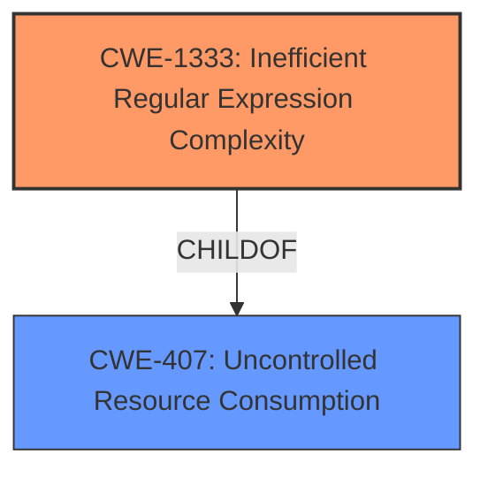

# Enhanced Analysis for CVE-2022-40023

# Summary
| CWE ID | CWE Name | Confidence | CWE Abstraction Level | CWE Vulnerability Mapping Label | CWE-Vulnerability Mapping Notes |
|---|---|---|---|---|---|
| CWE-1333 | Inefficient Regular Expression Complexity | 1.0 | Base | Allowed | Primary CWE |

## Evidence and Confidence

*   **Confidence Score:** 1.0
*   **Evidence Strength:** HIGH

## Relationship Analysis
The primary relationship that influenced the decision was the direct match of the vulnerability to the description of CWE-1333. CWE-1333 is a Base level CWE, which is the preferred level of abstraction. There are other potential CWEs involving regular expressions, such as CWE-625, CWE-185, and CWE-777, but CWE-1333 most accurately describes the root cause of the vulnerability. The other relationships are not relevant.



## Vulnerability Chain
The chain of events for this vulnerability is as follows:
1.  **Root Cause:** CWE-1333 (**Inefficient Regular Expression Complexity**) - The Mako template engine uses a regular expression that has exponential worst-case computational complexity.
2.  **Impact:** Denial of Service (DoS) - An attacker can provide a crafted input that causes the regular expression to consume excessive CPU cycles, leading to a denial of service.

## Summary of Analysis
The initial assessment identified CWE-1333 as the primary candidate, which aligns with the vulnerability description and the provided CVE details. The "**weakness:** **Regular expression Denial of Service**" phrase from the "Vulnerability Description Key Phrases" section is a clear indicator. Additionally, the "CVE Reference Links Content Summary" confirms that the root cause is a poorly constructed regular expression susceptible to backtracking, causing excessive CPU consumption, which aligns perfectly with CWE-1333.
The relationship analysis confirms the selection of CWE-1333 because it is a base level CWE which is the most specific to the **inefficient regular expression**.
The final decision is based on the direct evidence provided in the vulnerability description and the supporting CVE details, making CWE-1333 the most appropriate and specific classification.

Relevant CWE Information:

# Enhanced Context (25 CWEs)
The following CWEs were identified as potentially relevant to this vulnerability:

## CWE-625: Permissive Regular Expression
**Abstraction Level**: Base

## CWE-185: Incorrect Regular Expression
**Abstraction Level**: Class

## CWE-186: Overly Restrictive Regular Expression
**Abstraction Level**: Base

## CWE-1333: Inefficient Regular Expression Complexity
**Abstraction Level**: Base

## CWE-777: Regular Expression without Anchors
**Abstraction Level**: Variant

## CWE-1289: Improper Validation of Unsafe Equivalence in Input
**Abstraction Level**: Base

## CWE-184: Incomplete List of Disallowed Inputs
**Abstraction Level**: Base

## CWE-138: Improper Neutralization of Special Elements
**Abstraction Level**: Class

## CWE-74: Improper Neutralization of Special Elements in Output Used by a Downstream Component ('Injection')
**Abstraction Level**: Class

## CWE-183: Permissive List of Allowed Inputs
**Abstraction Level**: Base

## CWE-1333: Inefficient Regular Expression Complexity
**Abstraction Level**: Base

## CWE-617: Reachable Assertion
**Abstraction Level**: Base

## CWE-625: Permissive Regular Expression
**Abstraction Level**: Base

## CWE-943: Improper Neutralization of Special Elements in Data Query Logic
**Abstraction Level**: Class

## CWE-626: Null Byte Interaction Error (Poison Null Byte)
**Abstraction Level**: Variant

## CWE-187: Partial String Comparison
**Abstraction Level**: variant

## CWE-182: Collapse of Data into Unsafe Value
**Abstraction Level**: base

## CWE-471: Modification of Assumed-Immutable Data (MAID)
**Abstraction Level**: base

## CWE-1321: Improperly Controlled Modification of Object Prototype Attributes ('Prototype Pollution')
**Abstraction Level**: variant

## CWE-35: Path Traversal: '.../...//'
**Abstraction Level**: variant

## CWE-34: Path Traversal: '....//'
**Abstraction Level**: variant

## CWE-33: Path Traversal: '....' (Multiple Dot)
**Abstraction Level**: variant

## CWE-183: Permissive List of Allowed Inputs
**Abstraction Level**: Base

## CWE-184: Incomplete List of Disallowed Inputs
**Abstraction Level**: Base

## CWE-434: Unrestricted Upload of File with Dangerous Type
**Abstraction Level**: base

**CWE-1333**: **Inefficient Regular Expression Complexity** - The product uses a regular expression with an inefficient, possibly exponential worst-case computational complexity that consumes excessive CPU cycles. This aligns directly with the vulnerability, where a poorly constructed regular expression in the Mako template engine leads to excessive backtracking and CPU consumption, causing a denial of service. The CVE summary also has the CWE-1333.

**CWE-617**: **Reachable Assertion** - The product contains an assert() or similar statement that can be triggered by an attacker, which leads to an application exit or other behavior that is more severe than necessary. This is not the primary issue, as the vulnerability is not directly related to an assertion failure.

**CWE-674**: **Uncontrolled Recursion** - The product does not properly control the amount of recursion that takes place, consuming excessive resources, such as allocated memory or the program stack. While ReDoS can cause recursion, the primary issue is the regular expression itself, not the recursion.

**CWE-185**: **Incorrect Regular Expression** - The product specifies a regular expression in a way that causes data to be improperly matched or compared. While the regular expression is incorrect, the primary issue is the inefficiency leading to excessive CPU consumption, not incorrect matching.

**CWE-777**: **Regular Expression without Anchors** - The product uses a regular expression to perform neutralization, but the regular expression is not anchored and may allow malicious or malformed data to slip through. This is not relevant as the vulnerability does not involve neutralization or missing anchors.

**CWE-625**: **Permissive Regular Expression** - The product uses a regular expression that does not sufficiently restrict the set of allowed values. While related to regular expressions, the core issue is the inefficiency and complexity, not the permissiveness of the expression.


## CWE Relationship Analysis

Current CWEs represent these abstraction levels: .


### Vulnerability Chain Analysis

**Chain starting from CWE-138:**
- 138 (Improper Neutralization of Special Elements) - ROOT


**Chain starting from CWE-33:**
- 33 (Path Traversal: '....' (Multiple Dot)) - ROOT


### CWE Relationship Diagram

```mermaid
graph TD
    classDef primary fill:#f96,stroke:#333,stroke-width:2px
    classDef secondary fill:#69f,stroke:#333
    classDef tertiary fill:#9e9,stroke:#333
```