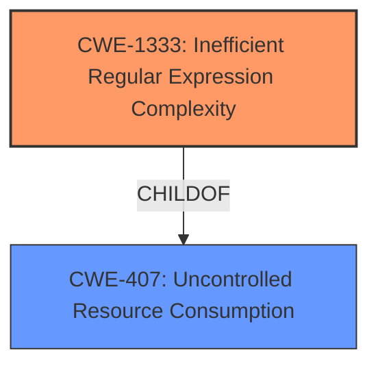

# Analysis for CVE-2022-40023

# Summary
| CWE ID | CWE Name | Confidence | CWE Abstraction Level | CWE Vulnerability Mapping Label | CWE-Vulnerability Mapping Notes |
|---|---|---|---|---|---|
| CWE-1333 | Inefficient Regular Expression Complexity | 1.0 | Base | Allowed | Primary CWE |

## Evidence and Confidence

*   **Confidence Score:** 1.0
*   **Evidence Strength:** HIGH

## Relationship Analysis
The primary relationship that influenced the decision was the direct match of the vulnerability to the description of CWE-1333. CWE-1333 is a Base level CWE, which is the preferred level of abstraction. There are other potential CWEs involving regular expressions, such as CWE-625, CWE-185, and CWE-777, but CWE-1333 most accurately describes the root cause of the vulnerability. The other relationships are not relevant.

## Vulnerability Chain
The chain of events for this vulnerability is as follows:
1.  **Root Cause:** CWE-1333 (**Inefficient Regular Expression Complexity**) - The Mako template engine uses a regular expression that has exponential worst-case computational complexity.
2.  **Impact:** Denial of Service (DoS) - An attacker can provide a crafted input that causes the regular expression to consume excessive CPU cycles, leading to a denial of service.

## Summary of Analysis
The initial assessment identified CWE-1333 as the primary candidate, which aligns with the vulnerability description and the provided CVE details. The "**weakness:** **Regular expression Denial of Service**" phrase from the "Vulnerability Description Key Phrases" section is a clear indicator. Additionally, the "CVE Reference Links Content Summary" confirms that the root cause is a poorly constructed regular expression susceptible to backtracking, causing excessive CPU consumption, which aligns perfectly with CWE-1333.
The relationship analysis confirms the selection of CWE-1333 because it is a base level CWE which is the most specific to the **inefficient regular expression**.
The final decision is based on the direct evidence provided in the vulnerability description and the supporting CVE details, making CWE-1333 the most appropriate and specific classification.

Relevant CWE Information:

# Enhanced Context (25 CWEs)
The following CWEs were identified as potentially relevant to this vulnerability:

## CWE-625: Permissive Regular Expression
**Abstraction Level**: Base

## CWE-185: Incorrect Regular Expression
**Abstraction Level**: Class

## CWE-186: Overly Restrictive Regular Expression
**Abstraction Level**: Base

## CWE-1333: Inefficient Regular Expression Complexity
**Abstraction Level**: Base

## CWE-777: Regular Expression without Anchors
**Abstraction Level**: Variant

## CWE-1289: Improper Validation of Unsafe Equivalence in Input
**Abstraction Level**: Base

## CWE-184: Incomplete List of Disallowed Inputs
**Abstraction Level**: Base

## CWE-138: Improper Neutralization of Special Elements
**Abstraction Level**: Class

## CWE-74: Improper Neutralization of Special Elements in Output Used by a Downstream Component ('Injection')
**Abstraction Level**: Class

## CWE-183: Permissive List of Allowed Inputs
**Abstraction Level**: Base

## CWE-1333: Inefficient Regular Expression Complexity
**Abstraction Level**: Base

## CWE-617: Reachable Assertion
**Abstraction Level**: Base

## CWE-625: Permissive Regular Expression
**Abstraction Level**: Base

## CWE-943: Improper Neutralization of Special Elements in Data Query Logic
**Abstraction Level**: Class

## CWE-626: Null Byte Interaction Error (Poison Null Byte)
**Abstraction Level**: Variant

## CWE-187: Partial String Comparison
**Abstraction Level**: variant

## CWE-182: Collapse of Data into Unsafe Value
**Abstraction Level**: base

## CWE-471: Modification of Assumed-Immutable Data (MAID)
**Abstraction Level**: base

## CWE-1321: Improperly Controlled Modification of Object Prototype Attributes ('Prototype Pollution')
**Abstraction Level**: variant

## CWE-35: Path Traversal: '.../...//'
**Abstraction Level**: variant

## CWE-34: Path Traversal: '....//'
**Abstraction Level**: variant

## CWE-33: Path Traversal: '....' (Multiple Dot)
**Abstraction Level**: variant

## CWE-183: Permissive List of Allowed Inputs
**Abstraction Level**: Base

## CWE-184: Incomplete List of Disallowed Inputs
**Abstraction Level**: Base

## CWE-434: Unrestricted Upload of File with Dangerous Type
**Abstraction Level**: base

**CWE-1333**: **Inefficient Regular Expression Complexity** - The product uses a regular expression with an inefficient, possibly exponential worst-case computational complexity that consumes excessive CPU cycles. This aligns directly with the vulnerability, where a poorly constructed regular expression in the Mako template engine leads to excessive backtracking and CPU consumption, causing a denial of service. The CVE summary also has the CWE-1333.

**CWE-617**: **Reachable Assertion** - The product contains an assert() or similar statement that can be triggered by an attacker, which leads to an application exit or other behavior that is more severe than necessary. This is not the primary issue, as the vulnerability is not directly related to an assertion failure.

**CWE-674**: **Uncontrolled Recursion** - The product does not properly control the amount of recursion that takes place, consuming excessive resources, such as allocated memory or the program stack. While ReDoS can cause recursion, the primary issue is the regular expression itself, not the recursion.

**CWE-185**: **Incorrect Regular Expression** - The product specifies a regular expression in a way that causes data to be improperly matched or compared. While the regular expression is incorrect, the primary issue is the inefficiency leading to excessive CPU consumption, not incorrect matching.

**CWE-777**: **Regular Expression without Anchors** - The product uses a regular expression to perform neutralization, but the regular expression is not anchored and may allow malicious or malformed data to slip through. This is not relevant as the vulnerability does not involve neutralization or missing anchors.

**CWE-625**: **Permissive Regular Expression** - The product uses a regular expression that does not sufficiently restrict the set of allowed values. While related to regular expressions, the core issue is the inefficiency and complexity, not the permissiveness of the expression.

# Enhanced Query for CVE-2022-40023

## Vulnerability Description
Sqlalchemy mako before 1.2.2 is vulnerable to **Regular expression Denial of Service** when using the Lexer class to parse. This also affects babelplugin and linguaplugin.

### Vulnerability Description Key Phrases
- **weakness:** **Regular expression Denial of Service**
- **product:** Sqlalchemy mako
- **version:** before 1.2.2
- **component:** Lexer class

## CVE Reference Links Content Summary
Based on the provided content, here's a breakdown of the vulnerability described by CVE-2022-40023:

**1. Root Cause:**

*   The vulnerability lies in a regular expression used within the `mako.lexer.Lexer` class to parse template strings. This regex is used to match opening tags (`<% ... %>`).
*   The regex did not correctly handle quoted sections within tags, which could lead to a denial-of-service (DoS) condition. Specifically, it would fail if a tag had a large number of quotes within its quoted sections, and, a large number of unterminated spaces inside a tag.

**2. Weaknesses/Vulnerabilities:**

*   **Regular Expression Denial of Service (ReDoS):** The primary weakness is the poorly constructed regular expression, which is susceptible to backtracking when provided with specially crafted input. This could consume excessive CPU resources, causing a denial of service.
*   The issue is present in the `Lexer` class which is also used by `babelplugin` and `linguaplugin`

**3. Impact of Exploitation:**

*   **Denial of Service (DoS):** An attacker can exploit this vulnerability by providing a malicious template string with a large number of quotes or unterminated spaces within a tag. This would cause the regular expression engine to consume excessive CPU resources, rendering the application or service unresponsive.
*   This could affect web applications utilizing the Mako template engine for parsing user inputs, or any other service that uses `mako.lexer.Lexer` class to parse template strings.

**4. Attack Vectors:**

*   The attack vector is through the parsing of Mako templates. Specifically, an attacker could inject a malicious template string to trigger the vulnerable regular expression in the `Lexer` class.
*   This could occur via user-supplied template strings to a web application, or through other means of providing input to the vulnerable code.
*   The vulnerability can be triggered by calling the Lexer class directly, or indirectly by calling `babelplugin` and `linguaplugin` which make use of the vulnerable `process_file` function from the `MessageExtractor` class.

**5. Required Attacker Capabilities/Position:**

*   **Network Access:** The attacker needs to be able to send malicious input to a system that uses the vulnerable Mako library.
*   **No special privileges:** No authentication or specific privileges are required to exploit this vulnerability. An attacker only needs to provide specially crafted input that triggers the vulnerable regex.
*   **No user interaction**: The vulnerability is triggered by processing the malicious input, without the need for interaction of users of the system.

**Additional Details:**

*   The vulnerability is located in the `match_tag_start` method of the Lexer class.
*   The fix involved correcting the regular expression to properly handle quoted sections within tags.
*   The vulnerability affects versions of Mako prior to 1.2.2. The patched version is 1.2.2.
*   The vulnerability has a CVSS v4 score of 8.7 and a CVSS v3 score of 7.5. The CVSS v4 vector string is `CVSS:4.0/AV:N/AC:L/AT:N/PR:N/UI:N/VC:N/VI:N/VA:H/SC:N/SI:N/SA:N`
*   The CWE associated with this vulnerability is CWE-1333:  Regular Expression Denial of Service.
*   Several projects were affected and required patching due to this vulnerability, such as `tableau/altimeter`, `camptocamp/shared_config_manager`, `camptocamp/c2cgeoportal`, `camptocamp/tilecloud-chain`, `camptocamp/mapfish-print-logs`, `camptocamp/ngeo`, `camptocamp/c2cwsgiutils`, `yoctoproject/poky`, `openembedded/openembedded-core`, `YoeDistro/poky` and `bcgov/rsbc-digital-forms`.

In summary, CVE-2022-40023 is a ReDoS vulnerability in the Mako template library that can be exploited by providing specially crafted input, leading to denial of service.

## Retriever Results

### Top Combined Results

| Rank | CWE ID | Name | Abstraction | Usage  | Retrievers | Individual Scores |
|------|--------|------|-------------|-------|------------|-------------------|
| 1 | 1333 | Inefficient Regular Expression Complexity | Base | Allowed | alternate_terms | 1.000 |
| 2 | 617 | Reachable Assertion | Base | Allowed | sparse | 0.182 |
| 3 | 674 | Uncontrolled Recursion | Class | Allowed-with-Review | sparse | 0.177 |
| 4 | 185 | Incorrect Regular Expression | Class | Allowed-with-Review | sparse | 0.167 |
| 5 | 777 | Regular Expression without Anchors | Variant | Allowed | sparse | 0.161 |
| 6 | 943 | Improper Neutralization of Special Elements in Data Query Logic | Class | Allowed-with-Review | dense | 0.458 |
| 7 | 182 | Collapse of Data into Unsafe Value | Base | Allowed | graph | 0.002 |
| 8 | 1321 | Improperly Controlled Modification of Object Prototype Attributes ('Prototype Pollution') | Variant | Allowed | sparse | 0.156 |
| 9 | 626 | Null Byte Interaction Error (Poison Null Byte) | Variant | Allowed | sparse | 0.155 |
| 10 | 625 | Permissive Regular Expression | Base | Allowed | sparse | 0.155 |

# Complete CWE Specifications

## CWE-1333: Inefficient Regular Expression Complexity
**Abstraction:** Base
**Status:** Draft

### Description
The product uses a regular expression with an inefficient, possibly exponential worst-case computational complexity that consumes excessive CPU cycles.

### Extended Description
Some regular expression engines have a feature called "backtracking". If the token cannot match, the engine "backtracks" to a position that may result in a different token that can match.
 Backtracking becomes a weakness if all of these conditions are met:

  - The number of possible backtracking attempts are exponential relative to the length of the input.

  - The input can fail to match the regular expression.

  - The input can be long enough.

 Attackers can create crafted inputs that intentionally cause the regular expression to use excessive backtracking in a way that causes the CPU consumption to spike. 

### Alternative Terms
ReDoS: ReDoS is an abbreviation of "Regular expression Denial of Service".
Regular Expression Denial of Service: While this term is attack-focused, this is commonly used to describe the weakness.
Catastrophic backtracking: This term is used to describe the behavior of the regular expression as a negative technical impact.

### Relationships
ChildOf -> CWE-407
ChildOf -> CWE-407

### Mapping Guidance
**Usage:** Allowed
**Rationale:** This CWE entry is at the Base level of abstraction, which is a preferred level of abstraction for mapping to the root causes of vulnerabilities.
**Comments:** Carefully read both the name and description to ensure that this mapping is an appropriate fit. Do not try to 'force' a mapping to a lower-level Base/Variant simply to comply with this preferred level of abstraction.
**Reasons:**
- Acceptable-Use

### Observed Examples
- **CVE-2020-5243:** server allows ReDOS with crafted User-Agent strings, due to overlapping capture groups that cause excessive backtracking.
- **CVE-2021-21317:** npm package for user-agent parser prone to ReDoS due to overlapping capture groups
- **CVE-2019-16215:** Markdown parser uses inefficient regex when processing a message, allowing users to cause CPU consumption and delay preventing processing of other messages.

## CWE-617: Reachable Assertion
**Abstraction:** Base
**Status:** Draft

### Description
The product contains an assert() or similar statement that can be triggered by an attacker, which leads to an application exit or other behavior that is more severe than necessary.

### Extended Description

While assertion is good for catching logic errors and reducing the chances of reaching more serious vulnerability conditions, it can still lead to a denial of service.

For example, if a server handles multiple simultaneous connections, and an assert() occurs in one single connection that causes all other connections to be dropped, this is a reachable assertion that leads to a denial of service.

### Alternative Terms
assertion failure

### Relationships
ChildOf -> CWE-670
ChildOf -> CWE-670

### Mapping Guidance
**Usage:** Allowed
**Rationale:** This CWE entry is at the Base level of abstraction, which is a preferred level of abstraction for mapping to the root causes of vulnerabilities.
**Comments:** Carefully read both the name and description to ensure that this mapping is an appropriate fit. Do not try to 'force' a mapping to a lower-level Base/Variant simply to comply with this preferred level of abstraction.
**Reasons:**
- Acceptable-Use

### Observed Examples
- **CVE-2023-49286:** Chain: function in web caching proxy does not correctly check a return value (CWE-253) leading to a reachable assertion (CWE-617)
- **CVE-2006-6767:** FTP server allows remote attackers to cause a denial of service (daemon abort) via crafted commands which trigger an assertion failure.
- **CVE-2006-6811:** Chat client allows remote attackers to cause a denial of service (crash) via a long message string when connecting to a server, which causes an assertion failure.

## CWE-674: Uncontrolled Recursion
**Abstraction:** Class
**Status:** Draft

### Description
The product does not properly control the amount of recursion that takes place,  consuming excessive resources, such as allocated memory or the program stack.

### Extended Description
Not provided

### Alternative Terms
Stack Exhaustion

### Relationships
ChildOf -> CWE-834

### Mapping Guidance
**Usage:** Allowed-with-Review
**Rationale:** This CWE entry is a Class and might have Base-level children that would be more appropriate
**Comments:** Examine children of this entry to see if there is a better fit
**Reasons:**
- Abstraction

### Observed Examples
- **CVE-2007-1285:** Deeply nested arrays trigger stack exhaustion.
- **CVE-2007-3409:** Self-referencing pointers create infinite loop and resultant stack exhaustion.
- **CVE-2016-10707:** Javascript application accidentally changes input in a way that prevents a recursive call from detecting an exit condition.

## CWE-185: Incorrect Regular Expression
**Abstraction:** Class
**Status:** Draft

### Description
The product specifies a regular expression in a way that causes data to be improperly matched or compared.

### Extended Description
When the regular expression is used in protection mechanisms such as filtering or validation, this may allow an attacker to bypass the intended restrictions on the incoming data.

### Alternative Terms
None

### Relationships
ChildOf -> CWE-697
CanPrecede -> CWE-187
CanPrecede -> CWE-182

### Mapping Guidance
**Usage:** Allowed-with-Review
**Rationale:** This CWE entry is a Class and might have Base-level children that would be more appropriate
**Comments:** Examine children of this entry to see if there is a better fit
**Reasons:**
- Abstraction

### Additional Notes
**[Relationship]** While there is some overlap with allowlist/denylist problems, this entry is intended to deal with incorrectly written regular expressions, regardless of their intended use. Not every regular expression is intended for use as an allowlist or denylist. In addition, allowlists and denylists can be implemented using other mechanisms besides regular expressions.

**[Research Gap]** Regexp errors are likely a primary factor in many MFVs, especially those that require multiple manipulations to exploit. However, they are rarely diagnosed at this level of detail.

### Observed Examples
- **CVE-2002-2109:** Regexp isn't "anchored" to the beginning or end, which allows spoofed values that have trusted values as substrings.
- **CVE-2005-1949:** Regexp for IP address isn't anchored at the end, allowing appending of shell metacharacters.
- **CVE-2001-1072:** Bypass access restrictions via multiple leading slash, which causes a regular expression to fail.

## CWE-777: Regular Expression without Anchors
**Abstraction:** Variant
**Status:** Incomplete

### Description
The product uses a regular expression to perform neutralization, but the regular expression is not anchored and may allow malicious or malformed data to slip through.

### Extended Description
When performing tasks such as validating against a set of allowed inputs (allowlist), data is examined and possibly modified to ensure that it is well-formed and adheres to a list of safe values. If the regular expression is not anchored, malicious or malformed data may be included before or after any string matching the regular expression. The type of malicious data that is allowed will depend on the context of the application and which anchors are omitted from the regular expression.

### Alternative Terms
None

### Relationships
ChildOf -> CWE-625

### Mapping Guidance
**Usage:** Allowed
**Rationale:** This CWE entry is at the Variant level of abstraction, which is a preferred level of abstraction for mapping to the root causes of vulnerabilities.
**Comments:** Carefully read both the name and description to ensure that this mapping is an appropriate fit. Do not try to 'force' a mapping to a lower-level Base/Variant simply to comply with this preferred level of abstraction.
**Reasons:**
- Acceptable-Use

### Observed Examples
- **CVE-2022-30034:** Chain: Web UI for a Python RPC framework does not use regex anchors to validate user login emails (CWE-777), potentially allowing bypass of OAuth (CWE-1390).

## CWE-943: Improper Neutralization of Special Elements in Data Query Logic
**Abstraction:** Class
**Status:** Incomplete

### Description
The product generates a query intended to access or manipulate data in a data store such as a database, but it does not neutralize or incorrectly neutralizes special elements that can modify the intended logic of the query.

### Extended Description

Depending on the capabilities of the query language, an attacker could inject additional logic into the query to:

  - Modify the intended selection criteria, thus changing which data entities (e.g., records) are returned, modified, or otherwise manipulated

  - Append additional commands to the query

  - Return more entities than intended

  - Return fewer entities than intended

  - Cause entities to be sorted in an unexpected way

The ability to execute additional commands or change which entities are returned has obvious risks. But when the product logic depends on the order or number of entities, this can also lead to vulnerabilities. For example, if the query expects to return only one entity that specifies an administrative user, but an attacker can change which entities are returned, this could cause the logic to return information for a regular user and incorrectly assume that the user has administrative privileges.

While this weakness is most commonly associated with SQL injection, there are many other query languages that are also subject to injection attacks, including HTSQL, LDAP, DQL, XQuery, Xpath, and "NoSQL" languages.

### Alternative Terms
None

### Relationships
ChildOf -> CWE-74

### Mapping Guidance
**Usage:** Allowed-with-Review
**Rationale:** This CWE entry is a Class and might have Base-level children that would be more appropriate
**Comments:** Examine children of this entry to see if there is a better fit
**Reasons:**
- Abstraction

### Additional Notes
**[Relationship]** It could be argued that data query languages are effectively a command language - albeit with a limited set of commands - and thus any query-language injection issue could be treated as a child of CWE-74. However, CWE-943 is intended to better organize query-oriented issues to separate them from fully-functioning programming languages, and also to provide a more precise identifier for the many query languages that do not have their own CWE identifier.

### Observed Examples
- **CVE-2014-2503:** Injection using Documentum Query Language (DQL)
- **CVE-2014-2508:** Injection using Documentum Query Language (DQL)

## CWE-182: Collapse of Data into Unsafe Value
**Abstraction:** Base
**Status:** Draft

### Description
The product filters data in a way that causes it to be reduced or "collapsed" into an unsafe value that violates an expected security property.

### Extended Description
Not provided

### Alternative Terms
None

### Relationships
ChildOf -> CWE-693
CanPrecede -> CWE-33
CanPrecede -> CWE-34
CanPrecede -> CWE-35

### Mapping Guidance
**Usage:** Allowed
**Rationale:** This CWE entry is at the Base level of abstraction, which is a preferred level of abstraction for mapping to the root causes of vulnerabilities.
**Comments:** Carefully read both the name and description to ensure that this mapping is an appropriate fit. Do not try to 'force' a mapping to a lower-level Base/Variant simply to comply with this preferred level of abstraction.
**Reasons:**
- Acceptable-Use

### Additional Notes
**[Relationship]** Overlaps regular expressions, although an implementation might not necessarily use regexp's.

### Observed Examples
- **CVE-2004-0815:** "/.////" in pathname collapses to absolute path.
- **CVE-2005-3123:** "/.//..//////././" is collapsed into "/.././" after ".." and "//" sequences are removed.
- **CVE-2002-0325:** ".../...//" collapsed to "..." due to removal of "./" in web server.

## CWE-1321: Improperly Controlled Modification of Object Prototype Attributes ('Prototype Pollution')
**Abstraction:** Variant
**Status:** Incomplete

### Description
The product receives input from an upstream component that specifies attributes that are to be initialized or updated in an object, but it does not properly control modifications of attributes of the object prototype.

### Extended Description

By adding or modifying attributes of an object prototype, it is possible to create attributes that exist on every object, or replace critical attributes with malicious ones. This can be problematic if the product depends on existence or non-existence of certain attributes, or uses pre-defined attributes of object prototype (such as hasOwnProperty, toString or valueOf).

This weakness is usually exploited by using a special attribute of objects called proto, constructor or prototype. Such attributes give access to the object prototype. This weakness is often found in code that assigns object attributes based on user input, or merges or clones objects recursively.

### Alternative Terms
None

### Relationships
ChildOf -> CWE-915
ChildOf -> CWE-913
CanPrecede -> CWE-471

### Mapping Guidance
**Usage:** Allowed
**Rationale:** This CWE entry is at the Variant level of abstraction, which is a preferred level of abstraction for mapping to the root causes of vulnerabilities.
**Comments:** Carefully read both the name and description to ensure that this mapping is an appropriate fit. Do not try to 'force' a mapping to a lower-level Base/Variant simply to comply with this preferred level of abstraction.
**Reasons:**
- Acceptable-Use

### Observed Examples
- **CVE-2018-3721:** Prototype pollution by merging objects.
- **CVE-2019-10744:** Prototype pollution by setting default values to object attributes recursively.
- **CVE-2019-11358:** Prototype pollution by merging objects recursively.

## CWE-626: Null Byte Interaction Error (Poison Null Byte)
**Abstraction:** Variant
**Status:** Draft

### Description
The product does not properly handle null bytes or NUL characters when passing data between different representations or components.

### Extended Description

A null byte (NUL character) can have different meanings across representations or languages. For example, it is a string terminator in standard C libraries, but Perl and PHP strings do not treat it as a terminator. When two representations are crossed - such as when Perl or PHP invokes underlying C functionality - this can produce an interaction error with unexpected results. Similar issues have been reported for ASP. Other interpreters written in C might also be affected.

The poison null byte is frequently useful in path traversal attacks by terminating hard-coded extensions that are added to a filename. It can play a role in regular expression processing in PHP.

### Alternative Terms
None

### Relationships
ChildOf -> CWE-147
ChildOf -> CWE-436

### Mapping Guidance
**Usage:** Allowed
**Rationale:** This CWE entry is at the Variant level of abstraction, which is a preferred level of abstraction for mapping to the root causes of vulnerabilities.
**Comments:** Carefully read both the name and description to ensure that this mapping is an appropriate fit. Do not try to 'force' a mapping to a lower-level Base/Variant simply to comply with this preferred level of abstraction.
**Reasons:**
- Acceptable-Use

### Additional Notes
**[Terminology]** Current usage of "poison null byte" is typically related to this C/Perl/PHP interaction error, but the original term in 1998 was applied to an off-by-one buffer overflow involving a null byte.

**[Research Gap]** There are not many CVE examples, because the poison NULL byte is a design limitation, which typically is not included in CVE by itself. It is typically used as a facilitator manipulation to widen the scope of potential attacks against other vulnerabilities.

### Observed Examples
- **CVE-2005-4155:** NUL byte bypasses PHP regular expression check
- **CVE-2005-3153:** inserting SQL after a NUL byte bypasses allowlist regexp, enabling SQL injection

## CWE-625: Permissive Regular Expression
**Abstraction:** Base
**Status:** Draft

### Description
The product uses a regular expression that does not sufficiently restrict the set of allowed values.

### Extended Description

This effectively causes the regexp to accept substrings that match the pattern, which produces a partial comparison to the target. In some cases, this can lead to other weaknesses. Common errors include:

  - not identifying the beginning and end of the target string

  - using wildcards instead of acceptable character ranges

  - others

### Alternative Terms
None

### Relationships
ChildOf -> CWE-185
PeerOf -> CWE-187
PeerOf -> CWE-184
PeerOf -> CWE-183

### Mapping Guidance
**Usage:** Allowed
**Rationale:** This CWE entry is at the Base level of abstraction, which is a preferred level of abstraction for mapping to the root causes of vulnerabilities.
**Comments:** Carefully read both the name and description to ensure that this mapping is an appropriate fit. Do not try to 'force' a mapping to a lower-level Base/Variant simply to comply with this preferred level of abstraction.
**Reasons:**
- Acceptable-Use

### Observed Examples
- **CVE-2021-22204:** Chain: regex in EXIF processor code does not correctly determine where a string ends (CWE-625), enabling eval injection (CWE-95), as exploited in the wild per CISA KEV.
- **CVE-2006-1895:** ".*" regexp leads to static code injection
- **CVE-2002-2175:** insertion of username into regexp results in partial comparison, causing wrong database entry to be updated when one username is a substring of another.

