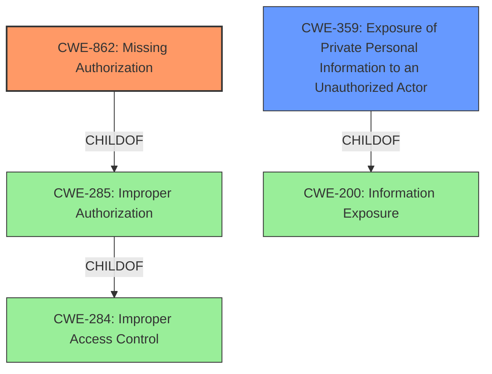

# Analysis Report for CVE-2022-40036

# Vulnerability Analysis Report: CVE-2022-40036

## Description


## Analysis (with Relationship Data)

# Summary
| CWE ID | CWE Name | Confidence | CWE Abstraction Level | CWE Vulnerability Mapping Label | CWE-Vulnerability Mapping Notes |
|---|---|---|---|---|---|
| CWE-862 | Missing Authorization | 0.9 | Class | Primary | Allowed-with-Review |
| CWE-359 | Exposure of Private Personal Information to an Unauthorized Actor | 0.7 | Base | Secondary | Allowed |

## Evidence and Confidence

*   **Confidence Score:** 0.8
*   **Evidence Strength:** HIGH

## Relationship Analysis
The primary CWE is CWE-862 (Missing Authorization), which is a Class-level CWE. It is a child of CWE-285 (Improper Authorization), which is itself a child of CWE-284 (Improper Access Control). CWE-359 (Exposure of Private Personal Information to an Unauthorized Actor) is a Base-level CWE and a child of CWE-200 (Information Exposure). The choice of CWE-862 is more specific than its parents and focuses on the lack of authorization check. CWE-359 is added as a secondary CWE to specify the impact of the missing authorization.



## Vulnerability Chain
The chain of events is as follows:
1.  **Missing Authorization (CWE-862):** The `/adminGetUserList` endpoint lacks proper authorization checks. This is the root cause.
2.  **Exposure of Private Personal Information to an Unauthorized Actor (CWE-359):** Due to the missing authorization, an attacker can access sensitive user information. This is the direct impact of the missing authorization.

## Summary of Analysis
The analysis is based on the provided evidence, which clearly states that the vulnerability is due to the **lack of proper authorization** checks in the `/adminGetUserList` endpoint, allowing an attacker to obtain sensitive user information.

The **root cause** of the vulnerability is the **missing authorization**, which directly leads to the exposure of sensitive information.

The selection of CWE-862 is justified by the vulnerability description, which states that the endpoint allows access to sensitive user information without proper permission checks.
The CWE-359 describes the impact of the vulnerability which is the Exposure of Private Personal Information.

The provided "CVE Reference Links Content Summary" explicitly states: "The primary weakness is the lack of proper authorization checks before allowing access to the `/adminGetUserList` endpoint. This allows unauthorized users to access sensitive data."

The selection of CWE-862 aligns with the mapping guidance, as it is a more specific Class-level CWE than its parents, CWE-285 and CWE-284. While CWE-862 is a Class, the description matches the vulnerability well and a more specific CWE is not available given the level of information.

CWE-359 is chosen to represent the impact.

Other CWEs Considered but Not Used:

*   CWE-285 (Improper Authorization): While related, it is too high-level and the description matches CWE-862 more closely. The mapping guidance for CWE-285 suggests considering its children, such as CWE-862.
*   CWE-863 (Incorrect Authorization): This CWE implies that an authorization check is performed, but it is done incorrectly. The vulnerability description clearly states that there is a missing authorization check.
*   CWE-732 (Incorrect Permission Assignment for Critical Resource): This is about incorrect assignment of permission, not about missing authorization.
*   CWE-434 (Unrestricted Upload of File with Dangerous Type): Irrelevant, as it deals with file uploads, not authorization.
*   CWE-471 (Modification of Assumed-Immutable Data (MAID)): Not applicable, as the vulnerability isn't related to modifying assumed-immutable data.
*   CWE-697 (Incorrect Comparison): Not applicable, as there is no comparison operation involved in the vulnerability.
*   CWE-269 (Improper Privilege Management): Too general; CWE-862 describes the issue more precisely.


## CWE Relationship Analysis

Current CWEs represent these abstraction levels: .


### Vulnerability Chain Analysis

**Chain starting from CWE-862:**
- 862 (Missing Authorization) - ROOT


**Chain starting from CWE-200:**
- 200 (Exposure of Sensitive Information to an Unauthorized Actor) - ROOT


### CWE Relationship Diagram

```mermaid
graph TD
    classDef primary fill:#f96,stroke:#333,stroke-width:2px
    classDef secondary fill:#69f,stroke:#333
    classDef tertiary fill:#9e9,stroke:#333
```


*Report generated on 2025-03-31 13:34:03*
