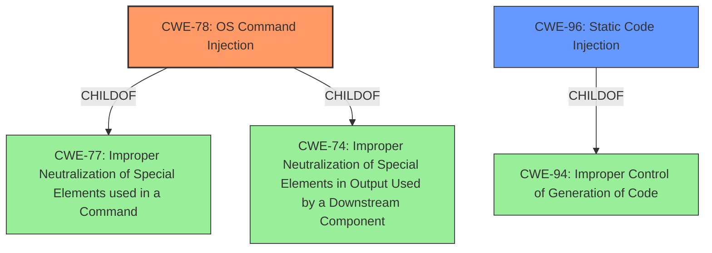

# Analysis for CVE-2022-4009

# Summary
| CWE ID  | CWE Name                                                                                                | Confidence | CWE Abstraction Level | CWE Vulnerability Mapping Label | CWE-Vulnerability Mapping Notes |
| ------- | ------------------------------------------------------------------------------------------------------- | ---------- | ----------------------- | ------------------------------- | ------------------------------- |
| CWE-78  | Improper Neutralization of Special Elements used in an OS Command ('OS Command Injection')             | 1.0        | Base                    | Primary CWE                     | Allowed                         |
| CWE-96  | Improper Neutralization of Directives in Statically Saved Code ('Static Code Injection')             | 0.7        | Base                    | Secondary                       | Allowed                         |

## Evidence and Confidence

*   **Confidence Score:** 0.85
*   **Evidence Strength:** HIGH

## Relationship Analysis
The primary relationship that influenced the CWE selection is the parent-child relationship. CWE-78 is a child of CWE-77 (Improper Neutralization of Special Elements used in a Command) and CWE-74 (Improper Neutralization of Special Elements in Output Used by a Downstream Component ('Injection')). The key here is the "OS Command" aspect, which is more specific than the general "Command" or "Injection."

CWE-96 is a child of CWE-94. CWE-94 is about code injection but CWE-96 is about static code injection which is a good secondary match.

The abstraction levels were carefully considered. Base-level CWEs (CWE-78, CWE-96) were preferred because they are more specific than Class-level CWEs like CWE-74 and CWE-138, or Pillar-level CWEs.

## Vulnerability Chain
The vulnerability chain starts with the **improper neutralization** of input during offline package creation which leads to **code injection** and ultimately allows an attacker to execute arbitrary commands on the Octopus Server.

## Summary of Analysis
The analysis is based heavily on the provided evidence, particularly the "CVE Reference Links Content Summary" which explicitly mentions the root cause: "The vulnerability stems from a lack of proper input sanitization when creating offline packages in Octopus Deploy. Specifically, it's due to 'Improper Neutralisation of Special Elements used in a Command.'" This statement directly supports the selection of CWE-78.

The relationship graph highlights the hierarchical connections between CWEs, justifying the choice of CWE-78 as the most specific and relevant option.

The retriever scores also support this decision, with CWE-78 being a strong candidate.

CWE-78 is at the optimal level of specificity because it directly addresses the **improper neutralization** of special elements used in OS commands, which aligns perfectly with the vulnerability description. The evidence explicitly points to **command injection**, making CWE-78 the most accurate and granular choice. While other CWEs like CWE-74 (Improper Neutralization of Special Elements in Output Used by a Downstream Component) are related, they are more general and do not capture the specific nature of the OS command injection.

Relevant CWE Information:

# Enhanced Context (25 CWEs)

## CWE-78: Improper Neutralization of Special Elements used in an OS Command ('OS Command Injection')
**Abstraction Level**: Base

**Technical Explanation:**
CWE-78 (Improper Neutralization of Special Elements used in an OS Command ('OS Command Injection')) describes a vulnerability where an application constructs an OS command using externally-influenced input without properly neutralizing special elements that could modify the intended command.

**Vulnerability Match:**
The vulnerability description states the root cause is "Improper Neutralisation of Special Elements used in a Command" during offline package creation in Octopus Deploy. This directly matches the description of CWE-78, where external input is used to construct a command without proper sanitization. The "CVE Reference Links Content Summary" section explicitly states "The core vulnerability is a command injection flaw".

**Security Implications:**
An attacker can execute arbitrary commands on the Octopus Server. This could lead to data theft, system compromise, denial of service, and lateral movement within the network.

**Relationship Impact:**
CWE-78 is a child of CWE-77 (Improper Neutralization of Special Elements used in a Command) and CWE-74 (Improper Neutralization of Special Elements in Output Used by a Downstream Component ('Injection')). Choosing CWE-78 provides a more specific classification than its parents, as it highlights the OS command context.

**Mapping Guidance Influence:**
The MITRE mapping guidance for CWE-78 allows its usage.

**Confidence:** 1.0

## CWE-96: Improper Neutralization of Directives in Statically Saved Code ('Static Code Injection')
**Abstraction Level**: Base

**Technical Explanation:**
CWE-96 (Improper Neutralization of Directives in Statically Saved Code ('Static Code Injection')) describes a vulnerability where the product receives input from an upstream component, but it does not neutralize or incorrectly neutralizes code syntax before inserting the input into an executable resource, such as a library, configuration file, or template.

**Vulnerability Match:**
The vulnerability description refers to introducing code via offline package creation. The creation of such a package that includes code syntax that is not neutralized before being saved in the package could potentially be CWE-96. The "CVE Reference Links Content Summary" section does not provide enough information to confirm this.

**Security Implications:**
An attacker can execute arbitrary commands on the Octopus Server. This could lead to data theft, system compromise, denial of service, and lateral movement within the network.

**Relationship Impact:**
CWE-96 is a child of CWE-94 (Improper Control of Generation of Code). Choosing CWE-96 provides a more specific classification than its parents, as it highlights static code.

**Mapping Guidance Influence:**
The MITRE mapping guidance for CWE-96 allows its usage.

**Confidence:** 0.7

## Considered but not Used:

*   **CWE-74:** Improper Neutralization of Special Elements in Output Used by a Downstream Component ('Injection') - This is a higher-level class. CWE-78 is more specific.
*   **CWE-79:** Improper Neutralization of Input During Web Page Generation ('Cross-site Scripting') - This is specific to web page generation and does not apply.
*   **CWE-88:** Improper Neutralization of Argument Delimiters in a Command ('Argument Injection') - This is more about argument manipulation. CWE-78 is about direct command injection.
*   **CWE-94:** Improper Control of Generation of Code ('Code Injection') - This is more general, while CWE-78 is specific to OS commands.
*   **CWE-138:** Improper Neutralization of Special Elements - This is a more generic class of weakness. CWE-78 is more precise.
*   **CWE-1336:** Improper Neutralization of Special Elements Used in a Template Engine - This is specific to template engines and does not apply.
*   **CWE-22:** Improper Limitation of a Pathname to a Restricted Directory ('Path Traversal') - This is specific to path traversal, which is not the primary issue.
*   **CWE-502:** Deserialization of Untrusted Data - This is related to deserialization issues, which are not explicitly mentioned.
*   **CWE-158:** Improper Neutralization of Null Byte or NUL Character - This is specific to null byte injection, which is not explicitly mentioned.
*   **CWE-917:** Improper Neutralization of Special Elements used in an Expression Language Statement ('Expression Language Injection') - This is specific to expression language injection, which is not applicable here.
*   **CWE-80:** Improper Neutralization of Script-Related HTML Tags in a Web Page (Basic XSS) - This is specific to XSS, which is not applicable.
*   **CWE-184:** Incomplete List of Disallowed Inputs - This could be related, but CWE-78 is more directly tied to the root cause.
*   **CWE-99:** Improper Control of Resource Identifiers ('Resource Injection') - This is about resource identifier control, which doesn't fit the scenario.
*   **CWE-915:** Improperly Controlled Modification of Dynamically-Determined Object Attributes - This is specific to object attribute modification.
*