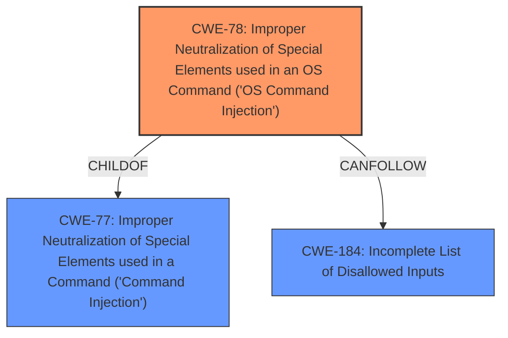

# Analysis for CVE-2022-40127

# Summary
| CWE ID | CWE Name | Confidence | CWE Abstraction Level | CWE Vulnerability Mapping Label | CWE-Vulnerability Mapping Notes |
|---|---|---|---|---|---|
| CWE-78 | Improper Neutralization of Special Elements used in an OS Command ('OS Command Injection') | 1.0 | Base | Allowed | Primary CWE |

## Evidence and Confidence

*   **Confidence Score:** 1.0
*   **Evidence Strength:** HIGH

## Relationship Analysis
The primary relationship that influenced the decision was the ChildOf relationship between CWE-78 and its parent CWEs, specifically CWE-77. Also, CWE-78 can be followed by CWE-184, Incomplete List of Disallowed Inputs. This highlights the chain of events where **improper neutralization** can lead to OS Command Injection.

## Vulnerability Chain
The vulnerability chain starts with **improper handling of the `run_id` parameter**, which allows an attacker to inject commands. This leads directly to OS Command Injection and the ability to execute arbitrary commands on the system.

## Summary of Analysis
The analysis is based on the provided vulnerability description and CVE Reference Links Content Summary. The key evidence is the statement that the vulnerability allows an attacker to "execute arbitrary commands via manually provided run_id parameter." This aligns directly with the definition of CWE-78, Improper Neutralization of Special Elements used in an OS Command ('OS Command Injection').

The selection of CWE-78 is at the optimal level of specificity because it directly describes the **root cause** of the vulnerability: the ability to inject OS commands due to **improper neutralization** of special elements in the `run_id` parameter.

Relevant CWE Information:

# Enhanced Context (25 CWEs)
The following CWEs were identified as potentially relevant to this vulnerability:

## CWE-1289: Improper Validation of Unsafe Equivalence in Input
**Abstraction Level**: Base
**Similarity Score**: 0.78
**Source**: dense
Not Selected: This CWE is not applicable since the vulnerability does not involve validating equivalence of input.

## CWE-74: Improper Neutralization of Special Elements in Output Used by a Downstream Component ('Injection')
**Abstraction Level**: Class
**Similarity Score**: 0.77
**Source**: dense
Not Selected: This is a Class-level CWE. CWE-78 is a more specific, Base-level CWE that more accurately describes the vulnerability.

## CWE-41: Improper Resolution of Path Equivalence
**Abstraction Level**: Base
**Similarity Score**: 0.77
**Source**: dense
Not Selected: This CWE is not applicable since the vulnerability does not involve path equivalence.

## CWE-184: Incomplete List of Disallowed Inputs
**Abstraction Level**: Base
**Similarity Score**: 0.77
**Source**: dense
Not Selected: This could be a secondary weakness if the fix involved creating a denylist of characters. But the primary issue is that the **run_id parameter** is not neutralized.

## CWE-138: Improper Neutralization of Special Elements
**Abstraction Level**: Class
**Similarity Score**: 0.77
**Source**: dense
Not Selected: This is a Class-level CWE. CWE-78 is a more specific, Base-level CWE that more accurately describes the vulnerability.

## CWE-23: Relative Path Traversal
**Abstraction Level**: Base
**Similarity Score**: 0.76
**Source**: dense
Not Selected: This CWE is not applicable since the vulnerability does not involve path traversal.

## CWE-73: External Control of File Name or Path
**Abstraction Level**: Base
**Similarity Score**: 0.76
**Source**: dense
Not Selected: This CWE is not applicable since the vulnerability does not involve file name or path control.

## CWE-807: Reliance on Untrusted Inputs in a Security Decision
**Abstraction Level**: Base
**Similarity Score**: 0.75
**Source**: dense
Not Selected: This CWE is not applicable since the vulnerability does not involve a security decision based on untrusted inputs.

## CWE-183: Permissive List of Allowed Inputs
**Abstraction Level**: Base
**Similarity Score**: 0.75
**Source**: dense
Not Selected: This CWE is not applicable since the vulnerability does not involve a permissive list of allowed inputs.

## CWE-59: Improper Link Resolution Before File Access ('Link Following')
**Abstraction Level**: Base
**Similarity Score**: 0.75
**Source**: dense
Not Selected: This CWE is not applicable since the vulnerability does not involve link resolution.

## CWE-116: Improper Encoding or Escaping of Output
**Abstraction Level**: Class
**Similarity Score**: 8604.86
**Source**: sparse
Not Selected: While encoding/escaping *could* be a mitigation, the root cause is the lack of neutralization of special elements.

## CWE-22: Improper Limitation of a Pathname to a Restricted Directory ('Path Traversal')
**Abstraction Level**: Base
**Similarity Score**: 8484.35
**Source**: sparse
Not Selected: This CWE is not applicable since the vulnerability does not involve path traversal.

## CWE-88: Improper Neutralization of Argument Delimiters in a Command ('Argument Injection')
**Abstraction Level**: Base
**Similarity Score**: 8173.26
**Source**: sparse
Not Selected: While there could be argument injection, the broader issue is that OS commands can be injected.

## CWE-138: Improper Neutralization of Special Elements
**Abstraction Level**: Class
**Similarity Score**: 8008.91
**Source**: sparse
Not Selected: This is a Class-level CWE. CWE-78 is a more specific, Base-level CWE that more accurately describes the vulnerability.

## CWE-184: Incomplete List of Disallowed Inputs
**Abstraction Level**: Base
**Similarity Score**: 7990.08
**Source**: sparse
Not Selected: This could be a secondary weakness if the fix involved creating a denylist of characters. But the primary issue is that the **run_id parameter** is not neutralized.

## CWE-78: Improper Neutralization of Special Elements used in an OS Command ('OS Command Injection')
**Abstraction Level**: base
**Similarity Score**: 5.03
**Source**: graph

**Description**:
CWE-78: Improper Neutralization of Special Elements used in an OS Command ('OS Command Injection')

**Mapping Guidance**:
- Usage: Allowed
- Rationale: This CWE entry is at the Base level of abstraction, which is a preferred level of abstraction for mapping to the root causes of vulnerabilities.

**Relationships**:
- CANFOLLOW -> CWE-184
- CANALSOBE -> CWE-88
- CHILDOF -> CWE-77
- CHILDOF -> CWE-77
- CHILDOF -> CWE-74
Selected: This is the primary CWE due to the ability to execute arbitrary OS commands.

## CWE-770: Allocation of Resources Without Limits or Throttling
**Abstraction Level**: base
**Similarity Score**: 4.33
**Source**: graph
Not Selected: This CWE is not applicable since the vulnerability does not involve resource allocation.

## CWE-22: Improper Limitation of a Pathname to a Restricted Directory ('Path Traversal')
**Abstraction Level**: base
**Similarity Score**: 4.33
**Source**: graph
Not Selected: This CWE is not applicable since the vulnerability does not involve path traversal.

## CWE-190: Integer Overflow or Wraparound
**Abstraction Level**: base
**Similarity Score**: 4.33
**Source**: graph
Not Selected: This CWE is not applicable since the vulnerability does not involve integer overflow.

## CWE-88: Improper Neutralization of Argument Delimiters in a Command ('Argument Injection')
**Abstraction Level**: base
**Similarity Score**: 3.64
**Source**: graph
Not Selected: While there could be argument injection, the broader issue is that OS commands can be injected.

## CWE-209: Generation of Error Message Containing Sensitive Information
**Abstraction Level**: base
**Similarity Score**: 3.64
**Source**: graph
Not Selected: This CWE is not applicable since the vulnerability does not involve sensitive information in error messages.

## CWE-201: Insertion of Sensitive Information Into Sent Data
**Abstraction Level**: base
**Similarity Score**: 3.64
**Source**: graph
Not Selected: This CWE is not applicable since the vulnerability does not involve sensitive information