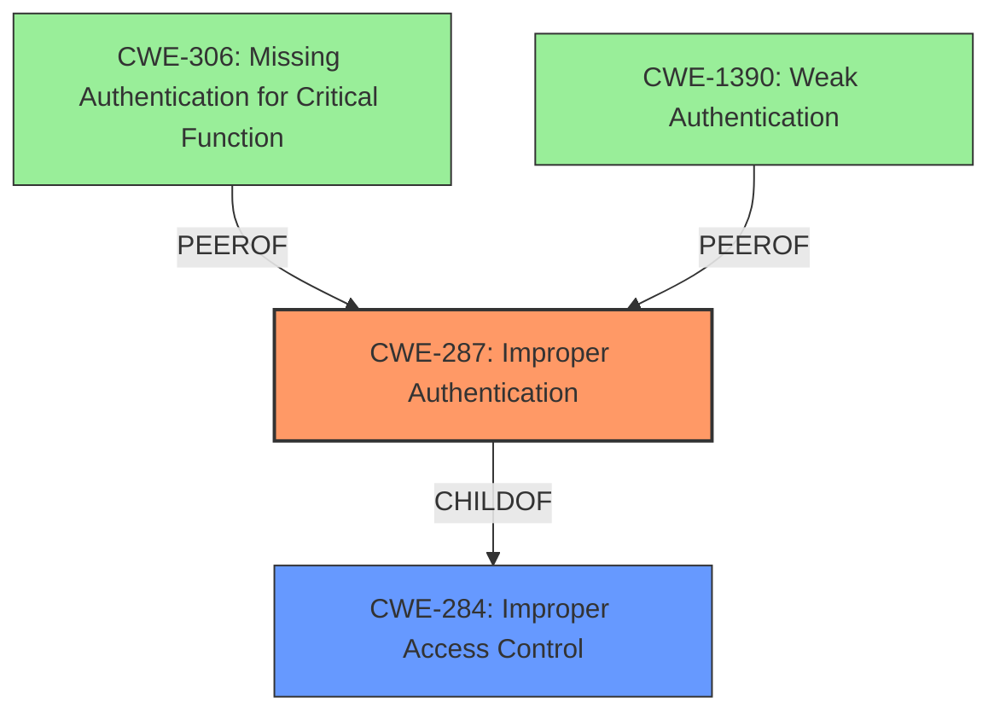

# Analysis for CVE-2022-40144

# Summary
| CWE ID | CWE Name | Confidence | CWE Abstraction Level | CWE Vulnerability Mapping Label | CWE-Vulnerability Mapping Notes |
|---|---|---|---|---|---|
| CWE-287 | Improper Authentication | 1.0 | Class | Primary | Allowed-with-Review |

## Evidence and Confidence

*   **Confidence Score:** 1.0
*   **Evidence Strength:** HIGH

## Relationship Analysis
CWE-287 is a Class-level CWE that is a child of CWE-284 (Improper Access Control). While CWE-287 is a Class, it directly addresses the **improper authentication** issue described in the vulnerability. More specific CWEs like CWE-306 (Missing Authentication for Critical Function) or CWE-1390 (Weak Authentication) could be considered, but the description indicates that the authentication process is **improper**, not necessarily missing or weak, thus I selected CWE-287.

## Vulnerability Chain
The chain of events is as follows:
1.  **Root Cause:** **Improper Authentication** (CWE-287). The product **does not properly authenticate** requests.
2.  **Impact:** Authentication bypass leading to unauthorized access.

## Summary of Analysis
The primary weakness identified is **Improper Authentication** (CWE-287). The vulnerability description clearly states that an attacker can bypass the product's login authentication by **falsifying request parameters**. This directly aligns with the definition of CWE-287, where the product **does not prove or insufficiently proves** that the claim is correct.

The evidence supporting this decision comes directly from the vulnerability description:
*   "A vulnerability in Trend Micro Apex One and Trend Micro Apex One as a Service could allow an attacker to bypass the products login authentication by falsifying request parameters on affected installations."
*   "The vulnerability stems from the product's failure to properly authenticate requests."

The Retriever Results also list CWE-287 with the highest score. While CWE-287 is discouraged, the description indicates an **improper** authentication, not missing or necessarily weak authentication, thus it's appropriate.

Based on the available evidence and analysis, the most appropriate CWE is CWE-287. Other CWEs were considered but did not fit as accurately. For example, CWE-306 (Missing Authentication for Critical Function) wasn't selected because the issue isn't a complete lack of authentication, but a flaw in the authentication process itself. Similarly, CWE-1390 (Weak Authentication) wasn't chosen because the description doesn't explicitly state that the authentication is weak, just that it can be bypassed by falsifying request parameters.

The selected CWE is at the optimal level of specificity, as it directly addresses the core issue of **improper authentication**. The confidence in this assessment is high (1.0) due to the clear alignment between the vulnerability description and the CWE definition.