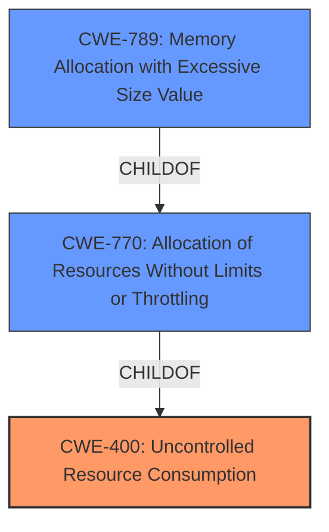

# Analysis Report for CVE-2022-40150

# Vulnerability Analysis Report: CVE-2022-40150

## Description


## Analysis (with Relationship Data)

# Summary
| CWE ID  | CWE Name | Confidence | CWE Abstraction Level | CWE Vulnerability Mapping Label | CWE-Vulnerability Mapping Notes |
|-----------------|-------------------------------------------------------|------------------|-------------------------|------------------------------------|---------------------------------------|
| CWE-400 | Uncontrolled Resource Consumption ('Resource Exhaustion') | 0.9 | Class | Allowed-with-Review | Since the vulnerability leads to an **out of memory** condition, and **Denial of Service**, this is the primary CWE. |
| CWE-789 | Memory Allocation with Excessive Size Value | 0.7 | Variant | Allowed | The vulnerability may allow an attacker to trigger excessive memory allocation, leading to the **out of memory** condition. |
| CWE-770 | Allocation of Resources Without Limits or Throttling | 0.6 | Base | Allowed | This could be related to the root cause of the excessive memory allocation. |

## Evidence and Confidence

*   **Confidence Score:** 0.8
*   **Evidence Strength:** HIGH

## Relationship Analysis
The primary CWE is CWE-400, which represents the high-level impact of the vulnerability (Denial of Service). The root cause appears to involve excessive memory allocation, potentially due to an excessive size value (CWE-789) or a lack of limits on resource allocation (CWE-770).



## Vulnerability Chain
The vulnerability chain starts with the parsing of untrusted XML or JSON data. The **weakness** is the potential for **out of memory** due to excessive resource allocation. This leads to a Denial of Service (DoS) **impact**. The chain can be summarized as follows:

1.  Untrusted XML/JSON data input
2.  **Improper or missing validation** of input size/complexity
3.  Excessive memory allocation (**out of memory**)
4.  Denial of Service (CWE-400)

## Summary of Analysis
The initial assessment pointed towards CWE-787 due to the primary CWE match from similar CVE descriptions, but it's not the most accurate. The vulnerability is primarily an instance of CWE-400 because the **out of memory** condition leads directly to a denial of service. The root cause might be related to excessive memory allocation via an excessive size value (CWE-789) or a lack of limits/throttling on resource allocation (CWE-770).

The supporting evidence includes:
*   "Those using Jettison to parse untrusted XML or JSON data may be vulnerable to Denial of Service attacks (DOS). If the parser is running on user supplied input, an attacker may supply content that causes the parser to crash by **Out of memory**."
*   "The libjettison-java library, a collection of StAX parsers and writers for JSON, is vulnerable to denial-of-service attacks."
*   "A specially crafted user input can cause the parser to crash due to an out-of-memory error, leading to a denial of service."
*   "The vulnerability can be exploited by providing malicious XML or JSON data to the parser."
*   "The issue is related to memory exhaustion."

The graph relationships influenced the selection by highlighting the connection between resource allocation issues and the ultimate impact of a denial of service.

The selected CWEs are at the optimal level of specificity because they accurately represent the vulnerability based on the available evidence. CWE-400 captures the overall impact, while CWE-789 and CWE-770 potentially describe the underlying causes.

Relevant CWE Information:

# Enhanced Context (25 CWEs)
The following CWEs were identified as potentially relevant to this vulnerability:

## CWE-476: NULL Pointer Dereference
**Abstraction Level**: Base
**Similarity Score**: 0.77
**Source**: dense

**Description**:
The product dereferences a pointer that it expects to be valid but is NULL.

**Mapping Guidance**:
- Usage: Allowed
- Rationale: This CWE entry is at the Base level of abstraction, which is a preferred level of abstraction for mapping to the root causes of vulnerabilities.

## CWE-404: Improper Resource Shutdown or Release
**Abstraction Level**: Class
**Similarity Score**: 0.77
**Source**: dense

**Description**:
The product does not release or incorrectly releases a resource before it is made available for re-use.

**Mapping Guidance**:
- Usage: Allowed-with-Review
- Rationale: This CWE entry is a Class and might have Base-level children that would be more appropriate

## CWE-226: Sensitive Information in Resource Not Removed Before Reuse
**Abstraction Level**: Base
**Similarity Score**: 0.76
**Source**: dense

**Description**:
The product releases a resource such as memory or a file so that it can be made available for reuse, but it does not clear or "zeroize" the information contained in the resource before the product performs a critical state transition or makes the resource available for reuse by other entities.

**Mapping Guidance**:
- Usage: Allowed
- Rationale: This CWE entry is at the Base level of abstraction, which is a preferred level of abstraction for mapping to the root causes of vulnerabilities.

## CWE-754: Improper Check for Unusual or Exceptional Conditions
**Abstraction Level**: Class
**Similarity Score**: 0.76
**Source**: dense

**Description**:
The product does not check or incorrectly checks for unusual or exceptional conditions that are not expected to occur frequently during day to day operation of the product.

**Mapping Guidance**:
- Usage: Allowed-with-Review
- Rationale: This CWE entry is a Class and might have Base-level children that would be more appropriate

## CWE-789: Memory Allocation with Excessive Size Value
**Abstraction Level**: Variant
**Similarity Score**: 0.76
**Source**: dense

**Description**:
The product allocates memory based on an untrusted, large size value, but it does not ensure that the size is within expected limits, allowing arbitrary amounts of memory to be allocated.

**Mapping Guidance**:
- Usage: Allowed
- Rationale: This CWE entry is at the Variant level of abstraction, which is a preferred level of abstraction for mapping to the root causes of vulnerabilities.

## CWE-824: Access of Uninitialized Pointer
**Abstraction Level**: Base
**Similarity Score**: 0.76
**Source**: dense

**Description**:
The product accesses or uses a pointer that has not been initialized.

**Mapping Guidance**:
- Usage: Allowed
- Rationale: This CWE entry is at the Base level of abstraction, which is a preferred level of abstraction for mapping to the root causes of vulnerabilities.

## CWE-129: Improper Validation of Array Index
**Abstraction Level**: Variant
**Similarity Score**: 0.76
**Source**: dense

**Description**:
The product uses untrusted input when calculating or using an array index, but the product does not validate or incorrectly validates the index to ensure the index references a valid position within the array.

**Mapping Guidance**:
- Usage: Allowed
- Rationale: This CWE entry is at the Variant level of abstraction, which is a preferred level of abstraction for mapping to the root causes of vulnerabilities.

## CWE-170: Improper Null Termination
**Abstraction Level**: Base
**Similarity Score**: 0.76
**Source**: dense

**Description**:
The product does not terminate or incorrectly terminates a string or array with a null character or equivalent terminator.

**Mapping Guidance**:
- Usage: Allowed
- Rationale: This CWE entry is at the Base level of abstraction, which is a preferred level of abstraction for mapping to the root causes of vulnerabilities.

## CWE-131: Incorrect Calculation of Buffer Size
**Abstraction Level**: Base
**Similarity Score**: 0.76
**Source**: dense

**Description**:
The product does not correctly calculate the size to be used when allocating a buffer, which could lead to a buffer overflow.

**Mapping Guidance**:
- Usage: Allowed
- Rationale: This CWE entry is at the Base level of abstraction, which is a preferred level of abstraction for mapping to the root causes of vulnerabilities.

## CWE-191: Integer Underflow (Wrap or Wraparound)
**Abstraction Level**: Base
**Similarity Score**: 0.75
**Source**: dense

**Description**:
The product subtracts one value from another, such that the result is less than the minimum allowable integer value, which produces a value that is not equal to the correct result.

**Mapping Guidance**:
- Usage: Allowed
- Rationale


## CWE Relationship Analysis

Current CWEs represent these abstraction levels: .


### Vulnerability Chain Analysis

**Chain starting from CWE-131:**
- 131 (Incorrect Calculation of Buffer Size) - ROOT


**Chain starting from CWE-476:**
- 476 (NULL Pointer Dereference) - ROOT


### CWE Relationship Diagram

```mermaid
graph TD
    classDef primary fill:#f96,stroke:#333,stroke-width:2px
    classDef secondary fill:#69f,stroke:#333
    classDef tertiary fill:#9e9,stroke:#333
```


*Report generated on 2025-03-30 14:44:28*
