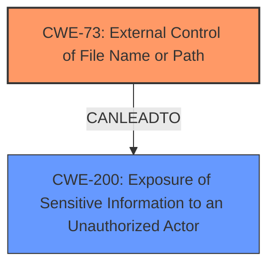

# Raw Analyzer Response for CVE-2022-40177

# Summary
| CWE ID | CWE Name | Confidence | CWE Abstraction Level | CWE Vulnerability Mapping Label | CWE-Vulnerability Mapping Notes |
|---|---|---|---|---|---|
| CWE-73 | External Control of File Name or Path | 0.9 | Base | Allowed | Primary CWE. The application allows external control of file paths, leading to unauthorized file access. |
| CWE-200 | Exposure of Sensitive Information to an Unauthorized Actor | 0.7 | Class | Discouraged | Secondary CWE. The exploitation leads to sensitive information exposure, but this is a consequence of CWE-73. |

## Evidence and Confidence

*   **Confidence Score:** 0.8
*   **Evidence Strength:** HIGH

## Relationship Analysis
The primary relationship influencing the selection is the chain where external control of file paths (CWE-73) leads to exposure of sensitive information (CWE-200). CWE-73 is a base level CWE, making it a specific root cause. CWE-200, a class-level CWE, is a high-level description of the impact.

## Vulnerability Chain
The vulnerability chain starts with **external control of file names/paths (CWE-73)**, allowing a low-privileged attacker to craft Axon language queries to access arbitrary files, ultimately leading to **exposure of sensitive information (CWE-200)**.

## Summary of Analysis
The initial analysis identified the root cause as the ability of an attacker to control file paths via Axon queries. The "CVE Reference Links Content Summary" section states: "The 'Operation' web application interprets and executes Axon language queries. Some endpoints allow file read access to the device's file system with root privileges. This is due to **insufficient restrictions on the file system access** allowed by the Axon queries." This directly points to CWE-73, as the application does not properly restrict which files can be accessed. The resulting impact is the exposure of sensitive information, which aligns with CWE-200. However, CWE-200 is a high-level consequence rather than a root cause. Therefore, CWE-73 is the primary CWE, and CWE-200 is a secondary CWE representing the impact.

The graph relationships reinforce this decision, as CWE-73 can lead to CWE-200. The abstraction level of CWE-73 (Base) is more specific than CWE-200 (Class), further justifying its selection as the primary CWE.

CWE-73 is at the optimal level of specificity because it directly addresses the **improper handling of file paths**.

Relevant CWE Information:

# Enhanced Context (25 CWEs)
The following CWEs were identified as potentially relevant to this vulnerability:

## CWE-74: Improper Neutralization of Special Elements in Output Used by a Downstream Component ('Injection')
**Abstraction Level**: Class
**Similarity Score**: 0.78
**Source**: dense

**Description**:
The product constructs all or part of a command, data structure, or record using externally-influenced input from an upstream component, but it does not neutralize or incorrectly neutralizes special elements that could modify how it is parsed or interpreted when it is sent to a downstream component.

**Mapping Guidance**:
- Usage: Discouraged
- Rationale: CWE-74 is high-level and often misused when lower-level weaknesses are more appropriate.

*Why Not Selected:* While the vulnerability involves the interpretation of Axon queries, the core issue is the **lack of restriction on file access** rather than the improper neutralization of special elements in the query itself.

## CWE-41: Improper Resolution of Path Equivalence
**Abstraction Level**: Base
**Similarity Score**: 0.77
**Source**: dense

**Description**:
The product is vulnerable to file system contents disclosure through path equivalence. Path equivalence involves the use of special characters in file and directory names. The associated manipulations are intended to generate multiple names for the same object.

**Mapping Guidance**:
- Usage: Allowed
- Rationale: This CWE entry is at the Base level of abstraction, which is a preferred level of abstraction for mapping to the root causes of vulnerabilities.

*Why Not Selected:* The vulnerability description does not specifically mention path equivalence issues like using special characters to access files. It focuses on the general ability to access unauthorized files.

## CWE-170: Improper Null Termination
**Abstraction Level**: Base
**Similarity Score**: 0.77
**Source**: dense

**Description**:
The product does not terminate or incorrectly terminates a string or array with a null character or equivalent terminator.

**Mapping Guidance**:
- Usage: Allowed
- Rationale: This CWE entry is at the Base level of abstraction, which is a preferred level of abstraction for mapping to the root causes of vulnerabilities.

*Why Not Selected:* Null termination issues are not relevant to this vulnerability.

## CWE-138: Improper Neutralization of Special Elements
**Abstraction Level**: Class
**Similarity Score**: 0.77
**Source**: dense

**Description**:
The product receives input from an upstream component, but it does not neutralize or incorrectly neutralizes special elements that could be interpreted as control elements or syntactic markers when they are sent to a downstream component.

**Mapping Guidance**:
- Usage: Discouraged
- Rationale: This CWE entry is a level-1 Class (i.e., a child of a Pillar). It might have lower-level children that would be more appropriate

*Why Not Selected:* Similar to CWE-74, while the input is an Axon Query, the issue is not improper neutralization but the ability to control file paths directly.

## CWE-73: External Control of File Name or Path
**Abstraction Level**: Base
**Similarity Score**: 0.77
**Source**: dense

**Description**:
The product allows user input to control or influence paths or file names that are used in filesystem operations.

**Mapping Guidance**:
- Usage: Allowed
- Rationale: This CWE entry is at the Base level of abstraction, which is a preferred level of abstraction for mapping to the root causes of vulnerabilities.

*Why Selected:* This is the primary CWE. The attacker can control file paths, leading to unauthorized file access.

## CWE-184: Incomplete List of Disallowed Inputs
**Abstraction Level**: Base
**Similarity Score**: 0.77
**Source**: dense

**Description**:
The product implements a protection mechanism that relies on a list of inputs (or properties of inputs) that are not allowed by policy or otherwise require other action to neutralize before additional processing takes place, but the list is incomplete.

**Mapping Guidance**:
- Usage: Allowed
- Rationale: This CWE entry is at the Base level of abstraction, which is a preferred level of abstraction for mapping to the root causes of vulnerabilities.

*Why Not Selected:* While it could be argued that the list of disallowed file paths is incomplete, the primary issue is the lack of any effective restriction, making CWE-73 a better fit.

## CWE-212: Improper Removal of Sensitive Information Before Storage or Transfer
**Abstraction Level**: Base
**Similarity Score**: 0.76
**Source**: dense

**Description**:
The product stores, transfers, or shares a resource that contains sensitive information, but it does not properly remove that information before the product makes the resource available to unauthorized actors.

**Mapping Guidance**:
- Usage: Allowed
- Rationale: This CWE entry is at the Base level of abstraction, which is a preferred level of abstraction for mapping to the root causes of vulnerabilities.

*Why Not Selected:* This CWE is not relevant as the issue isn't about removing sensitive information before storage or transfer, but about unauthorized access in the first place.

## CWE-653: Improper Isolation or Compartmentalization
**Abstraction Level**: Class
**Similarity Score**: 0.76
**Source**: dense

**Description**:
The product does not properly compartmentalize or isolate functionality, processes, or resources that require different privilege levels, rights, or permissions.

**Mapping Guidance**:
- Usage: Allowed
- Rationale: This CWE entry is at the Base level of abstraction, which is a preferred level of abstraction for mapping to the root causes of vulnerabilities.

*Why Not Selected:* While the vulnerability allows access with root privileges, the root cause is the external control of file paths, not the general lack of isolation.

## CWE-134: Use of Externally-Controlled Format String
**Abstraction Level**: Base
**Similarity Score**: 0.76
**Source**: dense

**Description**:
The product uses a function that accepts a format string as an argument, but the format string originates from an external source.

**Mapping Guidance**:
- Usage: Allowed
- Rationale: This CWE entry is at the Base level of abstraction, which is a preferred level of abstraction for mapping to the root causes of vulnerabilities.

*Why Not Selected:* Format string vulnerabilities are not present in the