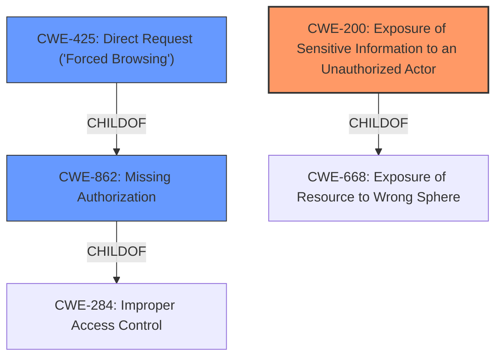

# Analysis for CVE-2022-40194

# Summary
| CWE ID | CWE Name | Confidence | CWE Abstraction Level | CWE Vulnerability Mapping Label | CWE-Vulnerability Mapping Notes |
|---|---|---|---|---|---|
| **CWE-200** | Exposure of Sensitive Information to an Unauthorized Actor | 0.7 | Class | Primary | Discouraged |
| CWE-862 | Missing Authorization | 0.6 | Class | Secondary | Allowed-with-Review |
| CWE-425 | Direct Request ('Forced Browsing') | 0.5 | Base | Secondary | Allowed |

## Evidence and Confidence

*   **Confidence Score:** 0.7
*   **Evidence Strength:** LOW

## Relationship Analysis
The primary relationship considered was the parent-child relationship between CWE-284 (Improper Access Control), CWE-862 (Missing Authorization), and CWE-425 (Direct Request). CWE-200 is a Class level of abstraction and a child of CWE-668. The selection of CWE-200 was influenced by the vulnerability description's focus on **unauthenticated sensitive information disclosure**.

## Vulnerability Chain
The vulnerability chain involves a **missing authentication** check, potentially leading to **direct requests** for sensitive information, ultimately resulting in **unauthenticated sensitive information disclosure**.

## Summary of Analysis
The initial analysis considered CWE-862 (Missing Authorization) and CWE-425 (Direct Request) due to the lack of authentication and direct access to resources. However, the key phrase "**Unauthenticated Sensitive Information Disclosure**" strongly suggests CWE-200 (Exposure of Sensitive Information to an Unauthorized Actor) as the primary weakness, even though it's a Class level CWE and generally discouraged. The description indicates the **sensitive information** being disclosed is the core issue. The weakness lies in the fact that sensitive information is being exposed without proper authentication.

Evidence is weak as the "CVE Reference Links Content Summary" section states "**NOINFO**".

Relevant CWE Information:

# Enhanced Context (25 CWEs)
The following CWEs were identified as potentially relevant to this vulnerability:

## CWE-200: Exposure of Sensitive Information to an Unauthorized Actor
**Abstraction Level**: Class
**Similarity Score**: 0.800
**Source**: dense

**Description**:
The product exposes sensitive information to an actor that is not explicitly authorized to have access to that information.

**Mapping Guidance**:
- Usage: Discouraged

## CWE-862: Missing Authorization
**Abstraction Level**: Class
**Similarity Score**: 0.111
**Source**: sparse

**Description**:
The product does not perform an authorization check when an actor attempts to access a resource or perform an action.

**Mapping Guidance**:
- Usage: Allowed-with-Review

## CWE-425: Direct Request ('Forced Browsing')
**Abstraction Level**: Base
**Similarity Score**: 0.104
**Source**: sparse

**Description**:
The web application does not adequately enforce appropriate authorization on all restricted URLs, scripts, or files.

**Mapping Guidance**:
- Usage: Allowed