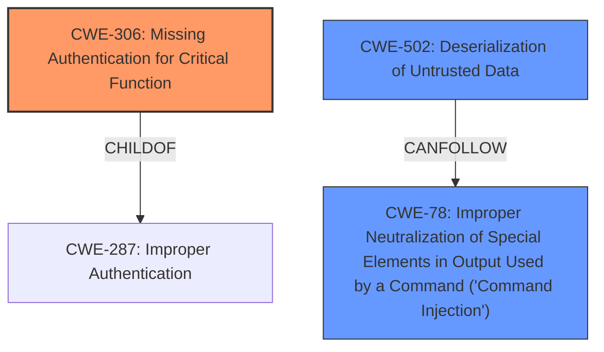

# Analysis Report for CVE-2022-40202

# Vulnerability Analysis Report: CVE-2022-40202

## Description


## Analysis (with Relationship Data)

# Summary
| CWE ID  | CWE Name                                              | Confidence | CWE Abstraction Level | CWE Vulnerability Mapping Label | CWE-Vulnerability Mapping Notes |
| :-------- | :---------------------------------------------------- | :--------- | :-------------------- | :------------------------------ | :------------------------------ |
| CWE-306   | Missing Authentication for Critical Function          | 1.0        | Base                  | Allowed                         | Primary CWE                     |
| CWE-502   | Deserialization of Untrusted Data                   | 0.9        | Base                  | Allowed                         | Secondary Candidate             |
| CWE-78    | Improper Neutralization of Special Elements in Output Used by a Command ('Command Injection') | 0.7       | Base                  | Allowed                         | Secondary Candidate            |

## Evidence and Confidence

*   **Confidence Score:** 0.9
*   **Evidence Strength:** HIGH

## Relationship Analysis
The primary weakness, **CWE-306 (Missing Authentication for Critical Function)**, is a base-level CWE and a child of **CWE-287 (Improper Authentication)**, which is a class-level CWE. This relationship indicates that **CWE-306** is a more specific case of authentication failure than **CWE-287**.
**CWE-502 (Deserialization of Untrusted Data)** is a base-level CWE that can lead to remote code execution if not handled properly. There's no direct relationship between **CWE-306** and **CWE-502** in terms of parent-child, but they can occur together in a vulnerability chain.



## Vulnerability Chain
The vulnerability chain starts with the **lack of proper authentication (CWE-306)** for the database backup function. This allows an attacker to provide **malicious serialized objects (CWE-502)**. When these objects are deserialized, they activate a backup scheduling function, allowing the attacker to designate function arguments and the file to be executed, leading to **remote code execution (CWE-78)**.

## Summary of Analysis
The initial analysis strongly suggests that the root cause is a **lack of proper authentication (CWE-306)** for a critical function, specifically the database backup. The vulnerability description clearly states that the database backup function in Delta Electronics InfraSuite Device Master " **lacks proper authentication**". The **CVE Reference Links Content Summary** section also explicitly mentions: "The database backup function **lacks proper authentication**." This missing authentication allows for the exploitation of other weaknesses, such as the **deserialization of untrusted data (CWE-502)**, which ultimately leads to remote code execution.

The Retriever Results also support **CWE-306** as the primary weakness, with a high relevance score. The usage is "Allowed" and the abstraction level is "Base," which aligns with the goal of selecting the most specific and appropriate CWE.

While **CWE-287 (Improper Authentication)** was considered, it is a broader, class-level CWE. Since the vulnerability description specifically mentions *missing* authentication for a *critical* function, **CWE-306** is a more precise and accurate mapping. **CWE-502** is also highly relevant as the mechanism by which the attacker gains control, but the root cause enabling this is the missing authentication.

**CWE-78 (Improper Neutralization of Special Elements in Output Used by a Command ('Command Injection'))** was also considered because the attacker can designate all function arguments and the file to be executed, leading to remote code execution.

The selection of **CWE-306** as the primary CWE is based on the clear evidence of missing authentication for a critical function and its base-level abstraction, providing a specific and accurate representation of the vulnerability. **CWE-502** and **CWE-78** are secondary weaknesses that build upon the missing authentication to achieve remote code execution.

Relevant CWE Information:

# Enhanced Context (25 CWEs)

## CWE-1289: Improper Validation of Unsafe Equivalence in Input
**Abstraction Level**: Base
**Similarity Score**: 0.78
**Source**: dense

**Description**:
The product receives an input value that is used as a resource identifier or other type of reference, but it does not validate or incorrectly validates that the input is equivalent to a potentially-unsafe value.

**Mapping Guidance**:
- Usage: Allowed
- Rationale: This CWE entry is at the Base level of abstraction, which is a preferred level of abstraction for mapping to the root causes of vulnerabilities.

## CWE-807: Reliance on Untrusted Inputs in a Security Decision
**Abstraction Level**: Base
**Similarity Score**: 0.75
**Source**: dense

**Description**:
The product uses a protection mechanism that relies on the existence or values of an input, but the input can be modified by an untrusted actor in a way that bypasses the protection mechanism.

**Mapping Guidance**:
- Usage: Allowed
- Rationale: This CWE entry is at the Base level of abstraction, which is a preferred level of abstraction for mapping to the root causes of vulnerabilities.

## CWE-1288: Improper Validation of Consistency within Input
**Abstraction Level**: Base
**Similarity Score**: 0.75
**Source**: dense

**Description**:
The product receives a complex input with multiple elements or fields that must be consistent with each other, but it does not validate or incorrectly validates that the input is actually consistent.

**Mapping Guidance**:
- Usage: Allowed
- Rationale: This CWE entry is at the Base level of abstraction, which is a preferred level of abstraction for mapping to the root causes of vulnerabilities.

## CWE-184: Incomplete List of Disallowed Inputs
**Abstraction Level**: Base
**Similarity Score**: 0.75
**Source**: dense

**Description**:
The product implements a protection mechanism that relies on a list of inputs (or properties of inputs) that are not allowed by policy or otherwise require other action to neutralize before additional processing takes place, but the list is incomplete.

**Mapping Guidance**:
- Usage: Allowed
- Rationale: This CWE entry is at the Base level of abstraction, which is a preferred level of abstraction for mapping to the root causes of vulnerabilities.

## CWE-74: Improper Neutralization of Special Elements in Output Used by a Downstream Component ('Injection')
**Abstraction Level**: Class
**Similarity Score**: 0.74
**Source**: dense

**Description**:
The product constructs all or part of a command, data structure, or record using externally-influenced input from an upstream component, but it does not neutralize or incorrectly neutralizes special elements that could modify how it is parsed or interpreted when it is sent to a downstream component.

**Mapping Guidance**:
- Usage: Discouraged
- Rationale: CWE-74 is high-level and often misused when lower-level weaknesses are more appropriate.

## CWE-138: Improper Neutralization of Special Elements
**Abstraction Level**: Class
**Similarity Score**: 0.74
**Source**: dense

**Description**:
The product receives input from an upstream component, but it does not neutralize or incorrectly neutralizes special elements that could be interpreted as control elements or syntactic markers when they are sent to a downstream component.

**Mapping Guidance**:
- Usage: Discouraged
- Rationale: This CWE entry is a level-1 Class (i.e., a child of a Pillar). It might have lower-level children that would be more appropriate

## CWE-345: Insufficient Verification of Data Authenticity
**Abstraction Level**: Class
**Similarity Score**: 0.74
**Source**: dense

**Description**:
The product does not sufficiently verify the origin or authenticity of data, in a way that causes it to accept invalid data.

**Mapping Guidance**:
- Usage: Discouraged
- Rationale: This CWE entry is a level-1 Class (i.e., a child of a Pillar). It might have lower-level children that would be more appropriate

## CWE-1286: Improper Validation of Syntactic Correctness of Input
**Abstraction Level**: Base
**Similarity Score**: 0.74
**Source**: dense

**Description**:
The product receives input that is expected to be well-formed - i.e., to comply with a certain syntax - but it does not validate or incorrectly validates that the input complies with the syntax.

**Mapping Guidance**:
- Usage: Allowed
- Rationale: This


## CWE Relationship Analysis

Current CWEs represent these abstraction levels: .


### Vulnerability Chain Analysis

**Chain starting from CWE-184:**
- 184 (Incomplete List of Disallowed Inputs) - ROOT


**Chain starting from CWE-807:**
- 807 (Reliance on Untrusted Inputs in a Security Decision) - ROOT


### CWE Relationship Diagram

```mermaid
graph TD
    classDef primary fill:#f96,stroke:#333,stroke-width:2px
    classDef secondary fill:#69f,stroke:#333
    classDef tertiary fill:#9e9,stroke:#333
```


*Report generated on 2025-03-31 00:08:23*
