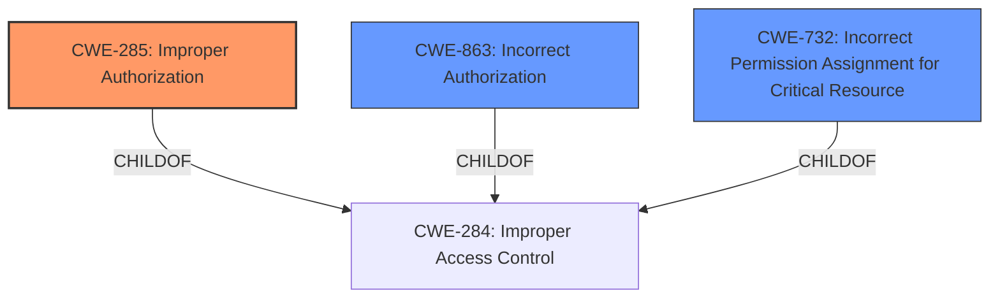

# Enhanced Analysis for CVE-2022-40231

# Summary
| CWE ID | CWE Name | Confidence | CWE Abstraction Level | CWE Vulnerability Mapping Label | CWE-Vulnerability Mapping Notes |
|---|---|---|---|---|---|
| CWE-285 | Improper Authorization | 0.9 | Class | Primary | Allowed-with-Review |
| CWE-863 | Incorrect Authorization | 0.8 | Class | Secondary | Allowed-with-Review, suggested alternative to CWE-285 |
| CWE-732 | Incorrect Permission Assignment for Critical Resource | 0.7 | Class | Secondary | Allowed-with-Review, alternative to CWE-285 |
## Evidence and Confidence

*   **Confidence Score:** 0.9
*   **Evidence Strength:** HIGH

## Relationship Analysis
The primary relationship influencing my decision is the parent-child relationship between CWE-284 (Improper Access Control) and its children, specifically CWE-285 (Improper Authorization), CWE-863 (Incorrect Authorization), and CWE-732 (Incorrect Permission Assignment for Critical Resource). Since the vulnerability description highlights **improper access controls** leading to unauthorized actions, I considered these more specific child CWEs.



## Vulnerability Chain
The vulnerability chain starts with the **improper access controls** within the dashboard UI, which leads to the ability for an authenticated user to perform unauthorized actions.

*   **Root Cause:** **Improper access controls**
*   **Weakness:** Missing or incorrect authorization checks.
*   **Impact:** Unauthorized actions performed by authenticated user.

## Summary of Analysis
Initially, CWE-284 (Improper Access Control) seemed like a potential fit, given the description's focus on **improper access controls**. However, the mapping guidance for CWE-284 discourages its use due to its high-level nature and suggests considering more specific descendants.

The vulnerability description key phrases highlight "**improper access controls**" as the root cause, leading to the impact of "perform unauthorized actions". The CVE Reference Links Content Summary confirms that the root cause is **improper permission control** in the dashboard UI. This indicates a problem with authorization, leading me to consider CWE-285 (Improper Authorization) and its related CWEs.

CWE-285 (Improper Authorization) fits well because it describes the product incorrectly performing an authorization check, which aligns with the **improper access controls** described in the vulnerability. The mapping guidance for CWE-285 suggests considering its children, such as CWE-862 (Missing Authorization), CWE-863 (Incorrect Authorization), and CWE-732 (Incorrect Permission Assignment for Critical Resource).

CWE-863 (Incorrect Authorization) is a strong candidate because it directly addresses the scenario where authorization checks are performed incorrectly. CWE-732 (Incorrect Permission Assignment for Critical Resource) is also relevant because it focuses on incorrect permission assignments for critical resources.

Ultimately, I chose CWE-285 as the primary CWE because it encompasses the general problem of **improper authorization**. I selected CWE-863 and CWE-732 as secondary CWEs to provide more specific context about the nature of the authorization failure.

My assessment is heavily based on the provided evidence. The key phrase "**improper access controls**" and the summary's "**improper permission control**" directly support the selection of authorization-related CWEs.

The selection of CWE-285, CWE-863, and CWE-732 are at the optimal level of specificity, given the information available. While more detailed information could potentially lead to even more specific CWEs, the current evidence supports these classifications.

Relevant CWE Information:

# Enhanced Context (25 CWEs)
The following CWEs were identified as potentially relevant to this vulnerability:

## CWE-668: Exposure of Resource to Wrong Sphere
**Abstraction Level**: Class
**Similarity Score**: 0.76
**Source**: dense

**Description**:
The product exposes a resource to the wrong control sphere, providing unintended actors with inappropriate access to the resource.

**Mapping Guidance**:
- Usage: Discouraged
- Rationale: CWE-668 is high-level and is often misused as a catch-all when lower-level CWE IDs might be applicable. It is sometimes used for low-information vulnerability reports [REF-1287]. It is a level-1 Class (i.e., a child of a Pillar). It is not useful for trend analysis.

*Reasoning*: This was not chosen as the description is too generic. The other CWEs selected are more specific.

## CWE-807: Reliance on Untrusted Inputs in a Security Decision
**Abstraction Level**: Base
**Similarity Score**: 0.74
**Source**: dense

**Description**:
The product uses a protection mechanism that relies on the existence or values of an input, but the input can be modified by an untrusted actor in a way that bypasses the protection mechanism.

**Mapping Guidance**:
- Usage: Allowed
- Rationale: This CWE entry is at the Base level of abstraction, which is a preferred level of abstraction for mapping to the root causes of vulnerabilities.

*Reasoning*: The vulnerability description does not mention anything about untrusted inputs. It focuses on the **improper access controls**.

## CWE-41: Improper Resolution of Path Equivalence
**Abstraction Level**: Base
**Similarity Score**: 0.74
**Source**: dense

**Description**:
The product is vulnerable to file system contents disclosure through path equivalence. Path equivalence involves the use of special characters in file and directory names. The associated manipulations are intended to generate multiple names for the same object.

**Mapping Guidance**:
- Usage: Allowed
- Rationale: This CWE entry is at the Base level of abstraction, which is a preferred level of abstraction for mapping to the root causes of vulnerabilities.

*Reasoning*: The vulnerability description does not mention anything about file system paths.

## CWE-74: Improper Neutralization of Special Elements in Output Used by a Downstream Component ('Injection')
**Abstraction Level**: Class
**Similarity Score**: 0.74
**Source**: dense

**Description**:
The product constructs all or part of a command, data structure, or record using externally-influenced input from an upstream component, but it does not neutralize or incorrectly neutralizes special elements that could modify how it is parsed or interpreted when it is sent to a downstream component.

**Mapping Guidance**:
- Usage: Discouraged
- Rationale: CWE-74 is high-level and often misused when lower-level weaknesses are more appropriate.

*Reasoning*: The vulnerability description does not mention anything about injection.

## CWE-212: Improper Removal of Sensitive Information Before Storage or Transfer
**Abstraction Level**: Base
**Similarity Score**: 0.74
**Source**: dense

**Description**:
The product stores, transfers, or shares a resource that contains sensitive information, but it does not properly remove that information before the product makes the resource available to unauthorized actors.

**Mapping Guidance**:
- Usage: Allowed
- Rationale: This CWE entry is at the Base level of abstraction, which is a preferred level of abstraction for mapping to the root causes of vulnerabilities.

*Reasoning*: This CWE is not relevant as the description relates to access control, and not the handling of sensitive information.

## CWE-639: Authorization Bypass Through User-Controlled Key
**Abstraction Level**: Base
**Similarity Score**: 0.74
**Source**: dense

**Description**:
The system's authorization functionality does not prevent one user from gaining access to another user's data or record by modifying the key value identifying the data.

**Mapping Guidance**:
- Usage: Allowed
- Rationale: This CWE entry is at the Base level of abstraction, which is a preferred level of abstraction for mapping to the root causes of vulnerabilities.

*Reasoning*: This CWE is not relevant as the description is too specific. The other CWEs selected are more generic and fit the vulnerability better.

## CWE-538: Insertion of Sensitive Information into Externally-Accessible File or Directory
**Abstraction Level**: Base
**Similarity Score**: 0.74
**Source**: dense

**Description**:
The product places sensitive information into files or directories that are accessible to actors who are allowed to have access to the files, but not to the sensitive information.

**Mapping Guidance**:
- Usage: Allowed
- Rationale: This CWE entry is at the Base level of abstraction, which is a preferred level of abstraction for mapping to the root causes of vulnerabilities.

*Reason


## CWE Relationship Analysis

Current CWEs represent these abstraction levels: .


### Vulnerability Chain Analysis

**Chain starting from CWE-862:**
- 862 (Missing Authorization) - ROOT


**Chain starting from CWE-41:**
- 41 (Improper Resolution of Path Equivalence) - ROOT


### CWE Relationship Diagram

```mermaid
graph TD
    classDef primary fill:#f96,stroke:#333,stroke-width:2px
    classDef secondary fill:#69f,stroke:#333
    classDef tertiary fill:#9e9,stroke:#333
```