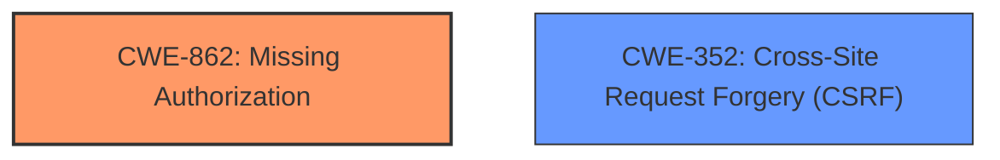

# Raw Analyzer Response for CVE-2022-4024

# Summary
| CWE ID | CWE Name | Confidence | CWE Abstraction Level | CWE Vulnerability Mapping Label | CWE-Vulnerability Mapping Notes |
|---|---|---|---|---|---|
| CWE-862 | Missing Authorization | 1.0 | Class | Primary | Allowed-with-Review |
| CWE-352 | Cross-Site Request Forgery (CSRF) | 1.0 | Compound | Secondary | Allowed |

## Evidence and Confidence

*   **Confidence Score:** 1.0
*   **Evidence Strength:** HIGH

## Relationship Analysis
The primary weakness is **Missing Authorization (CWE-862)**, as the plugin **does not perform an authorization check** when deleting users. The secondary weakness is **Cross-Site Request Forgery (CSRF) (CWE-352)**, as the plugin **does not verify if the request was intentionally provided by the user**.

## Vulnerability Chain
The vulnerability chain involves the following:
1.  **Missing Authorization (CWE-862)**: The plugin **does not perform an authorization check** when deleting users.
2.  **Cross-Site Request Forgery (CSRF) (CWE-352)**: The plugin **does not verify if the request was intentionally provided by the user**.
3.  **Impact**: An unauthenticated attacker can delete arbitrary users (along with their posts).

## Summary of Analysis
The analysis indicates that the primary weakness is **CWE-862 (Missing Authorization)**, as the plugin **does not perform an authorization check** when deleting users via an init action handler. The vulnerability description explicitly states that the plugin **does not have authorization**, allowing unauthenticated attackers to delete arbitrary users. The secondary weakness is **CWE-352 (Cross-Site Request Forgery)**, as the plugin **does not have CSRF protection**, allowing attackers to forge requests on behalf of legitimate users.

The vulnerability description states: "The Registration Forms WordPress plugin before 3.8.1.3 **does not have authorisation and CSRF** when deleting users via an init action handler, allowing unauthenticated attackers to delete arbitrary users (along with their posts)".

The retriever scores and relationship analysis support the selection of **CWE-862** and **CWE-352** as the primary and secondary weaknesses, respectively. **CWE-862** is at the Class level, but it accurately represents the **missing authorization** vulnerability. **CWE-352** is a Compound weakness, which is appropriate for representing the **CSRF bypass**.

CWEs considered but not used:

*   **CWE-863: Incorrect Authorization**: While similar to **CWE-862**, the vulnerability description clearly states that authorization is **missing**, not incorrectly implemented.
*   **CWE-425: Direct Request ('Forced Browsing')**: This CWE is less specific than **CWE-862** and **CWE-352** in this context.
*   **CWE-434: Unrestricted Upload of File with Dangerous Type**: This CWE is not relevant to the vulnerability, as it involves deleting users, not uploading files.
*   **CWE-285: Improper Authorization**: Similar to **CWE-863**, the vulnerability description states authorization is **missing**, not improperly implemented.