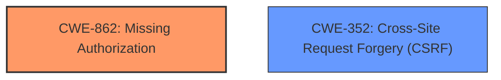

# Analysis for CVE-2022-4024

# Summary
| CWE ID | CWE Name | Confidence | CWE Abstraction Level | CWE Vulnerability Mapping Label | CWE-Vulnerability Mapping Notes |
|---|---|---|---|---|---|
| CWE-862 | Missing Authorization | 1.0 | Class | Primary | Allowed-with-Review |
| CWE-352 | Cross-Site Request Forgery (CSRF) | 1.0 | Compound | Secondary | Allowed |

## Evidence and Confidence

*   **Confidence Score:** 1.0
*   **Evidence Strength:** HIGH

## Relationship Analysis
The primary weakness is **Missing Authorization (CWE-862)**, as the plugin **does not perform an authorization check** when deleting users. The secondary weakness is **Cross-Site Request Forgery (CSRF) (CWE-352)**, as the plugin **does not verify if the request was intentionally provided by the user**.

## Vulnerability Chain
The vulnerability chain involves the following:
1.  **Missing Authorization (CWE-862)**: The plugin **does not perform an authorization check** when deleting users.
2.  **Cross-Site Request Forgery (CSRF) (CWE-352)**: The plugin **does not verify if the request was intentionally provided by the user**.
3.  **Impact**: An unauthenticated attacker can delete arbitrary users (along with their posts).

## Summary of Analysis
The analysis indicates that the primary weakness is **CWE-862 (Missing Authorization)**, as the plugin **does not perform an authorization check** when deleting users via an init action handler. The vulnerability description explicitly states that the plugin **does not have authorization**, allowing unauthenticated attackers to delete arbitrary users. The secondary weakness is **CWE-352 (Cross-Site Request Forgery)**, as the plugin **does not have CSRF protection**, allowing attackers to forge requests on behalf of legitimate users.

The vulnerability description states: "The Registration Forms WordPress plugin before 3.8.1.3 **does not have authorisation and CSRF** when deleting users via an init action handler, allowing unauthenticated attackers to delete arbitrary users (along with their posts)".

The retriever scores and relationship analysis support the selection of **CWE-862** and **CWE-352** as the primary and secondary weaknesses, respectively. **CWE-862** is at the Class level, but it accurately represents the **missing authorization** vulnerability. **CWE-352** is a Compound weakness, which is appropriate for representing the **CSRF bypass**.

CWEs considered but not used:

*   **CWE-863: Incorrect Authorization**: While similar to **CWE-862**, the vulnerability description clearly states that authorization is **missing**, not incorrectly implemented.
*   **CWE-425: Direct Request ('Forced Browsing')**: This CWE is less specific than **CWE-862** and **CWE-352** in this context.
*   **CWE-434: Unrestricted Upload of File with Dangerous Type**: This CWE is not relevant to the vulnerability, as it involves deleting users, not uploading files.
*   **CWE-285: Improper Authorization**: Similar to **CWE-863**, the vulnerability description states authorization is **missing**, not improperly implemented.

# Enhanced Query for CVE-2022-4024

# Vulnerability Description

    The Registration Forms WordPress plugin before 3.8.1.3 does not have authorisation and CSRF when deleting users via an init action handler, allowing unauthenticated attackers to delete arbitrary users (along with their posts)

    # Keyphrase-Specific CWE Analysis
    This vulnerability contains multiple keyphrases that may map to different CWEs. 
    Please analyze each keyphrase separately and determine the most appropriate CWE(s) for each.

    ## WEAKNESS: 'authorisation bypass'

Relevant CWEs for this WEAKNESS:

### 1. CWE-352: Cross-Site Request Forgery (CSRF) (Score: 296.86)

The web application does not, or can not, sufficiently verify whether a well-formed, valid, consistent request was intentionally provided by the user who submitted the request....

### 2. CWE-862: Missing Authorization (Score: 276.67)

The product does not perform an authorization check when an actor attempts to access a resource or perform an action....

### 3. CWE-863: Incorrect Authorization (Score: 228.26)

The product performs an authorization check when an actor attempts to access a resource or perform an action, but it does not correctly perform the check....

### 4. CWE-285: Improper Authorization (Score: 211.65)

The product does not perform or incorrectly performs an authorization check when an actor attempts to access a resource or perform an action....

### 5. CWE-425: Direct Request ('Forced Browsing') (Score: 201.54)

The web application does not adequately enforce appropriate authorization on all restricted URLs, scripts, or files....

## WEAKNESS: 'CSRF bypass'

Relevant CWEs for this WEAKNESS:

### 1. CWE-352: Cross-Site Request Forgery (CSRF) (Score: 296.86)

The web application does not, or can not, sufficiently verify whether a well-formed, valid, consistent request was intentionally provided by the user who submitted the request....

### 2. CWE-862: Missing Authorization (Score: 276.67)

The product does not perform an authorization check when an actor attempts to access a resource or perform an action....

### 3. CWE-863: Incorrect Authorization (Score: 228.26)

The product performs an authorization check when an actor attempts to access a resource or perform an action, but it does not correctly perform the check....

### 4. CWE-434: Unrestricted Upload of File with Dangerous Type (Score: 215.58)

The product allows the upload or transfer of dangerous file types that are automatically processed within its environment....

### 5. CWE-425: Direct Request ('Forced Browsing') (Score: 201.54)

The web application does not adequately enforce appropriate authorization on all restricted URLs, scripts, or files....

## IMPACT: 'delete arbitrary users'

Relevant CWEs for this IMPACT:

### 1. CWE-352: Cross-Site Request Forgery (CSRF) (Score: 296.86)

The web application does not, or can not, sufficiently verify whether a well-formed, valid, consistent request was intentionally provided by the user who submitted the request....

### 2. CWE-862: Missing Authorization (Score: 276.67)

The product does not perform an authorization check when an actor attempts to access a resource or perform an action....

### 3. CWE-863: Incorrect Authorization (Score: 228.26)

The product performs an authorization check when an actor attempts to access a resource or perform an action, but it does not correctly perform the check....

### 4. CWE-285: Improper Authorization (Score: 211.65)

The product does not perform or incorrectly performs an authorization check when an actor attempts to access a resource or perform an action....

### 5. CWE-425: Direct Request ('Forced Browsing') (Score: 201.54)

The web application does not adequately enforce appropriate authorization on all restricted URLs, scripts, or files....

## VECTOR: 'init action handler'

Relevant CWEs for this VECTOR:

### 1. CWE-352: Cross-Site Request Forgery (CSRF) (Score: 296.86)

The web application does not, or can not, sufficiently verify whether a well-formed, valid, consistent request was intentionally provided by the user who submitted the request....

### 2. CWE-862: Missing Authorization (Score: 276.67)

The product does not perform an authorization check when an actor attempts to access a resource or perform an action....

### 3. CWE-863: Incorrect Authorization (Score: 228.26)

The product performs an authorization check when an actor attempts to access a resource or perform an action, but it does not correctly perform the check....

### 4. CWE-434: Unrestricted Upload of File with Dangerous Type (Score: 215.58)

The product allows the upload or transfer of dangerous file types that are automatically processed within its environment....

### 5. CWE-285: Improper Authorization (Score: 211.65)

The product does not perform or incorrectly performs an authorization check when an actor attempts to access a resource or perform an action....

## ATTACKER: 'unauthenticated attackers'

Relevant CWEs for this ATTACKER:

### 1. CWE-352: Cross-Site Request Forgery (CSRF) (Score: 296.86)

The web application does not, or can not, sufficiently verify whether a well-formed, valid, consistent request was intentionally provided by the user who submitted the request....

### 2. CWE-862: Missing Authorization (Score: 276.67)

The product does not perform an authorization check when an actor attempts to access a resource or perform an action....

### 3. CWE-863: Incorrect Authorization (Score: 228.26)

The product performs an authorization check when an actor attempts to access a resource or perform an action, but it does not correctly perform the check....

### 4. CWE-285: Improper Authorization (Score: 211.65)

The product does not perform or incorrectly performs an authorization check when an actor attempts to access a resource or perform an action....

### 5. CWE-425: Direct Request ('Forced Browsing') (Score: 201.54)

The web application does not adequately enforce appropriate authorization on all restricted URLs, scripts, or files....

## PRODUCT: 'Registration Forms WordPress plugin'

Relevant CWEs for this PRODUCT:

### 1. CWE-352: Cross-Site Request Forgery (CSRF) (Score: 296.86)

The web application does not, or can not, sufficiently verify whether a well-formed, valid, consistent request was intentionally provided by the user who submitted the request....

### 2. CWE-862: Missing Authorization (Score: 276.67)

The product does not perform an authorization check when an actor attempts to access a resource or perform an action....

### 3. CWE-863: Incorrect Authorization (Score: 228.26)

The product performs an authorization check when an actor attempts to access a resource or perform an action, but it does not correctly perform the check....

### 4. CWE-434: Unrestricted Upload of File with Dangerous Type (Score: 215.58)

The product allows the upload or transfer of dangerous file types that are automatically processed within its environment....

### 5. CWE-472: External Control of Assumed-Immutable Web Parameter (Score: 87.31)

The web application does not sufficiently verify inputs that are assumed to be immutable but are actually externally controllable, such as hidden form fields....

## VERSION: 'before 3.8.1.3'

Relevant CWEs for this VERSION:

### 1. CWE-352: Cross-Site Request Forgery (CSRF) (Score: 296.86)

The web application does not, or can not, sufficiently verify whether a well-formed, valid, consistent request was intentionally provided by the user who submitted the request....

### 2. CWE-862: Missing Authorization (Score: 276.67)

The product does not perform an authorization check when an actor attempts to access a resource or perform an action....

### 3. CWE-863: Incorrect Authorization (Score: 228.26)

The product performs an authorization check when an actor attempts to access a resource or perform an action, but it does not correctly perform the check....

### 4. CWE-434: Unrestricted Upload of File with Dangerous Type (Score: 215.58)

The product allows the upload or transfer of dangerous file types that are automatically processed within its environment....

### 5. CWE-285: Improper Authorization (Score: 211.65)

The product does not perform or incorrectly performs an authorization check when an actor attempts to access a resource or perform an action....

    # Analysis Instructions
    1. For each keyphrase, identify the most appropriate CWE(s) that represent the weakness.
    2. Consider how the different keyphrases might relate to each other in the vulnerability chain.
    3. Provide a final determination of primary CWE(s) and any secondary CWEs.
    4. Format your response using the standard analysis template.

    Please analyze how these different weaknesses interact and provide a comprehensive CWE classification.
    