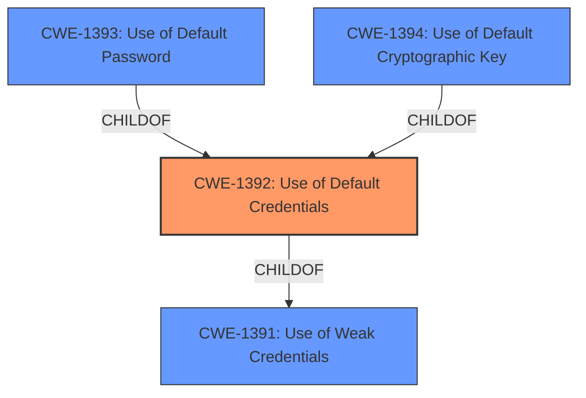

# Analysis for CVE-2022-40242

# Summary
| CWE ID  | CWE Name                        | Confidence | CWE Abstraction Level | CWE Vulnerability Mapping Label | CWE-Vulnerability Mapping Notes |
|---------|---------------------------------|------------|-----------------------|---------------------------------|---------------------------------|
| CWE-1392 | Use of Default Credentials      | 1.0        | Base                  | Primary CWE                     | Allowed                         |
| CWE-1393 | Use of Default Password         | 0.8        | Base                  | Secondary Candidate             | Allowed                         |
| CWE-798  | Use of Hard-coded Credentials   | 0.6        | Base                  | Secondary Candidate             | Allowed                         |

## Evidence and Confidence

*   **Confidence Score:** 0.9
*   **Evidence Strength:** HIGH

## Relationship Analysis
The primary CWE selected is CWE-1392 (Use of Default Credentials), which is a Base level CWE. It has a child relationship to CWE-1393 (Use of Default Password) and CWE-1394 (Use of Default Cryptographic Key), which are more specific. It also has a parent relationship to CWE-1391 (Use of Weak Credentials), which is a Class level CWE. The selection of CWE-1392 is appropriate because the vulnerability involves the use of default credentials, but the description does not specify whether it is a password or a cryptographic key.

## Vulnerability Chain
The vulnerability chain starts with the **root cause** of using **default credentials** (CWE-1392). This leads to the vulnerability of unauthorized access, and finally results in the impact of complete system compromise, including confidentiality, integrity, and availability.

## Summary of Analysis
The initial analysis correctly identified the presence of default credentials as the root cause. The final conclusion, based on the retriever results and the provided evidence, indicates that CWE-1392 (Use of Default Credentials) is the most appropriate mapping. The vulnerability description clearly states that the **root cause** is the use of **default credentials**.

> **Vulnerability Description Key Phrases**
> -   **rootcause:** **default credentials**

> **CVE Reference Links Content Summary**
> -   **Root cause of vulnerability**: Default credentials are used in AMI MegaRAC SPX.
> -   **Weaknesses/vulnerabilities present**: Usage of default credentials.

CWE-1392 is a Base level CWE, which is the preferred level of abstraction. The MITRE mapping guidance for CWE-1392 states that it is an Allowed mapping.

Other CWEs considered but not used:

*   CWE-1391 (Use of Weak Credentials): This is a Class level CWE and less specific than CWE-1392.
*   CWE-1393 (Use of Default Password): This is a Base level CWE and more specific than CWE-1392, but the vulnerability description does not specify whether it is a password.
*   CWE-798 (Use of Hard-coded Credentials): This is a Base level CWE, but the vulnerability description specifically mentions default credentials, not hard-coded credentials.
*   CWE-259 (Use of Hard-coded Password): This is a Variant level CWE, but the vulnerability description specifically mentions default credentials, not hard-coded credentials.
*   CWE-1394 (Use of Default Cryptographic Key): This is a Base level CWE and more specific than CWE-1392, but the vulnerability description does not specify whether it is a cryptographic key.
*   CWE-321 (Use of Hard-coded Cryptographic Key): This is a Variant level CWE, but the vulnerability description specifically mentions default credentials, not hard-coded credentials.

Relevant CWE Information:

# Enhanced Context (25 CWEs)

## CWE-1392: Use of Default Credentials
**Abstraction:** Base
**Status:** Incomplete

### Description
The product uses default credentials (such as passwords or cryptographic keys) for potentially critical functionality.

### Extended Description
It is common practice for products to be designed to use default keys, passwords, or other mechanisms for authentication. The rationale is to simplify the manufacturing process or the system administrator's task of installation and deployment into an enterprise. However, if admins do not change the defaults, it is easier for attackers to bypass authentication quickly across multiple organizations.

### Alternative Terms
None

### Relationships
ChildOf -> CWE-1391

### Mapping Guidance
**Usage:** Allowed
**Rationale:** This CWE entry is at the Base level of abstraction, which is a preferred level of abstraction for mapping to the root causes of vulnerabilities.
**Comments:** Carefully read both the name and description to ensure that this mapping is an appropriate fit. Do not try to 'force' a mapping to a lower-level Base/Variant simply to comply with this preferred level of abstraction.
**Reasons:**
- Acceptable-Use

### Observed Examples
-   **CVE-2022-30270:** Remote Terminal Unit (RTU) uses default credentials for some SSH accounts
-   **CVE-2021-41192:** data visualization/sharing package uses default secret keys or cookie values if they are not specified in environment variables
-   **CVE-2021-38759:** microcontroller board has default password