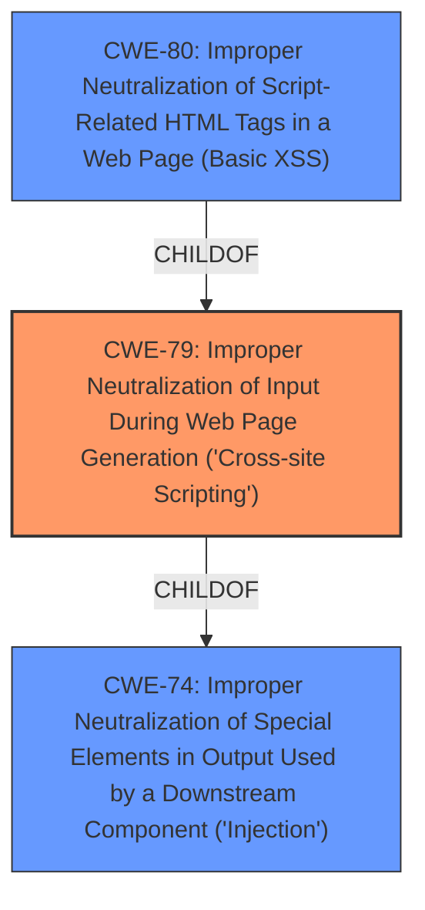

# Enhanced Analysis for CVE-2022-40248

# Summary
| CWE ID | CWE Name | Confidence | CWE Abstraction Level | CWE Vulnerability Mapping Label | CWE-Vulnerability Mapping Notes |
|---|---|---|---|---|---|
| CWE-79 | Improper Neutralization of Input During Web Page Generation ('Cross-site Scripting') | 1.0 | Base | Allowed | Primary CWE |

## Evidence and Confidence

*   **Confidence Score:** 1.0
*   **Evidence Strength:** HIGH

## Relationship Analysis
The primary relationship influencing the CWE selection is the ChildOf relationship between CWE-80 and CWE-79. While CWE-80 is more specific (Improper Neutralization of Script-Related HTML Tags), the vulnerability description doesn't limit the injection to just script-related tags, thus making CWE-79 a more accurate and broader classification. There are also peer relationships with CWE-352 Cross-Site Request Forgery (CSRF), indicating a potential for combined attacks, though not explicitly supported by the provided information. The Base level of abstraction of CWE-79 is appropriate as it directly represents the root cause of the vulnerability.



## Vulnerability Chain
The vulnerability chain starts with the **improper handling of input** in the "Product Affected field," leading to **HTML injection** and ultimately resulting in the ability to inject arbitrary HTML. This maps to a scenario where user-supplied data is not properly neutralized before being used in a web page.

## Summary of Analysis
The initial analysis strongly pointed towards CWE-79, given the explicit mention of **HTML injection** in the vulnerability description. The key phrase "inject arbitrary HTML" directly aligns with the core characteristic of CWE-79. The "CVE Reference Links Content Summary" confirms the existence of a fix for a security vulnerability, further reinforcing the validity of the assessment. The Retriever results also identified CWE-79 as the top candidate, lending additional support to this classification.

The assessment is heavily based on the vulnerability description, particularly the phrases "HTML injection" and "inject arbitrary HTML." The fact that an authenticated attacker can inject arbitrary HTML via a form field indicates that the application is **not properly neutralizing user-controllable input** before placing it in the output, which is used as a web page. This behavior precisely matches the description of CWE-79.

The graph relationships influenced the selection by highlighting the parent-child relationship between CWE-74 and CWE-79. While CWE-74 (Improper Neutralization of Special Elements) is a broader category, CWE-79 is more specific to web page generation, making it a better fit for this vulnerability.

CWE-79 is at the optimal level of specificity because it directly addresses the **root cause** of the vulnerability. The vulnerability is not limited to script-related tags, which would make CWE-80 a more appropriate choice, but rather involves arbitrary HTML injection, making CWE-79 a better fit.

Relevant CWE Information:

# Enhanced Context (25 CWEs)

## CWE-79: Improper Neutralization of Input During Web Page Generation ('Cross-site Scripting')
**Abstraction:** Base
**Status:** Stable

### Description
The product does not neutralize or incorrectly neutralizes user-controllable input before it is placed in output that is used as a web page that is served to other users.

### Extended Description

Cross-site scripting (XSS) vulnerabilities occur when:

1.  Untrusted data enters a web application, typically from a web request.
2.  The web application dynamically generates a web page that contains this untrusted data.
3.  During page generation, the application does not prevent the data from containing content that is executable by a web browser, such as JavaScript, HTML tags, HTML attributes, mouse events, Flash, ActiveX, etc.
4.  A victim visits the generated web page through a web browser, which contains malicious script that was injected using the untrusted data.
5.  Since the script comes from a web page that was sent by the web server, the victim's web browser executes the malicious script in the context of the web server's domain.
6.  This effectively violates the intention of the web browser's same-origin policy, which states that scripts in one domain should not be able to access resources or run code in a different domain.

There are three main kinds of XSS:

*   **Type 1: Reflected XSS (or Non-Persistent)**  - The server reads data directly from the HTTP request and reflects it back in the HTTP response. Reflected XSS exploits occur when an attacker causes a victim to supply dangerous content to a vulnerable web application, which is then reflected back to the victim and executed by the web browser. The most common mechanism for delivering malicious content is to include it as a parameter in a URL that is posted publicly or e-mailed directly to the victim. URLs constructed in this manner constitute the core of many phishing schemes, whereby an attacker convinces a victim to visit a URL that refers to a vulnerable site. After the site reflects the attacker's content back to the victim, the content is executed by the victim's browser.

*   **Type 2: Stored XSS (or Persistent)**  - The application stores dangerous data in a database, message forum, visitor log, or other trusted data store. At a later time, the dangerous data is subsequently read back into the application and included in dynamic content. From an attacker's perspective, the optimal place to inject malicious content is in an area that is displayed to either many users or particularly interesting users. Interesting users typically have elevated privileges in the application or interact with sensitive data that is valuable to the attacker. If one of these users executes malicious content, the attacker may be able to perform privileged operations on behalf of the user or gain access to sensitive data belonging to the user. For example, the attacker might inject XSS into a log message, which might not be handled properly when an administrator views the logs.

*   **Type 0: DOM-Based XSS**  - In DOM-based XSS, the client performs the injection of XSS into the page; in the other types, the server performs the injection. DOM-based XSS generally involves server-controlled, trusted script that is sent to the client, such as Javascript that performs sanity checks on a form before the user submits it. If the server-supplied script processes user-supplied data and then injects it back into the web page (such as with dynamic HTML), then DOM-based XSS is possible.

Once the malicious script is injected, the attacker can perform a variety of malicious activities. The attacker could transfer private information, such as cookies that may include session information, from the victim's machine to the attacker. The attacker could send malicious requests to a web site on behalf of the victim, which could be especially dangerous to the site if the victim has administrator privileges to manage that site. Phishing attacks could be used to emulate trusted web sites and trick the victim into entering a password, allowing the attacker to compromise the victim's account on that web site. Finally, the script could exploit a vulnerability in the web browser itself possibly taking over the victim's machine, sometimes referred to as "drive-by hacking."

In many cases, the attack can be launched without the victim even being aware of it. Even with careful users, attackers frequently use a variety of methods to encode the malicious portion of the attack, such as URL encoding or Unicode, so the request looks less suspicious.

### Alternative Terms
XSS: A common abbreviation for Cross-Site Scripting.
HTML Injection: Used as a synonym of stored (Type 2) XSS.
CSS: In the early years after initial discovery of XSS, "CSS" was a commonly-used acronym. However, this would cause confusion with "Cascading Style Sheets," so usage of this acronym has declined significantly.

### Relationships
ChildOf -> CWE-74
ChildOf -> CWE-74
CanPrecede -> CWE-494
PeerOf -> CWE-352

### Mapping Guidance
**Usage:** Allowed
**Rationale:** This CWE entry is at the Base level of abstraction, which is a preferred level of abstraction for mapping to the root causes of vulnerabilities.
**Comments:** Carefully read both the name and description to ensure that this mapping is an appropriate fit. Do not try to 'force' a mapping to a lower-level Base/Variant simply to comply with this preferred level of abstraction.
**Reasons:**
- Acceptable-Use

### Additional Notes
**[Relationship]**

There can be a close relationship between XSS and CSRF (CWE-352). An attacker might use CSRF in order to trick the victim into submitting requests to the server in which the requests contain an XSS payload. A well-known


## CWE Relationship Analysis

Current CWEs represent these abstraction levels: .


### Vulnerability Chain Analysis

**Chain starting from CWE-80:**
- 80 (Improper Neutralization of Script-Related HTML Tags in a Web Page (Basic XSS)) - ROOT


**Chain starting from CWE-494:**
- 494 (Download of Code Without Integrity Check) - ROOT


### CWE Relationship Diagram

```mermaid
graph TD
    classDef primary fill:#f96,stroke:#333,stroke-width:2px
    classDef secondary fill:#69f,stroke:#333
    classDef tertiary fill:#9e9,stroke:#333
```