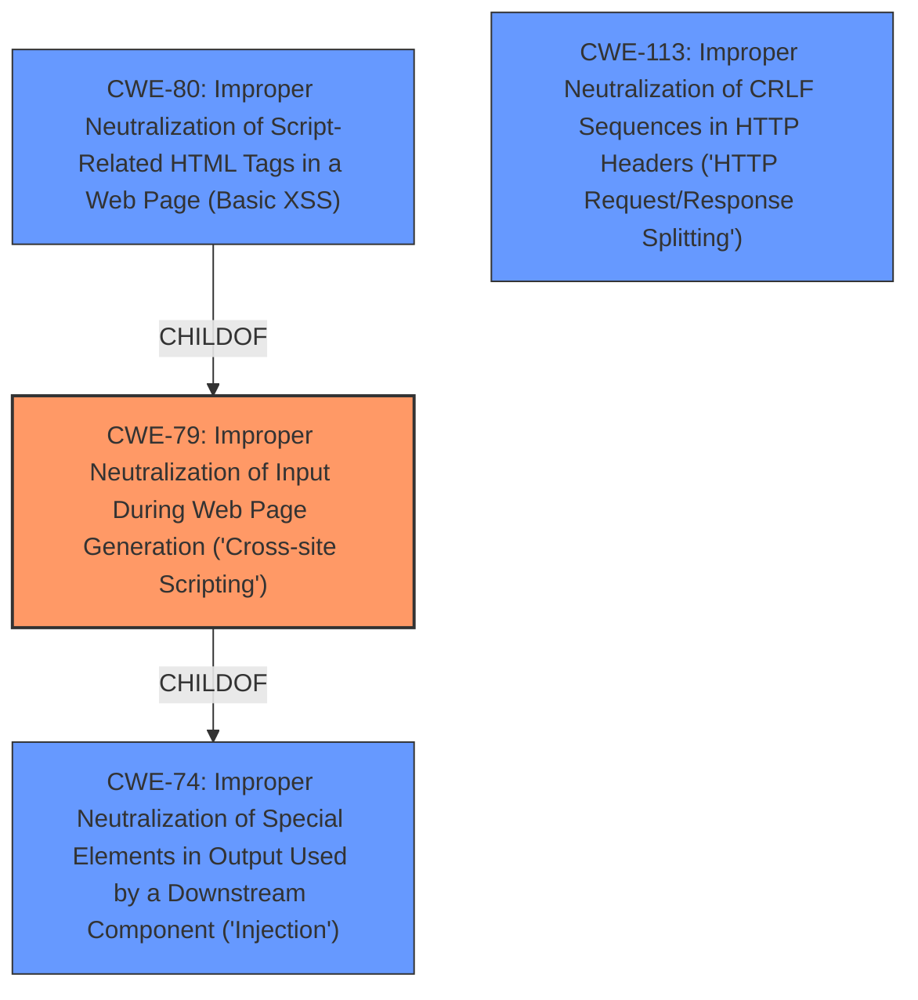

# Analysis for CVE-2022-40257

# Summary
| CWE ID | CWE Name | Confidence | CWE Abstraction Level | CWE Vulnerability Mapping Label | CWE-Vulnerability Mapping Notes |
|---|---|---|---|---|---|
| CWE-79 | Improper Neutralization of Input During Web Page Generation ('Cross-site Scripting') | 1.0 | Base | Allowed | Primary CWE. The vulnerability allows an attacker to inject arbitrary HTML via a crafted email, leading to the execution of malicious scripts within the context of the user's web browser. |

## Evidence and Confidence

*   **Confidence Score:** 1.0
*   **Evidence Strength:** HIGH

## Relationship Analysis
The primary CWE is CWE-79.
  - CWE-79 is a Base level CWE, which is the preferred level of abstraction.
  - CWE-79 is a child of CWE-74 (Improper Neutralization of Special Elements in Output Used by a Downstream Component ('Injection')).
  - CWE-80 (Improper Neutralization of Script-Related HTML Tags in a Web Page (Basic XSS)) is a Variant of CWE-79, but the vulnerability description doesn't specify the type of HTML tags that are not neutralized.
  - CWE-113 (Improper Neutralization of CRLF Sequences in HTTP Headers ('HTTP Request/Response Splitting')) is not relevant because the vulnerability is related to HTML injection, not CRLF injection.

## Vulnerability Chain
The chain of root cause and weaknesses that followed for the Vulnerability Description:
  - **Root Cause:** The application fails to properly neutralize HTML special characters in the Subject field of an email.
  - **Weakness:** Crafted email with HTML content in the Subject field
  - **Impact:** An authenticated attacker can inject arbitrary HTML, leading to Cross-Site Scripting (XSS).

## Summary of Analysis
The initial analysis and criticism led to the conclusion that CWE-79 is the most appropriate CWE for this vulnerability.

The vulnerability description explicitly states that there is an **HTML injection** vulnerability where an attacker can inject arbitrary HTML via a crafted email. The "CVE Reference Links Content Summary" does not provide specifics on the root cause itself.

The Retriever Results indicate that CWE-79 is the best match with a score of 1.0. The description of CWE-79 aligns with the vulnerability description, as it involves the improper neutralization of user-controllable input (HTML) before it is placed in output that is used as a web page. The abstraction level of CWE-79 is Base, which is the preferred level of abstraction.

CWE-80 (Improper Neutralization of Script-Related HTML Tags in a Web Page (Basic XSS)) was considered but not used because it is more specific to script-related HTML tags, and the vulnerability description does not specify the type of HTML tags that are not neutralized. Therefore, CWE-79 is a more general and appropriate classification.

CWE-138 (Improper Neutralization of Special Elements) was also considered, but it is a Class-level CWE and less specific than CWE-79.

Based on the evidence and relationship analysis, CWE-79 is the most appropriate CWE for this vulnerability.