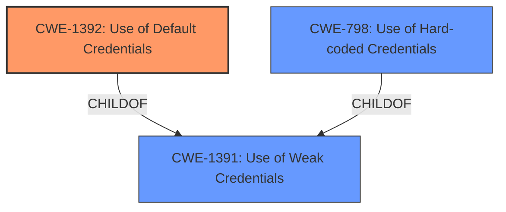

# Analysis Report for CVE-2022-40259

# Vulnerability Analysis Report: CVE-2022-40259

## Description


## Analysis (with Relationship Data)

# Summary
| CWE ID    | CWE Name                       | Confidence | CWE Abstraction Level | CWE Vulnerability Mapping Label | CWE-Vulnerability Mapping Notes |
| --------- | ------------------------------ | ---------- | --------------------- | ------------------------------- | ----------------------------- |
| CWE-1392  | Use of Default Credentials     | 0.9        | Base                  | Allowed                         | Primary CWE                   |
| CWE-1391  | Use of Weak Credentials        | 0.7        | Class                 | Allowed-with-Review           | Secondary Candidate           |
| CWE-798   | Use of Hard-coded Credentials  | 0.6        | Base                  | Allowed                         | Secondary Candidate           |

## Evidence and Confidence

*   **Confidence Score:** 0.9
*   **Evidence Strength:** HIGH

## Relationship Analysis
The primary relationship influencing the decision is the hierarchical relationship between CWE-1391 (Class: Use of Weak Credentials) and CWE-1392 (Base: Use of Default Credentials). CWE-1392 is a more specific child of CWE-1391. Given that the vulnerability description explicitly mentions "**default credentials**," selecting the base CWE-1392 is more appropriate.



## Vulnerability Chain
The vulnerability chain starts with the **root cause** of using **default credentials**. The impact of this weakness is arbitrary code execution via Redfish, leading to high impact on confidentiality, integrity, and availability.

## Summary of Analysis
The analysis is primarily based on the vulnerability description and the "Vulnerability Description Key Phrases," which explicitly identifies "**default credentials**" as the **root cause**. The "CVE Reference Links Content Summary" confirms the impact as arbitrary code execution. The retriever results also strongly suggest CWE-1392 as a potential candidate.

CWE-1392 is selected because it directly addresses the **root cause** of "**default credentials**." CWE-1391 is considered as a broader class, and CWE-798 addresses hardcoded credentials which is a different case than default. The selection aligns with MITRE's mapping guidance, which suggests using the most specific base-level CWE when possible.

Relevant CWE Information:

# Enhanced Context (25 CWEs)

## CWE-1391: Use of Weak Credentials
**Abstraction Level**: Class
**Similarity Score**: 0.77
**Source**: dense

**Description**:
The product uses weak credentials (such as a default key or hard-coded password) that can be calculated, derived, reused, or guessed by an attacker.

**Mapping Guidance**:
- Usage: Allowed-with-Review
- Rationale: This CWE entry is a Class and might have Base-level children that would be more appropriate

## CWE-1392: Use of Default Credentials
**Abstraction Level**: Base
**Similarity Score**: 0.77
**Source**: dense

**Description**:
The product uses default credentials (such as a passwords or cryptographic keys) for potentially critical functionality.

**Mapping Guidance**:
- Usage: Allowed
- Rationale: This CWE entry is at the Base level of abstraction, which is a preferred level of abstraction for mapping to the root causes of vulnerabilities.

## CWE-798: Use of Hard-coded Credentials
**Abstraction Level**: Base
**Similarity Score**: 0.77
**Source**: dense

**Description**:
The product contains hard-coded credentials, such as a password or cryptographic key.

**Mapping Guidance**:
- Usage: Allowed
- Rationale: This CWE entry is at the Base level of abstraction, which is a preferred level of abstraction for mapping to the root causes of vulnerabilities.

### CWE-1392: Use of Default Credentials
**CWE-1392**: Use of Default Credentials is the primary CWE because the vulnerability description explicitly mentions "**default credentials**". This aligns perfectly with the CWE's description: "The product uses default credentials (such as passwords or cryptographic keys) for potentially critical functionality." The security implication is that attackers can bypass authentication, leading to arbitrary code execution.
### CWE-1391: Use of Weak Credentials
**CWE-1391**: Use of Weak Credentials is a secondary CWE because default credentials fall under the broader category of weak credentials. This CWE's description is: "The product uses weak credentials (such as a default key or hard-coded password) that can be calculated, derived, reused, or guessed by an attacker." While applicable, it is less specific than CWE-1392.
### CWE-798: Use of Hard-coded Credentials
**CWE-798**: Use of Hard-coded Credentials is a secondary CWE because while related to credential management issues, hardcoded credentials are not explicitly mentioned. The description of CWE-798 is: "The product contains hard-coded credentials, such as a password or cryptographic key." This CWE is less directly relevant than CWE-1392 because it focuses on credentials that are built into the product's code rather than default credentials that are intended to be changed.


## CWE Relationship Analysis

Current CWEs represent these abstraction levels: .


### Vulnerability Chain Analysis

**Chain starting from CWE-1391:**
- 1391 (Use of Weak Credentials) - ROOT


**Chain starting from CWE-798:**
- 798 (Use of Hard-coded Credentials) - ROOT


### CWE Relationship Diagram

```mermaid
graph TD
    classDef primary fill:#f96,stroke:#333,stroke-width:2px
    classDef secondary fill:#69f,stroke:#333
    classDef tertiary fill:#9e9,stroke:#333
```


*Report generated on 2025-03-31 12:52:58*
