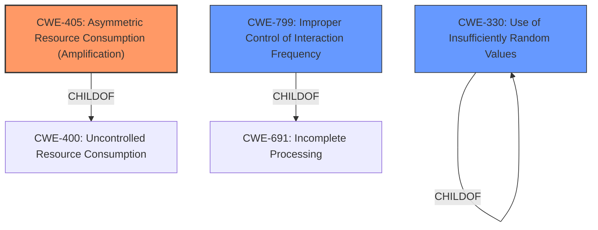

# Analysis for CVE-2022-40306

# Summary
| CWE ID | CWE Name | Confidence | CWE Abstraction Level | CWE Vulnerability Mapping Label | CWE-Vulnerability Mapping Notes |
|---|---|---|---|---|---|
| CWE-405 | Asymmetric Resource Consumption (Amplification) | 0.9 | Class | Allowed-with-Review | Primary CWE: The vulnerability allows attackers to cause a denial of service (DoS) by requesting the login form repeatedly, which triggers expensive RSA key-generation operations. This is a clear case of asymmetric resource consumption, as the attacker's effort (sending requests) is significantly less than the server's effort (generating RSA keys). |
| CWE-799 | Improper Control of Interaction Frequency | 0.7 | Class | Allowed-with-Review | Secondary CWE: The application does not properly limit the number of requests to the login form, which exacerbates the resource consumption issue. |
| CWE-330 | Use of Insufficiently Random Values | 0.6 | Class | Discouraged | Secondary CWE: RSA key generation relies on random number generation. The description mentions "expensive RSA key-generation operations". If a weak or predictable random number generator is used, it can further amplify the problem. |

## Evidence and Confidence

*   **Confidence Score:** 0.8
*   **Evidence Strength:** HIGH

## Relationship Analysis
The primary relationship that influenced the selection was the parent-child relationship between CWE-400 (Resource Consumption) and CWE-405 (Asymmetric Resource Consumption (Amplification)). The vulnerability clearly demonstrates an amplification effect, making CWE-405 the more specific and appropriate choice. CWE-799 is related, as it describes the lack of control over interaction frequency, which contributes to the amplification effect. CWE-330 (Use of Insufficiently Random Values) is related to RSA key generation.

## Vulnerability Chain
The vulnerability chain starts with the **expensive RSA key-generation operations** being performed on every request to the login form. This leads to **Asymmetric Resource Consumption**, where the attacker's minimal effort results in significant server-side resource usage. Finally, this culminates in a **Denial of Service (DoS)**.

## Summary of Analysis
The initial analysis focused on the **expensive RSA key-generation operations** which allows attackers to cause a denial of service (DoS) by requesting that form repeatedly.
The CWE-405 was selected as the primary weakness because it directly addresses the asymmetric nature of the resource consumption. The attacker initiates an action that requires much more computation on the server side.
CWE-799 was considered because the vulnerability is caused by the fact that the server does not limit the number of requests to the login form. This allows the attacker to repeatedly trigger the expensive RSA key-generation operations, leading to a denial of service. This contributes to the Asymmetric Resource Consumption (CWE-405).
CWE-330 was also considered because the weakness description mentions that the server generates RSA key pairs. RSA key generation relies on random number generation. If a weak or predictable random number generator is used, it can further amplify the problem.

The final selection of CWE-405, CWE-799, and CWE-330 provides a comprehensive view of the vulnerability. The CWEs are at the appropriate level of specificity, providing a clear understanding of the root cause and contributing factors.
The selection is based on the vulnerability description, the CVE Reference Links Content Summary, and the Retriever Results. The relationship analysis further supports the selection of these CWEs.

Relevant CWE Information:

# Enhanced Context (25 CWEs)
The following CWEs were identified as potentially relevant to this vulnerability:

## CWE-328: Use of Weak Hash
**Abstraction Level**: Base
**Similarity Score**: 0.79
**Source**: dense

**Description**:
The product uses an algorithm that produces a digest (output value) that does not meet security expectations for a hash function that allows an adversary to reasonably determine the original input (preimage attack), find another input that can produce the same hash (2nd preimage attack), or find multiple inputs that evaluate to the same hash (birthday attack).

**Mapping Guidance**:
- Usage: Allowed
- Rationale: This CWE entry is at the Base level of abstraction, which is a preferred level of abstraction for mapping to the root causes of vulnerabilities.

## CWE-330: Use of Insufficiently Random Values
**Abstraction Level**: Class
**Similarity Score**: 0.79
**Source**: dense

**Description**:
The product uses insufficiently random numbers or values in a security context that depends on unpredictable numbers.

**Mapping Guidance**:
- Usage: Discouraged
- Rationale: This CWE entry is a level-1 Class (i.e., a child of a Pillar). It might have lower-level children that would be more appropriate

## CWE-405: Asymmetric Resource Consumption (Amplification)
**Abstraction Level**: Class
**Similarity Score**: 0.79
**Source**: dense

**Description**:
The product does not properly control situations in which an adversary can cause the product to consume or produce excessive resources without requiring the adversary to invest equivalent work or otherwise prove authorization, i.e., the adversary's influence is "asymmetric."

**Mapping Guidance**:
- Usage: Allowed-with-Review
- Rationale: This CWE entry is a Class and might have Base-level children that would be more appropriate

## CWE-1391: Use of Weak Credentials
**Abstraction Level**: Class
**Similarity Score**: 0.78
**Source**: dense

**Description**:
The product uses weak credentials (such as a default key or hard-coded password) that can be calculated, derived, reused, or guessed by an attacker.

**Mapping Guidance**:
- Usage: Allowed-with-Review
- Rationale: This CWE entry is a Class and might have Base-level children that would be more appropriate

## CWE-208: Observable Timing Discrepancy
**Abstraction Level**: Base
**Similarity Score**: 0.77
**Source**: dense

**Description**:
Two separate operations in a product require different amounts of time to complete, in a way that is observable to an actor and reveals security-relevant information about the state of the product, such as whether a particular operation was successful or not.

**Mapping Guidance**:
- Usage: Allowed
- Rationale: This CWE entry is at the Base level of abstraction, which is a preferred level of abstraction for mapping to the root causes of vulnerabilities.

## CWE-799: Improper Control of Interaction Frequency
**Abstraction Level**: Class
**Similarity Score**: 0.77
**Source**: dense

**Description**:
The product does not properly limit the number or frequency of interactions that it has with an actor, such as the number of incoming requests.

**Mapping Guidance**:
- Usage: Allowed-with-Review
- Rationale: This CWE entry is a Class and might have Base-level children that would be more appropriate

## CWE-345: Insufficient Verification of Data Authenticity
**Abstraction Level**: Class
**Similarity Score**: 0.77
**Source**: dense

**Description**:
The product does not sufficiently verify the origin or authenticity of data, in a way that causes it to accept invalid data.

**Mapping Guidance**:
- Usage: Discouraged
- Rationale: This CWE entry is a level-1 Class (i.e., a child of a Pillar). It might have lower-level children that would be more appropriate

## CWE-916: Use of Password Hash With Insufficient Computational Effort
**Abstraction Level**: Base
**Similarity Score**: 0.77
**Source**: dense

**Description**:
The product generates a hash for a password, but it uses a scheme that does not provide a sufficient level of computational effort that would make password cracking attacks infeasible or expensive.

**Mapping Guidance**:
- Usage: Allowed
- Rationale: This CWE entry is at the Base level of abstraction, which is a preferred level of abstraction for mapping to the root causes of vulnerabilities.

## CWE-1240: Use of a Cryptographic Primitive with a Risky Implementation
**Abstraction Level**: Base
**Similarity Score**: 0.77
**Source**: dense

**Description**:
To fulfill the need for a cryptographic primitive, the product