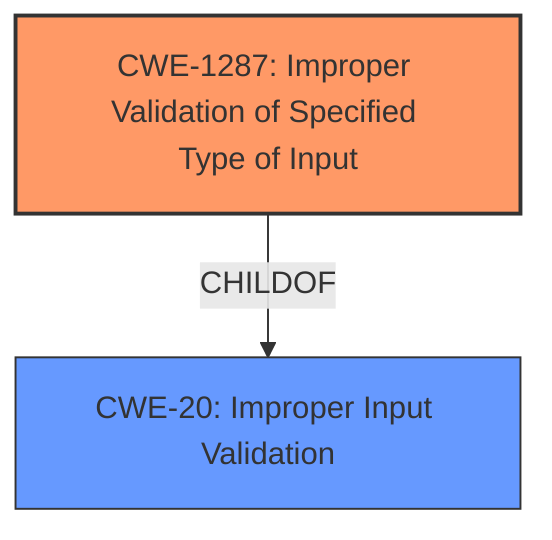

# Raw Analyzer Response for CVE-2022-4033

# Summary
| CWE ID | CWE Name | Confidence | CWE Abstraction Level | CWE Vulnerability Mapping Label | CWE-Vulnerability Mapping Notes |
|---|---|---|---|---|---|
| CWE-1287 | Improper Validation of Specified Type of Input | 0.9 | Base | Allowed | Primary CWE |
| CWE-20 | Improper Input Validation | 0.7 | Class | Discouraged | Secondary Candidate |

## Evidence and Confidence

*   **Confidence Score:** 0.9
*   **Evidence Strength:** HIGH

## Relationship Analysis
The primary CWE, CWE-1287 (Improper Validation of Specified Type of Input), is a child of CWE-20 (Improper Input Validation). This parent-child relationship indicates that CWE-1287 is a more specific case of the more general input validation issue described by CWE-20. Given the details in the vulnerability description, it is clear that the **insufficient input validation** specifically relates to the *type* of input. Therefore, choosing the more specific CWE-1287 is more appropriate.

## Vulnerability Chain
The chain of events is as follows:
1.  **Root Cause:** **Insufficient input validation** (CWE-1287) of the `question[id]` parameter in the Quiz and Survey Master plugin. Specifically, the type of input is not validated.
2.  **Impact:** Attackers can inject content other than the specified value, leading to potential unintended behavior or exploitation.

## Summary of Analysis
The initial analysis, based on the provided evidence and descriptions, points to CWE-1287 as the primary weakness. This is due to the clear indication that the vulnerability stems from a failure to validate the *type* of input received via the `question[id]` parameter. The "Vulnerability Description Key Phrases" section explicitly mentions "**insufficient input validation**" and the ability to "inject content other than the specified value (i.e. a number, file path, etc..)." The CVE Reference Links Content Summary further reinforces this by stating "**insufficient input validation** of the 'question[id]' parameter."

The relationship between CWE-1287 and its parent, CWE-20, was considered. While CWE-20 (Improper Input Validation) is a broader category, the specific issue is the failure to validate the *type* of input, making CWE-1287 a more precise match. The MITRE mapping guidance for CWE-20 discourages its use when more specific CWEs are available, which further supports the choice of CWE-1287.

The evidence strongly supports the selection of CWE-1287 as the primary CWE because the vulnerability description explicitly mentions that the plugin does not properly validate the type of input received via the `question[id]` parameter. This is a direct match to the description of CWE-1287, which focuses on the **improper validation** of the *specified type* of input.

Relevant CWE Information:

# Enhanced Context (25 CWEs)
The following CWEs were identified as potentially relevant to this vulnerability:

## CWE-1287: Improper Validation of Specified Type of Input
**Abstraction Level**: Base
**Similarity Score**: 0.361 from sparse retriever
**Source**: sparse retriever

**Description**:
The product receives input that is expected to be of a certain type, but it does not validate or incorrectly validates that the input is actually of the expected type.

**Mapping Guidance**:
- Usage: Allowed
- Rationale: This CWE entry is at the Base level of abstraction, which is a preferred level of abstraction for mapping to the root causes of vulnerabilities.

## CWE-20: Improper Input Validation
**Abstraction Level**: Class
**Similarity Score**: 0.356 from sparse retriever
**Source**: sparse retriever

**Description**:
The product receives input or data, but it does
        not validate or incorrectly validates that the input has the
        properties that are required to process the data safely and
        correctly.

**Mapping Guidance**:
- Usage: Discouraged
- Rationale: CWE-20 is commonly misused in low-information vulnerability reports when lower-level CWEs could be used instead, or when more details about the vulnerability are available [REF-1287]. It is not useful for trend analysis. It is also a level-1 Class (i.e., a child of a Pillar).
**Comments:** Consider lower-level children such as Improper Use of Validation Framework (CWE-1173) or improper validation involving specific types or properties of input such as Specified Quantity (CWE-1284); Specified Index, Position, or Offset (CWE-1285); Syntactic Correctness (CWE-1286); Specified Type (CWE-1287); Consistency within Input (CWE-1288); or Unsafe Equivalence (CWE-1289).
**Reasons:**
- Frequent Misuse
**Suggested Alternatives:**
- CWE-1284: Specified Quantity
- CWE-1285: Specified Index, Position, or Offset
- CWE-1286: Syntactic Correctness
- CWE-1287: Specified Type
- CWE-1288: Consistency within Input
- CWE-1289: Unsafe Equivalence
- CWE-116: Improper Encoding or Escaping of Output

### Considered but not used:
*   CWE-116, CWE-138, CWE-22, CWE-352, CWE-471, CWE-79, CWE-1286, CWE-1284, CWE-23, CWE-73: These CWEs were considered but ultimately rejected because they did not specifically address the **improper validation** of the *type* of input, which is the core issue in this vulnerability. For example, CWE-79 (Cross-Site Scripting) is a potential impact, but the root cause is the **lack of type validation**. CWE-22 (Path Traversal) is not relevant because the vulnerability is not about restricting pathnames. Similarly, CWE-352 (CSRF) is not applicable since the vulnerability is not about unauthorized requests.