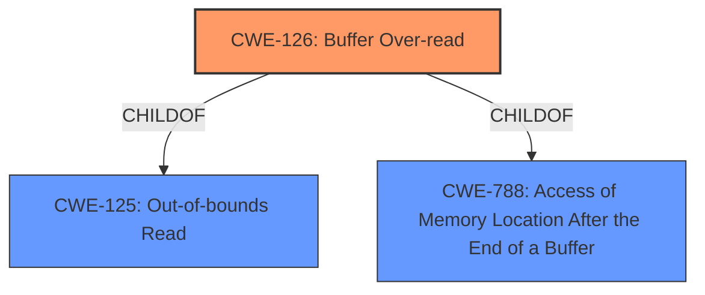

# Analysis Report for CVE-2022-40512

# Vulnerability Analysis Report: CVE-2022-40512

## Description


## Analysis (with Relationship Data)

# Summary
| CWE ID | CWE Name | Confidence | CWE Abstraction Level | CWE Vulnerability Mapping Label | CWE-Vulnerability Mapping Notes |
|---|---|---|---|---|---|
| CWE-126 | Buffer Over-read | 1.0 | Variant | Allowed | Primary CWE |

## Evidence and Confidence

*   **Confidence Score:** 1.0
*   **Evidence Strength:** HIGH

## Relationship Analysis
The primary relationship that influenced the selection of CWE-126 is its relationship as a Variant of CWE-125 (Out-of-bounds Read). Given the description explicitly mentions a "buffer over-read", selecting the more specific CWE-126 is appropriate. The other CWEs listed are more general and don't accurately reflect the specific flaw.



## Vulnerability Chain
The vulnerability chain consists of a **buffer over-read** which leads to a denial of service.

## Summary of Analysis
The vulnerability description clearly states "Transient DOS in WLAN Firmware due to **buffer over-read** while processing probe response or beacon." The key phrase "rootcause: **buffer over-read**" further reinforces this. The most appropriate CWE is CWE-126 (Buffer Over-read), which is a variant of CWE-125 (Out-of-bounds Read) and accurately describes the vulnerability where the product reads from a buffer using mechanisms that reference memory locations after the targeted buffer.

CWE-119 (Improper Restriction of Operations within the Bounds of a Memory Buffer) was considered, but it is a Class-level CWE and the description specifies a "buffer over-read," making CWE-126 a more precise fit. The mapping guidance for CWE-119 also discourages its use when lower-level CWEs are available. CWE-125 (Out-of-bounds Read) was also considered, but CWE-126 is more specific.

CWE-1284 (Improper Validation of Specified Quantity in Input) could be a contributing factor if the over-read is due to an incorrectly specified length. However, without further evidence, the primary weakness is the over-read itself.


## CWE Relationship Analysis

Current CWEs represent these abstraction levels: .


### Vulnerability Chain Analysis

**Chain starting from CWE-1284:**
- 1284 (Improper Validation of Specified Quantity in Input) - ROOT


**Chain starting from CWE-119:**
- 119 (Improper Restriction of Operations within the Bounds of a Memory Buffer) - ROOT


### CWE Relationship Diagram

```mermaid
graph TD
    classDef primary fill:#f96,stroke:#333,stroke-width:2px
    classDef secondary fill:#69f,stroke:#333
    classDef tertiary fill:#9e9,stroke:#333
```


*Report generated on 2025-03-31 12:58:19*
