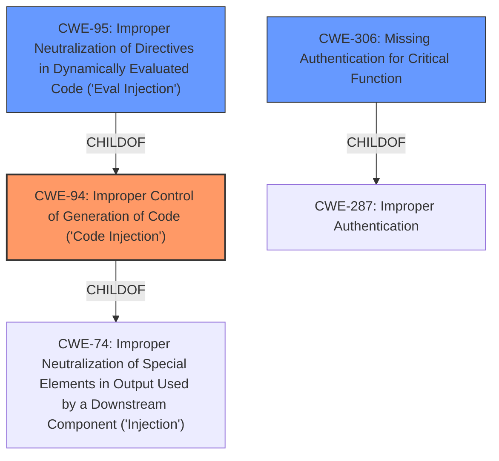

# Enhanced Analysis for CVE-2022-4060

# Summary
| CWE ID | CWE Name | Confidence | CWE Abstraction Level | CWE Vulnerability Mapping Label | CWE-Vulnerability Mapping Notes |
|---|---|---|---|---|---|
| CWE-94 | Improper Control of Generation of Code ('Code Injection') | 0.9 | Base | Allowed-with-Review | Primary CWE: The plugin **does not limit what callback functions can be called by users**, leading to arbitrary code execution. |
| CWE-95 | Improper Neutralization of Directives in Dynamically Evaluated Code ('Eval Injection') | 0.7 | Variant | Allowed | Secondary CWE: May be present since code is dynamically evaluated. |
| CWE-306 | Missing Authentication for Critical Function | 0.6 | Base | Allowed | Secondary CWE: The vulnerability can be triggered by any visitor which indicates a missing authentication. |

## Evidence and Confidence

*   **Confidence Score:** 0.8
*   **Evidence Strength:** HIGH

## Relationship Analysis
The primary CWE is CWE-94, which is a base-level CWE. CWE-95 is a variant of CWE-94 which means that CWE-95 is more specific. CWE-306 is child of CWE-287, which is Authentication Issues. The relationships influenced the decision to select CWE-94 as the primary because the code injection is clear, and CWE-95 as a secondary because dynamic evaluation is implied.



## Vulnerability Chain
The vulnerability chain starts with the **failure to restrict callback functions**, leading to **potential code injection** and **arbitrary code execution**. The chain may also involve **missing authentication** since any visitor can trigger this.

## Summary of Analysis
The initial assessment identified the **lack of limitation on callback functions** as the root cause, leading to potential code injection. The vulnerability description clearly states that the plugin **does not limit what callback functions can be called by users**, making it possible for any visitors to run code.
This is explicitly stated in the "Vulnerability Description Key Phrases" section:
- **rootcause:** **does not limit what callback functions can be called by users**
- **impact:** run code
- **attacker:** any visitors

The relationship graph shows that CWE-94 is a parent of CWE-95 and a child of CWE-74.
The retriever results listed CWE-94 as a top candidate. The mapping guidance for CWE-94 suggests it should be used with review and that it is frequently misused for vulnerabilities with a technical impact of "code execution." However, the vulnerability description here clearly states that the **lack of limitation on callback functions** leads directly to the ability to execute code.
The evidence and retriever results led to the conclusion that CWE-94 is the most appropriate primary CWE, with CWE-95 and CWE-306 as secondary candidates. The selected CWEs are at the optimal level of specificity.

Relevant CWE Information:

# Enhanced Context (25 CWEs)

## CWE-807: Reliance on Untrusted Inputs in a Security Decision
**Abstraction Level**: Base
**Similarity Score**: 0.77
**Source**: dense

**Description**:
The product uses a protection mechanism that relies on the existence or values of an input, but the input can be modified by an untrusted actor in a way that bypasses the protection mechanism.
**Rationale for not selecting**: While untrusted input is involved, the core issue is the **lack of restriction on callback functions**, not the reliance on untrusted input in a security decision.

## CWE-639: Authorization Bypass Through User-Controlled Key
**Abstraction Level**: Base
**Similarity Score**: 0.76
**Source**: dense

**Description**:
The system's authorization functionality does not prevent one user from gaining access to another user's data or record by modifying the key value identifying the data.
**Rationale for not selecting**: The vulnerability does not involve modifying a key value to access another user's data.

## CWE-472: External Control of Assumed-Immutable Web Parameter
**Abstraction Level**: Base
**Similarity Score**: 0.76
**Source**: dense

**Description**:
The web application does not sufficiently verify inputs that are assumed to be immutable but are actually externally controllable, such as hidden form fields.
**Rationale for not selecting**: The vulnerability is not about externally controlling assumed-immutable parameters.

## CWE-1289: Improper Validation of Unsafe Equivalence in Input
**Abstraction Level**: Base
**Similarity Score**: 0.76
**Source**: dense

**Description**:
The product receives an input value that is used as a resource identifier or other type of reference, but it does not validate or incorrectly validates that the input is equivalent to a potentially-unsafe value.
**Rationale for not selecting**: The vulnerability does not involve validation of unsafe equivalence in input.

## CWE-184: Incomplete List of Disallowed Inputs
**Abstraction Level**: Base
**Similarity Score**: 0.76
**Source**: dense

**Description**:
The product implements a protection mechanism that relies on a list of inputs (or properties of inputs) that are not allowed by policy or otherwise require other action to neutralize before additional processing takes place, but the list is incomplete.
**Rationale for not selecting**: The vulnerability is about a **lack of any restriction** on callback functions, not an incomplete list of disallowed inputs.

## CWE-1390: Weak Authentication
**Abstraction Level**: Class
**Similarity Score**: 0.75
**Source**: dense

**Description**:
The product uses an authentication mechanism to restrict access to specific users or identities, but the mechanism does not sufficiently prove that the claimed identity is correct.
**Rationale for not selecting**: While weak authentication could be related, the core issue is the **absence of restrictions on callback functions**.

## CWE-653: Improper Isolation or Compartmentalization
**Abstraction Level**: Class
**Similarity Score**: 0.75
**Source**: dense

**Description**:
The product does not properly compartmentalize or isolate functionality, processes, or resources that require different privilege levels, rights, or permissions.
**Rationale for not selecting**: The vulnerability does not involve improper isolation or compartmentalization.

## CWE-74: Improper Neutralization of Special Elements in Output Used by a Downstream Component ('Injection')
**Abstraction Level**: Class
**Similarity Score**: 0.75
**Source**: dense

**Description**:
The product constructs all or part of a command, data structure, or record using externally-influenced input from an upstream component, but it does not neutralize or incorrectly neutralizes special elements that could modify how it is parsed or interpreted when it is sent to a downstream component.
**Rationale for not selecting**: While injection is involved, CWE-94 is a more specific description of the vulnerability.

## CWE-274: Improper Handling of Insufficient Privileges
**Abstraction Level**: Base
**Similarity Score**: 0.75
**Source**: dense

**Description**:
The product does not handle or incorrectly handles when it has insufficient privileges to perform an operation, leading to resultant weaknesses.
**Rationale for not selecting**: The vulnerability does not directly relate to handling insufficient privileges.

## CWE-1220: Insufficient Granularity of Access Control
**Abstraction Level**: Base
**Similarity Score**: 0.75
**Source**: dense

**Description**:
The product implements access controls via a policy or other feature with the intention to disable or restrict accesses (reads and/or writes) to assets in a system from untrusted agents. However, implemented access controls lack required granularity, which renders the control policy too broad because it allows accesses from unauthorized agents to the security-sensitive assets.
**Rationale for not selecting**: The vulnerability is about a **lack of any restriction** on callback functions, not insufficient granularity of access control.

## CWE-79: Improper Neutralization of Input During Web Page Generation ('Cross-site Scripting')
**Abstraction Level**: Base
**Similarity Score**: 6658.02
**Source**: sparse

**Description**:
The product does not neutralize or incorrectly neutralizes user-controllable input before it is placed in output that is used as a web page that is served to other users.
**Rationale for not selecting**: The vulnerability is not related to cross-site scripting.

## CWE-116: Improper


## CWE Relationship Analysis

Current CWEs represent these abstraction levels: .


### Vulnerability Chain Analysis

**Chain starting from CWE-472:**
- 472 (External Control of Assumed-Immutable Web Parameter) - ROOT


**Chain starting from CWE-184:**
- 184 (Incomplete List of Disallowed Inputs) - ROOT


### CWE Relationship Diagram

```mermaid
graph TD
    classDef primary fill:#f96,stroke:#333,stroke-width:2px
    classDef secondary fill:#69f,stroke:#333
    classDef tertiary fill:#9e9,stroke:#333
```