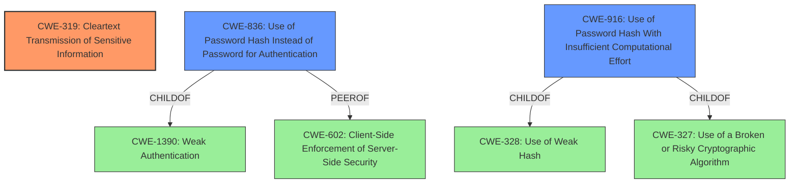

# Analysis Report for CVE-2022-40621

# Vulnerability Analysis Report: CVE-2022-40621

## Description


## Analysis (with Relationship Data)

# Summary
| CWE ID  | CWE Name | Confidence | CWE Abstraction Level | CWE Vulnerability Mapping Label | CWE-Vulnerability Mapping Notes |
|-----------------|-------------------------------------------------------------------|------------|-----------------------|-----------------------------------|----------------------------------------------------------------------------------------------------------------------------------------------------------------------------------------------------------------------------|
| **CWE-319** | Cleartext Transmission of Sensitive Information | 1 | Base | Allowed | Primary CWE. The **communication over HTTP** which means data is transmitted in **cleartext**, allows an attacker with network access to **capture the hashed password.** |
| CWE-836 | Use of Password Hash Instead of Password for Authentication | 0.7 | Base | Allowed | Secondary candidate. Because the hashing mechanism does not rely on a server-supplied key, it is possible for an attacker with sufficient network access to capture the hashed password of a logged on user and use it in a classic Pass-the-Hash style attack.|
| CWE-916 | Use of Password Hash With Insufficient Computational Effort | 0.6 | Base | Allowed | Secondary candidate. It is possible that the hashing mechanism is weak, but there is insufficient information to determine that. |

## Evidence and Confidence

*   **Confidence Score:** 0.8
*   **Evidence Strength:** MEDIUM

## Relationship Analysis
The primary CWE is CWE-319, which describes the root cause of transmitting sensitive information in cleartext. CWE-836 is a peer of CWE-602 (Client-Side Enforcement of Server-Side Security) and child of CWE-1390. CWE-916 is a child of CWE-328 (Use of Weak Hash) and CWE-327 (Use of a Broken or Risky Cryptographic Algorithm).



## Vulnerability Chain
The vulnerability chain starts with **communication over HTTP**, leading to **cleartext transmission of the hashed password**, which allows an attacker to **capture the hashed password** and perform a Pass-the-Hash attack.

## Summary of Analysis
The primary vulnerability is the **communication over HTTP**, which allows the hashed password to be captured.

The vulnerability description states: "Because the WAVLINK Quantum D4G (WN531G3) running firmware version M31G3.V5030.200325 and earlier **communicates over HTTP** and not HTTPS, and because the hashing mechanism does not rely on a server-supplied key, it is possible for an attacker with sufficient network access to **capture the hashed password** of a logged on user and use it in a classic Pass-the-Hash style attack."

I selected CWE-319 because the root cause is the **communication over HTTP** (**cleartext transmission**) of the **hashed password**, which is sensitive information.
I considered CWE-836 because the hashing mechanism does not rely on a server-supplied key, allowing a Pass-the-Hash attack.
I considered CWE-916 because there is a possibility the hashing mechanism is weak.

Other CWEs considered but not selected:
*   CWE-294: Authentication Bypass by Capture-replay - While a Pass-the-Hash is a type of replay attack, the root cause here is the cleartext transmission.
*   CWE-522: Insufficiently Protected Credentials - This is a broader category, but CWE-319 is more specific to the transmission aspect.
*   CWE-306: Missing Authentication for Critical Function - Authentication exists, but it's vulnerable due to cleartext transmission.
*   CWE-614: Sensitive Cookie in HTTPS Session Without 'Secure' Attribute - Irrelevant since the communication is over HTTP, not HTTPS.
*   CWE-201: Insertion of Sensitive Information Into Sent Data - While the hashed password is being sent, the core issue is the lack of encryption.


## CWE Relationship Analysis

Current CWEs represent these abstraction levels: .


### Vulnerability Chain Analysis

**Chain starting from CWE-916:**
- 916 (Use of Password Hash With Insufficient Computational Effort) - ROOT


**Chain starting from CWE-201:**
- 201 (Insertion of Sensitive Information Into Sent Data) - ROOT


### CWE Relationship Diagram

```mermaid
graph TD
    classDef primary fill:#f96,stroke:#333,stroke-width:2px
    classDef secondary fill:#69f,stroke:#333
    classDef tertiary fill:#9e9,stroke:#333
```


*Report generated on 2025-03-30 13:13:42*
