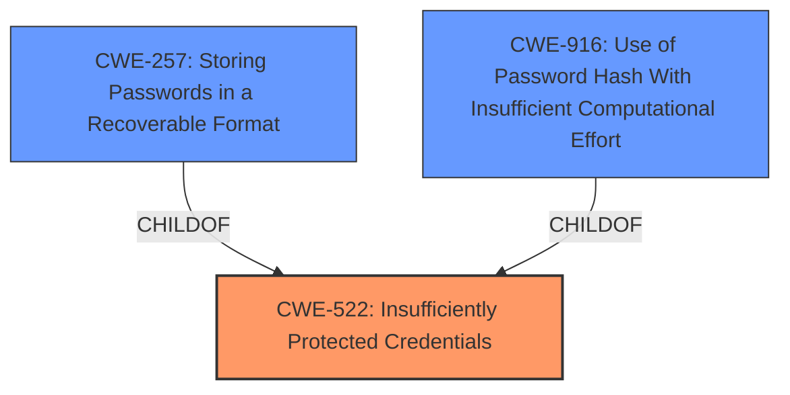

# Analysis Report for CVE-2022-40678

# Vulnerability Analysis Report: CVE-2022-40678

## Description


## Analysis (with Relationship Data)

# Summary
| CWE ID | CWE Name | Confidence | CWE Abstraction Level | CWE Vulnerability Mapping Label | CWE-Vulnerability Mapping Notes |
|---|---|---|---|---|---|
| CWE-522 | Insufficiently Protected Credentials | 1.0 | Class | Allowed-with-Review | Primary CWE |
| CWE-257 | Storing Passwords in a Recoverable Format | 0.8 | Base | Allowed | Secondary Candidate |
| CWE-916 | Use of Password Hash With Insufficient Computational Effort | 0.7 | Base | Allowed | Secondary Candidate |

## Evidence and Confidence

*   **Confidence Score:** 0.9
*   **Evidence Strength:** HIGH

## Relationship Analysis
The primary CWE is CWE-522, which is a class-level CWE. The retriever results also list CWE-257 and CWE-916, which are base-level CWEs and children of CWE-522. This indicates a parent-child relationship where the base CWEs provide more specific details about the nature of the **insufficiently protected credentials**. CWE-257 represents storing passwords in a recoverable format, and CWE-916 represents the use of password hashes with insufficient computational effort.



## Vulnerability Chain
The vulnerability chain starts with **insufficiently protected credentials** which allows a local attacker with database access to recover user passwords.
  - **Root Cause:** **Insufficiently protected credentials** (CWE-522)
  - **Impact:** Recover user passwords, leading to information disclosure.

## Summary of Analysis
The vulnerability is due to **insufficiently protected credentials**, which allows a local attacker with database access to recover user passwords. The primary CWE is CWE-522, which is a class-level CWE that represents the general category of **insufficiently protected credentials**. The retriever results also list CWE-257 and CWE-916, which are base-level CWEs and children of CWE-522.

The selection of CWE-522 is based on the vulnerability description stating "An **insufficiently protected credentials**".
The "CVE Reference Links Content Summary" also states "Root cause of vulnerability: Insufficiently protected credentials."

CWE-522 is chosen as the primary CWE because it directly addresses the root cause identified in the vulnerability description. While CWE-257 (Storing Passwords in a Recoverable Format) and CWE-916 (Use of Password Hash With Insufficient Computational Effort) could be potential contributing factors or more specific instances of the **insufficient protection**, the provided information doesn't explicitly detail the exact mechanism, thus making CWE-522 the most appropriate primary classification.

The final decision is primarily based on the provided evidence, and the graph relationships help to understand the potential underlying issues. The selected CWEs are at an appropriate level of specificity, with CWE-522 representing the general weakness and CWE-257 and CWE-916 as potential contributing factors.

Relevant CWE Information:

# Enhanced Context (25 CWEs)
The following CWEs were identified as potentially relevant to this vulnerability:

## CWE-807: Reliance on Untrusted Inputs in a Security Decision
**Abstraction Level**: Base
**Similarity Score**: 0.75
**Source**: dense

**Description**:
The product uses a protection mechanism that relies on the existence or values of an input, but the input can be modified by an untrusted actor in a way that bypasses the protection mechanism.

**Mapping Guidance**:
- Usage: Allowed
- Rationale: This CWE entry is at the Base level of abstraction, which is a preferred level of abstraction for mapping to the root causes of vulnerabilities.

*Not selected*: This CWE is not directly related to the root cause of the vulnerability. The **insufficiently protected credentials** are not necessarily a result of relying on untrusted inputs.

## CWE-668: Exposure of Resource to Wrong Sphere
**Abstraction Level**: Class
**Similarity Score**: 0.75
**Source**: dense

**Description**:
The product exposes a resource to the wrong control sphere, providing unintended actors with inappropriate access to the resource.

**Mapping Guidance**:
- Usage: Discouraged
- Rationale: CWE-668 is high-level and is often misused as a catch-all when lower-level CWE IDs might be applicable. It is sometimes used for low-information vulnerability reports [REF-1287]. It is a level-1 Class (i.e., a child of a Pillar). It is not useful for trend analysis.

*Not selected*: This CWE is too general. While the vulnerability does result in exposure of sensitive information, the root cause is more specifically related to the **insufficient protection** of credentials.

## CWE-639: Authorization Bypass Through User-Controlled Key
**Abstraction Level**: Base
**Similarity Score**: 0.75
**Source**: dense

**Description**:
The system's authorization functionality does not prevent one user from gaining access to another user's data or record by modifying the key value identifying the data.

**Mapping Guidance**:
- Usage: Allowed
- Rationale: This CWE entry is at the Base level of abstraction, which is a preferred level of abstraction for mapping to the root causes of vulnerabilities.

*Not selected*: The vulnerability is not directly related to authorization bypass through user-controlled keys.

## CWE-280: Improper Handling of Insufficient Permissions or Privileges
**Abstraction Level**: Base
**Similarity Score**: 0.74
**Source**: dense

**Description**:
The product does not handle or incorrectly handles when it has insufficient privileges to access resources or functionality as specified by their permissions. This may cause it to follow unexpected code paths that may leave the product in an invalid state.

**Mapping Guidance**:
- Usage: Allowed
- Rationale: This CWE entry is at the Base level of abstraction, which is a preferred level of abstraction for mapping to the root causes of vulnerabilities.

*Not selected*: This CWE is not directly related to the root cause of the vulnerability.

## CWE-274: Improper Handling of Insufficient Privileges
**Abstraction Level**: Base
**Similarity Score**: 0.74
**Source**: dense

**Description**:
The product does not handle or incorrectly handles when it has insufficient privileges to perform an operation, leading to resultant weaknesses.

**Mapping Guidance**:
- Usage: Discouraged
- Rationale: This CWE entry could be deprecated in a future version of CWE.

*Not selected*: This CWE is not directly related to the root cause of the vulnerability.

## CWE-538: Insertion of Sensitive Information into Externally-Accessible File or Directory
**Abstraction Level**: Base
**Similarity Score**: 0.74
**Source**: dense

**Description**:
The product places sensitive information into files or directories that are accessible to actors who are allowed to have access to the files, but not to the sensitive information.

**Mapping Guidance**:
- Usage: Allowed
- Rationale: This CWE entry is at the Base level of abstraction, which is a preferred level of abstraction for mapping to the root causes of vulnerabilities.

*Not selected*: The vulnerability is not directly related to the insertion of sensitive information into externally accessible files or directories.

## CWE-653: Improper Isolation or Compartmentalization
**Abstraction Level**: Class
**Similarity Score**: 0.74
**Source**: dense

**Description**:
The product does not properly compartmentalize or isolate functionality, processes, or resources that require different privilege levels, rights, or permissions.

**Mapping Guidance**:
- Usage: Allowed
- Rationale: This CWE entry is at the Base level of abstraction, which is a preferred level of abstraction for mapping to the root causes of vulnerabilities.

*Not selected*: This CWE is not directly related to the root cause of the vulnerability.

## CWE-1391: Use of Weak Credentials
**Abstraction Level**: Class
**Similarity Score**: 0.74
**Source**: dense

**Description**:
The product uses weak credentials (such as a default key or hard-coded password) that can be calculated, derived, reused, or guessed by an attacker.

**Mapping Guidance**:
- Usage: Allowed-with-Review
- Rationale: This CWE entry is a Class and might have Base-level children that would be more appropriate

*Not selected*: This CWE is about the use of weak credentials, but the description does not indicate if the credentials are weak or not.

## CWE-73: External Control of File Name or Path
**Abstraction Level**: Base
**Similarity Score**: 0.74
**Source**: dense

**Description**:
The product allows user input to control or


## CWE Relationship Analysis

Current CWEs represent these abstraction levels: .


### Vulnerability Chain Analysis

**Chain starting from CWE-916:**
- 916 (Use of Password Hash With Insufficient Computational Effort) - ROOT


**Chain starting from CWE-280:**
- 280 (Improper Handling of Insufficient Permissions or Privileges ) - ROOT


### CWE Relationship Diagram

```mermaid
graph TD
    classDef primary fill:#f96,stroke:#333,stroke-width:2px
    classDef secondary fill:#69f,stroke:#333
    classDef tertiary fill:#9e9,stroke:#333
```


*Report generated on 2025-03-31 00:28:43*
