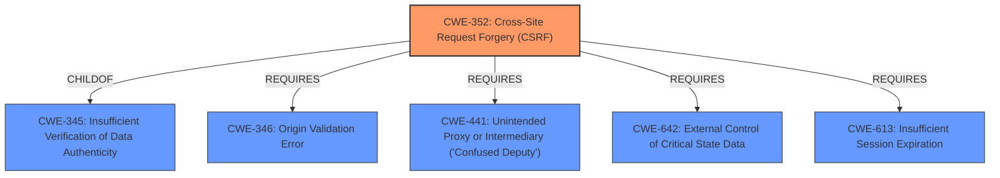

# Raw Analyzer Response for CVE-2022-40695

# Summary
| CWE ID  | CWE Name                                                                       | Confidence | CWE Abstraction Level | CWE Vulnerability Mapping Label | CWE-Vulnerability Mapping Notes |
| ------- | ------------------------------------------------------------------------------ | ---------- | ----------------------- | ------------------------------- | ------------------------------- |
| CWE-352 | Cross-Site Request Forgery (CSRF)                                              | 1.0        | Compound                | Primary                         | Allowed                       |

## Evidence and Confidence

*   **Confidence Score:** 1.0
*   **Evidence Strength:** HIGH

## Relationship Analysis
The primary relationship that influenced my decision was the direct match of the vulnerability description to the definition of CWE-352. CWE-352 is a compound weakness, requiring multiple conditions to be met, and the provided description aligns perfectly with those conditions. While other CWEs like CWE-79 were considered due to the impact (cross-site scripting), the root cause is clearly the **lack of CSRF protection**, making CWE-352 the most accurate classification.

## Vulnerability Chain
The chain of events leading to the vulnerability can be described as follows:
1.  **Root Cause:** **Lack of CSRF protection** in the SEO Redirection Plugin.
2.  An attacker crafts a malicious request.
3.  A logged-in administrator is tricked into executing the malicious request.
4.  **Impact:** Unauthorized changes or actions are performed within the plugin, potentially leading to cross-site scripting.

## Summary of Analysis
The initial analysis strongly pointed towards CWE-352 due to the **lack of CSRF protection**. The description explicitly mentions this **root cause**, and the CVE reference content summary confirms this. The Retriever Results also listed CWE-352 as the top candidate.

The vulnerability description states: "Multiple Cross-Site Scripting (CSRF) vulnerabilities in SEO Redirection Plugin plugin <= 8.9 on WordPress" and the vulnerability key phrases include "**rootcause:** **lack of CSRF protection**". The CVE Reference Links Content Summary states "**Root Cause:** The plugin lacks proper CSRF protection mechanisms." This evidence directly supports the selection of CWE-352.

CWE-79 was considered, however, the **lack of CSRF protection** is the underlying issue that allows the cross-site scripting to occur. Therefore, CWE-352 is the more accurate classification because it identifies the **root cause**.
I am selecting CWE-352 because it is the most specific CWE that accurately describes the vulnerability, focusing on the **lack of CSRF protection** as the **root cause**.

Relevant CWE Information:

# Enhanced Context (25 CWEs)

## CWE-352: Cross-Site Request Forgery (CSRF)
**Abstraction:** Compound
**Status:** Stable

### Description
The web application does not, or can not, sufficiently verify whether a well-formed, valid, consistent request was intentionally provided by the user who submitted the request.

### Extended Description
When a web server is designed to receive a request from a client without any mechanism for verifying that it was intentionally sent, then it might be possible for an attacker to trick a client into making an unintentional request to the web server which will be treated as an authentic request. This can be done via a URL, image load, XMLHttpRequest, etc. and can result in exposure of data or unintended code execution.

### Mapping Guidance
**Usage:** Allowed
**Rationale:** This is a well-known Composite of multiple weaknesses that must all occur simultaneously, although it is attack-oriented in nature.