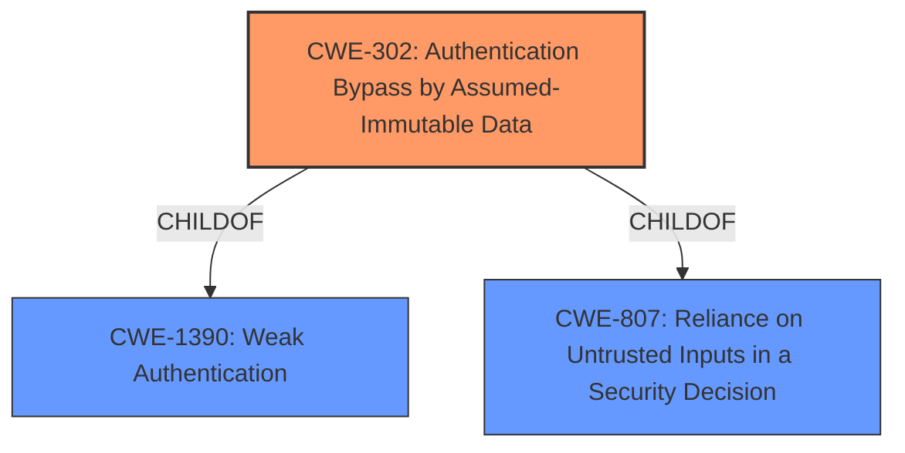

# Analysis for CVE-2022-40703

# Summary
| CWE ID | CWE Name | Confidence | CWE Abstraction Level | CWE Vulnerability Mapping Label | CWE-Vulnerability Mapping Notes |
|---|---|---|---|---|---|
| CWE-302 | Authentication Bypass by Assumed-Immutable Data | 1.0 | Base | Primary | Allowed |

## Evidence and Confidence

*   **Confidence Score:** 1.0
*   **Evidence Strength:** HIGH

## Relationship Analysis
The primary relationship impacting the decision is the direct match of the vulnerability to CWE-302, which is a base-level CWE. CWE-302 is a ChildOf CWE-1390 (Weak Authentication) and CWE-807 (Reliance on Untrusted Inputs in a Security Decision), indicating it is a more specific form of these broader authentication and trust issues.

## Vulnerability Chain
The vulnerability chain starts with the **incorrect** assumption that certain data is immutable. This **leads to** an **authentication bypass** when an attacker with physical access can manipulate that data, **resulting in** the ability to alter information within the app.

## Summary of Analysis
The initial analysis strongly points to CWE-302 as the primary weakness. The vulnerability description explicitly mentions "**Authentication Bypass by Assumed-Immutable Data**" as the root cause, which aligns perfectly with CWE-302. The CVE Reference Links Content Summary reinforces this by stating that the root cause is an "Intent Manipulation" exploit leveraging the assumption that certain data within the application is immutable, **leading to** an **authentication bypass**.

The evidence provided is strong, and the retriever results also list CWE-302 as the top match. The mapping guidance for CWE-302 allows its usage and recommends careful reading of the name and description to ensure an appropriate fit, which is satisfied in this case.

Therefore, CWE-302 is the optimal selection because it directly reflects the **root cause** of the vulnerability: the application's **failure to properly validate** or protect against manipulation of intents, **leading to** an **authentication bypass**.

CWE-472 (External Control of Assumed-Immutable Web Parameter) was considered because it also deals with assumed-immutable data. However, it is more specific to web applications and parameters, while this vulnerability involves Android intents, making CWE-302 a better fit. CWE-290 (Authentication Bypass by Spoofing) and CWE-287 (Improper Authentication) were also considered but deemed too general compared to the specificity of CWE-302.
Relevant CWE Information:

# Enhanced Context (25 CWEs)
The following CWEs were identified as potentially relevant to this vulnerability:

## CWE-302: Authentication Bypass by Assumed-Immutable Data
**Abstraction Level**: Base
**Similarity Score**: 0.80
**Source**: dense

**Description**:
The authentication scheme or implementation uses key data elements that are assumed to be immutable, but can be controlled or modified by the attacker.

**Mapping Guidance**:
- Usage: Allowed
- Rationale: This CWE entry is at the Base level of abstraction, which is a preferred level of abstraction for mapping to the root causes of vulnerabilities.