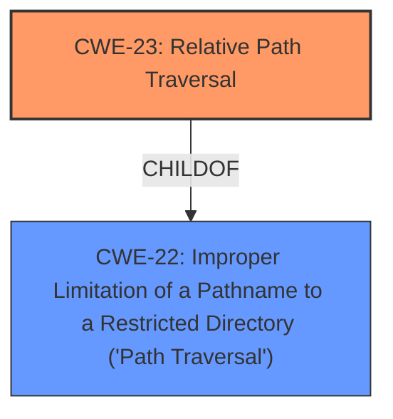

# Analysis for CVE-2022-40713

# Summary
| CWE ID | CWE Name | Confidence | CWE Abstraction Level | CWE Vulnerability Mapping Label | CWE-Vulnerability Mapping Notes |
|---|---|---|---|---|---|
| CWE-23 | Relative Path Traversal | 1.0 | Base | Allowed | Primary CWE |

## Evidence and Confidence

*   **Confidence Score:** 1.0
*   **Evidence Strength:** HIGH

## Relationship Analysis
The primary CWE identified is CWE-23, which is a Base level CWE. It has parent CWE-22. Several other CWEs such as CWE-24, CWE-36, CWE-41, CWE-59, CWE-73, CWE-98, and CWE-184 were considered but deemed not as directly applicable as CWE-23. This is based on the vulnerability description provided.



## Vulnerability Chain
The chain of events is as follows:
1.  **Root Cause:** **Multiple Relative Path Traversal issues** due to the application failing to properly sanitize user-supplied input, specifically in the `file` parameter of specific endpoints. (CWE-23)
2.  **Impact:** A remote authenticated attacker can read files on the filesystem arbitrarily that are accessible to the application, leading to the disclosure of sensitive information.

## Summary of Analysis
The initial analysis focused on identifying the **rootcause** and impact of the vulnerability. The vulnerability description clearly states "**Multiple Relative Path Traversal issues** exist...allowing a remote authenticated attacker to read files on the filesystem arbitrarily." The CVE Reference Links Content Summary explicitly confirms this, stating the "**Root cause of vulnerability:** The application fails to properly sanitize user-supplied input, specifically in the `file` parameter of specific endpoints, allowing an attacker to traverse directories outside of the intended path." and "**Weaknesses/vulnerabilities present:** Relative Path Traversal (CWE-23) vulnerability exists due to insufficient input sanitization."

The Retriever Results further supported the selection of CWE-23 and its parent CWE-22. The analysis concluded that CWE-23 is the most appropriate CWE because it directly addresses the **relative path traversal** issue, which is the **rootcause** of the vulnerability.

The confidence level is rated as 1.0 due to the clear and direct evidence in the vulnerability description and the CVE Reference Links Content Summary.

Relevant CWE Information:

# Enhanced Context (25 CWEs)
The following CWEs were identified as potentially relevant to this vulnerability:

## CWE-23: Relative Path Traversal
**Abstraction Level**: Base
**Similarity Score**: 0.83
**Source**: dense

**Description**:
The product uses external input to construct a pathname that should be within a restricted directory, but it does not properly neutralize sequences such as ".." that can resolve to a location that is outside of that directory.

**Mapping Guidance**:
- Usage: Allowed
- Rationale: This CWE entry is at the Base level of abstraction, which is a preferred level of abstraction for mapping to the root causes of vulnerabilities.


## CWE-24: Path Traversal: '../filedir'
**Abstraction Level**: Variant
**Similarity Score**: 0.82
**Source**: dense

**Description**:
The product uses external input to construct a pathname that should be within a restricted directory, but it does not properly neutralize "../" sequences that can resolve to a location that is outside of that directory.

**Mapping Guidance**:
- Usage: Allowed
- Rationale: This CWE entry is at the Variant level of abstraction, which is a preferred level of abstraction for mapping to the root causes of vulnerabilities.


## CWE-41: Improper Resolution of Path Equivalence
**Abstraction Level**: Base
**Similarity Score**: 0.81
**Source**: dense

**Description**:
The product is vulnerable to file system contents disclosure through path equivalence. Path equivalence involves the use of special characters in file and directory names. The associated manipulations are intended to generate multiple names for the same object.

**Mapping Guidance**:
- Usage: Allowed
- Rationale: This CWE entry is at the Base level of abstraction, which is a preferred level of abstraction for mapping to the root causes of vulnerabilities.


## CWE-36: Absolute Path Traversal
**Abstraction Level**: Base
**Similarity Score**: 0.81
**Source**: dense

**Description**:
The product uses external input to construct a pathname that should be within a restricted directory, but it does not properly neutralize absolute path sequences such as "/abs/path" that can resolve to a location that is outside of that directory.

**Mapping Guidance**:
- Usage: Allowed
- Rationale: This CWE entry is at the Base level of abstraction, which is a preferred level of abstraction for mapping to the root causes of vulnerabilities.


## CWE-25: Path Traversal: '/../filedir'
**Abstraction Level**: Variant
**Similarity Score**: 0.81
**Source**: dense

**Description**:
The product uses external input to construct a pathname that should be within a restricted directory, but it does not properly neutralize "/../" sequences that can resolve to a location that is outside of that directory.

**Mapping Guidance**:
- Usage: Allowed
- Rationale: This CWE entry is at the Variant level of abstraction, which is a preferred level of abstraction for mapping to the root causes of vulnerabilities.


## CWE-73: External Control of File Name or Path
**Abstraction Level**: Base
**Similarity Score**: 0.80
**Source**: dense

**Description**:
The product allows user input to control or influence paths or file names that are used in filesystem operations.

**Mapping Guidance**:
- Usage: Allowed
- Rationale: This CWE entry is at the Base level of abstraction, which is a preferred level of abstraction for mapping to the root causes of vulnerabilities.


## CWE-27: Path Traversal: 'dir/../../filename'
**Abstraction Level**: Variant
**Similarity Score**: 0.80
**Source**: dense

**Description**:
The product uses external input to construct a pathname that should be within a restricted directory, but it does not properly neutralize multiple internal "../" sequences that can resolve to a location that is outside of that directory.

**Mapping Guidance**:
- Usage: Allowed
- Rationale: This CWE entry is at the Variant level of abstraction, which is a preferred level of abstraction for mapping to the root causes of vulnerabilities.


## CWE-29: Path Traversal: '\..\filename'
**Abstraction Level**: Variant
**Similarity Score**: 0.79
**Source**: dense

**Description**:
The product uses external input to construct a pathname that should be within a restricted directory, but it does not properly neutralize '\..\filename' (leading backslash dot dot) sequences that can resolve to a location that is outside of that directory.

**Mapping Guidance**:
- Usage: Allowed
- Rationale: This CWE entry is at the Variant level of abstraction, which is a preferred level of abstraction for mapping to the root causes of vulnerabilities.


## CWE-59: Improper Link Resolution Before File Access ('Link Following')
**Abstraction Level**: Base
**Similarity Score**: 0.79
**Source**: dense

**Description**:
The product attempts to access a file based on the filename, but it does not properly prevent that filename from identifying a link or shortcut that resolves to an unintended resource.

**Mapping Guidance**:
- Usage: Allowed
- Rationale: This CWE entry is at the Base level of abstraction, which is a preferred level of abstraction for mapping to the root causes of vulnerabilities.


## CWE-26: Path Traversal: '/dir/../filename'
**Abstraction Level**: Variant
**Similarity Score**: 0.79
**Source**: dense

**Description**:
The product uses external input to construct a pathname that should be within a restricted directory, but it does not properly neutralize "/dir/../filename" sequences that can resolve to a location that is outside of that directory.

**Mapping Guidance**:
- Usage: Allowed
- Rationale: This CWE entry is at the Variant level of abstraction, which is a preferred level of abstraction for mapping to the root causes of vulnerabilities.


## CWE-22: Improper Limitation of a Pathname to a Restricted Directory ('Path Traversal')
**Abstraction Level**: Base
**Similarity Score**: 14442.38
**Source**: sparse

**Description**:
The product uses external input to construct a pathname that is intended to identify a file or directory that is located underneath a restricted parent directory, but the product does not properly neutralize special elements within the pathname that can cause the pathname to resolve to a location that is outside of the restricted directory.

**Mapping Guidance**:
- Usage: Allowed
- Rationale: This CWE entry is at the Base level of abstraction, which is a preferred level of abstraction for mapping to the root causes of vulnerabilities.


## CWE-23: Relative Path Traversal
**Abstraction Level**: Base
**Similarity Score**: 14

# Enhanced Query for CVE-2022-40713

## Vulnerability Description
An issue was discovered in NOKIA 1350OMS R14.2. **Multiple Relative Path Traversal issues** exist in different specific endpoints via the file parameter, allowing a remote authenticated attacker to read files on the filesystem arbitrarily.

### Vulnerability Description Key Phrases
- **rootcause:** **Multiple Relative Path Traversal issues**
- **impact:** read files on the filesystem arbitrarily
- **vector:** file parameter
- **attacker:** remote authenticated attacker
- **product:** NOKIA 1350OMS
- **version:** R14.2
- **component:** specific endpoints

## CVE Reference Links Content Summary
Based on the provided content, here's a breakdown of the vulnerabilities described, excluding those unrelated to CVE-2022-40713:

**CVE-2022-40713 is present in the document**

**CVE-2022-40713 – Nokia 1350 OMS Optical Management System**
*   **Vulnerability Description:** Multiple Relative Path Traversal - CWE-23
*   **Software Version**: R14.2
*   **Root cause of vulnerability:** The application fails to properly sanitize user-supplied input, specifically in the `file` parameter of specific endpoints, allowing an attacker to traverse directories outside of the intended path.
*   **Weaknesses/vulnerabilities present:** Relative Path Traversal (CWE-23) vulnerability exists due to insufficient input sanitization.
*   **Impact of exploitation:** An authenticated attacker can read files on the filesystem arbitrarily that are accessible to the application. This can lead to the disclosure of sensitive information, including application source code, configuration files and system files.
*   **Attack vectors:**  By manipulating the "file" parameter with sequences like `../`, an authenticated attacker can read files outside the intended directory.
*   **Required attacker capabilities/position:** The attacker needs to be an authenticated user.

The following CVEs are mentioned in the document, but do not relate to the specified CVE.

**CVE-2024-52949 – iptraf-ng**
*   **Vulnerability Description**: Stack-based Buffer Overflow - CWE-121
*   **Software Version**: 1.2.1
*   **Root cause of vulnerability:** A stack-based buffer overflow exists in the `strcpy` function because it doesn't control the size of the input when copying data.
*   **Weaknesses/vulnerabilities present:** Stack-based Buffer Overflow (CWE-121) caused by a lack of bounds checking.
*   **Impact of exploitation:** An attacker can use a specially crafted configuration file to execute arbitrary code on the victim's program with root privilege.
*   **Attack vectors:**  The vulnerability can be triggered by providing a malformed input to the `-C` argument, which is then used in a `strcpy` operation, leading to the overflow.
*   **Required attacker capabilities/position:** The attacker needs to be able to supply a malicious configuration file to the program.

**CVE-2024-49351 – IBM Workload Scheduler**
*   **Vulnerability Description:** Plaintext Storage of a Password- CWE-256
*   **Software Version:** 9.5.0
*    **Root cause of vulnerability:** The application improperly stores engine connection passwords in cleartext.
*    **Weaknesses/vulnerabilities present:** Improper Password Storage (CWE-256)
*   **Impact of exploitation:** Authenticated remote attackers with administrator privileges can access and read the engine connection password in cleartext, potentially escalating privileges and compromising data.
*   **Attack vectors:**  The vulnerability is triggered when accessing the connection properties panel under the Administration tab.
*  **Required attacker capabilities/position:** The attacker needs to be an authenticated remote user with administrator privileges.

**CVE-2024-9329 – Eclipse Glassfish**
*   **Vulnerability Description:** Improper Handling of Parameters - CWE-233
*  **Software Version:** 7.0.15
*   **Root cause of vulnerability:** The application improperly handles the `Host` HTTP parameter leading to an Open Redirect.
*   **Weaknesses/vulnerabilities present:**  Improper Handling of Parameters (CWE-233), specifically related to open redirect.
*   **Impact of exploitation:** An attacker can construct a URL within the application that causes a redirection to an arbitrary external domain. This behaviour can be leveraged to facilitate phishing attacks against users.
*   **Attack vectors:** By sending an HTTP GET request to the `/management/domain` endpoint and manipulating the `Host` parameter, an attacker can redirect the user to a malicious site.
*  **Required attacker capabilities/position:** The attacker does not need to be authenticated.

**CVE-2024-9054 – Microchip TP4100**
*   **Vulnerability Description**: RCE on file configuration parameter - CWE-78
*   **Software Version**: 2.3.12
*   **Root cause of vulnerability:** The device does not sanitize parameters within the configuration file, allowing the execution of arbitrary bash commands.
*   **Weaknesses/vulnerabilities present:** OS Command Injection (CWE-78) due to a lack of input sanitization of the configuration file parameters.
*   **Impact of exploitation:**  A malicious user able to upload a new configuration file can insert bash commands into the 'secret_key' parameter, which will be executed by the device, resulting in remote code execution.
*   **Attack vectors:**  The vulnerability can be exploited by modifying the configuration file and uploading it through the web GUI, specifically by injecting bash command in the "secret_key" XML parameter.
*  **Required attacker capabilities/position:** The attacker needs access to the device web GUI and a configuration file (or the knowledge of the file structure).

**CVE-2024-7801 – Microchip TP4100**
*   **Vulnerability Description**: Improper Neutralization of Special Elements used in an SQL Command ('SQL Injection') - CWE-89
*   **Software Version**: 2.3.12
*    **Root cause of vulnerability:**  The application concatenates user-supplied input from the `channelId` parameter into a SQL query without proper sanitization.
*    **Weaknesses/vulnerabilities present:**  SQL Injection (CWE-89).
*   **Impact of exploitation:** An attacker can execute unauthenticated SQL injection requests on the web resource `get_chart_data` through the `channelId` parameter, allowing them to retrieve sensitive information.
*   **Attack vectors:** The vulnerability is exploited by sending a crafted POST request to `/get_chart_data` and injecting SQL code into the `channelId` parameter.
*   **Required attacker capabilities/position:** The attacker needs to be connected to the LAN of the device and does not need to be authenticated.

**CVE-2024-6360 – OpenText Vertica Management Console**
*   **Vulnerability Description**: Incorrect Permission Assignment for Critical Resource – CWE-732
*   **Software Version**: 10.1.0
*    **Root cause of vulnerability:** Hardcoded plaintext keys are created and used for authorization when calling protected APIs.
*   **Weaknesses/vulnerabilities present:**  Incorrect Permission Assignment for Critical Resource (CWE-732).
*   **Impact of exploitation:**  An attacker can potentially abuse privileges by using the hardcoded apikey leading to unauthorized access to Vertica agent.
*   **Attack vectors:**  Exploitation involves leveraging the hardcoded plaintext keys.
*  **Required attacker capabilities/position:**  Details regarding attacker position are not specified in the text.

**CVE-2024-5532 – OpenText™ Operations Agent**
*   **Vulnerability Description**: Cross Site Scripting Stored - CWE-79
*   **Software Version**: 12.20, 12.21, 12.22, 12.23, 12.24, 12.25, 12.26
*   **Root cause of vulnerability:**  The application allows stored Cross-site scripting (XSS) attacks by inserting malicious payloads in the CORE_ID value in the agent configuration file.
*   **Weaknesses/vulnerabilities present:**  Stored Cross-Site Scripting (CWE-79).
*   **Impact of exploitation:**  An attacker can compromise user interactions with the vulnerable application, potentially leading to full control of the application's functionality and data.
*   **Attack vectors:**  The vulnerability can be exploited by adding a malicious payload within the `CORE_ID` parameter in the agent configuration file. When accessing certain URLs, the injected Javascript is executed.
*  **Required attacker capabilities/position:** The attacker needs to have permissions to modify the agent configuration file.

**CVE-2024-43687 – Microchip TP4100**
*   **Vulnerability Description**: Improper Neutralization of Input During Web Page Generation ('Cross-site Scripting') - CWE-79
*   **Software Version**: 2.3.12
*   **Root cause of vulnerability:** The "Custom Banner" field does not sanitize user input, allowing for stored cross-site scripting.
*    **Weaknesses/vulnerabilities present:**  Stored Cross-site scripting (CWE-79) due to a lack of input sanitization.
*  **Impact of exploitation:** Malicious JavaScript code injected into the "Custom Banner" field is executed when a user visits the banner page, allowing the attacker to perform privileged actions or access sensitive data.
*   **Attack vectors:** The vulnerability is exploited by injecting javascript code into the `txtcustom` parameter of the `/bannerconfig` POST request.
*   **Required attacker capabilities/position:**  The attacker needs to be an authenticated user of the web application.

**CVE-2024-43686 – Microchip TP4100**
*   **Vulnerability Description**: Improper Neutralization of Input During Web Page Generation ('Cross-site Scripting') - CWE-79
*   **Software Version**: 2.3.12
*   **Root cause of vulnerability:**  The `channelId` parameter is vulnerable to Reflected XSS.
*   **Weaknesses/vulnerabilities present:** Reflected Cross-site scripting (CWE-79) due to a lack of sanitization of the `channelId` parameter.
*  **Impact of exploitation:** By inserting a malicious javascript code in `channelId`, an unauthenticated attacker can perform privileged operations or access sensitive user data.
*   **Attack vectors:** The vulnerability is exploited by sending a crafted POST request to `/get_chart_data` and injecting javascript code into the `channelId` parameter.
*   **Required attacker capabilities/position:**  The attacker does not need to be authenticated.

**CVE-2024-43685 – Microchip TP4100**
*   **Vulnerability Description**: Improper Authentication – CWE-287
*   **Software Version**: 2.3.12
*   **Root cause of vulnerability:** A new cookie `ci_session` is provided before login, which can be exploited for session hijacking.
*   **Weaknesses/vulnerabilities present:**  Improper Authentication (CWE-287) and Session Fixation vulnerabilities.
*   **Impact of exploitation:** An attacker can obtain and use the session cookie to access the application without knowing the credentials.
*   **Attack vectors:** The attacker can obtain the cookie before login, induce a user to authenticate with that cookie and then hijack the user session or create their own cookie.
*  **Required attacker capabilities/position:** An attacker needs to be able to intercept and/or create cookies to perform the attack, access to the network is required.

**CVE-2024-43684 – Microchip TP4100**
*   **Vulnerability Description**: Cross-Site Request Forgery (CSRF) – CWE-352
*   **Software Version**: 2.3.12
*   **Root cause of vulnerability:** Lack of Anti-CSRF token implementation.
*  **Weaknesses/vulnerabilities present:** Cross-Site Request Forgery (CSRF) (CWE-352).
*   **Impact of exploitation:** An attacker could trick a user into making unintentional requests to the web server, allowing them to perform operations as the victim, including deleting or stealing data or gaining full control of the web application.
*   **Attack vectors:** The attacker tricks a user into submitting a forged request to the web server.
*  **Required attacker capabilities/position:** The attacker needs the user to have an active session with the web application.

**CVE-2024-43683 – Microchip TP4100**
*   **Vulnerability Description**: URL Redirection to Untrusted Site ('Open Redirect') – CWE-601
*   **Software Version**: 2.3.12
*   **Root cause of vulnerability:** The device does not properly verify the `Host` header field in GET/POST requests.
*   **Weaknesses/vulnerabilities present:** Open Redirect (CWE-601) due to a lack of validation on the `Host` header.
*   **Impact of exploitation:** An attacker can redirect users to a malicious website by modifying the `Host` header.
*   **Attack vectors:**  The attacker modifies the `Host` header in the HTTP request, and the application redirects the user to the specified site.
*   **Required attacker capabilities/position:** The attacker does not need to be authenticated.

**CVE-2024-34399 – BMC Remedy Mid Tier**
*   **Vulnerability Description**: Improper Authentication - CWE-287
*   **Software Version**: 7.6.04
*    **Root cause of vulnerability:** Unauthenticated access to any user account.
*   **Weaknesses/vulnerabilities present:** Improper Authentication (CWE-287).
*   **Impact of exploitation:** An unauthenticated remote attacker can access any user account without using any password.
*  **Attack vectors:** No information on specific attack vectors.
*  **Required attacker capabilities/position:** The attacker does not need to be authenticated.

**CVE-2024-31847 – Italtel Embrace**
*   **Vulnerability Description**: Improper Neutralization of Input During Web Page Generation ('Stored Cross-site Scripting') - CWE-79
*   **Software Version**: 1.6.4
*    **Root cause of vulnerability:** The application does not sanitize parameters sent as input from clients before they are re-included within HTTP pages, leading to stored XSS.
*    **Weaknesses/vulnerabilities present:** Stored Cross-Site Scripting (CWE-79).
*    **Impact of exploitation:**  An attacker can inject arbitrary JavaScript code which is reflected in the Activity Log page, leading to potential unauthorized access or account takeover.
*    **Attack vectors:** The vulnerability is triggered by inserting javascript code into a parameter that is logged and shown in the ActivityLog page.
*    **Required attacker capabilities/position:** Both authenticated and unauthenticated attackers can exploit this vulnerability.

**CVE-2024-31846 – Italtel Embrace**
*   **Vulnerability Description**: Improper Access Control – CWE-284
*   **Software Version**: 1.6.4
*   **Root cause of vulnerability:** The web application does not restrict access to a resource from an unauthorized actor.
*   **Weaknesses/vulnerabilities present:** Improper Access Control (CWE-284).
*   **Impact of exploitation:** An unauthenticated user can view data about clients registered with the application, including personal information like phone numbers and emails.
*   **Attack vectors:**  The vulnerability is exploited by crafting a request to a specific endpoint without authentication.
*  **Required attacker capabilities/position:** The attacker does not need to be authenticated.

**CVE-2024-31845 – Italtel Embrace**
*   **Vulnerability Description**: Improper Output Neutralization for Logs - CWE-117
*   **Software Version**: 1.6.4
*   **Root cause of vulnerability:** The application writes logs using a GET query parameter that can be manipulated to forge log entries.
*    **Weaknesses/vulnerabilities present:**  Improper Output Neutralization for Logs (CWE-117).
*   **Impact of exploitation:** An attacker can insert fake log entries and execute actions attributed to different users.
*   **Attack vectors:** The vulnerability is exploited by manipulating the GET query parameter that is used for logging.
*   **Required attacker capabilities/position:** The attacker does not need to be authenticated.

**CVE-2024-31844 – Italtel Embrace**
*  **Vulnerability Description**: Generation of Error Message Containing Sensitive Information - CWE-209
*  **Software Version**: 1.6.4
*   **Root cause of vulnerability:** The server does not properly handle application errors.
*    **Weaknesses/vulnerabilities present:** Generation of Error Message Containing Sensitive Information (CWE-209).
*    **Impact of exploitation:**  An attacker can gather information about the system, like the absolute path of the application's source code, by crafting specific requests that generate errors.
*    **Attack vectors:** Exploiting the vulnerability involves crafting requests that will cause the application to generate an error containing the path.
*   **Required attacker capabilities/position:** The attacker does not need to be authenticated.

**CVE-2024-31843 – Italtel Embrace**
*   **Vulnerability Description**: Improper Neutralization of Special Elements used in an OS Command ('OS Command Injection') - CWE-78
*   **Software Version**: 1.6.4
*   **Root cause of vulnerability:** The application does not check parameters sent as input before constructing and executing OS commands, leading to OS Command Injection.
*    **Weaknesses/vulnerabilities present:** OS Command Injection (CWE-78).
*   **Impact of exploitation:**  An attacker can execute arbitrary OS commands on the server with the privileges of the application user.
*   **Attack vectors:** By manipulating the parameter in the URL to include OS commands.
*   **Required attacker capabilities/position:** The attacker needs to be an authenticated user.

**CVE-2024-31842 – Italtel Embrace**
*   **Vulnerability Description**: Use of GET Request Method With Sensitive Query Strings - CWE-598
*   **Software Version**: 1.6.4
*   **Root cause of vulnerability:** The application includes access tokens in GET requests, potentially exposing them in browser history, logs, or through referrers.
*   **Weaknesses/vulnerabilities present:** Use of GET Request Method With Sensitive Query Strings (CWE-598).
*   **Impact of exploitation:**  If an attacker gains access to the access token, they could access the web application as another user leading to complete account takeover.
*   **Attack vectors:** The vulnerability exists because access tokens are sent as parameters in GET requests.
*   **Required attacker capabilities/position:** The attacker needs to gain access to the GET request which is sent by authenticated users.

**CVE-2024-31841 – Italtel Embrace**
*   **Vulnerability Description**: Multiple Relative Path Traversal – CWE-23
*   **Software Version**: 1.6.4
*   **Root cause of vulnerability:** The web server fails to sanitize input, allowing for relative path traversal when reading files.
*   **Weaknesses/vulnerabilities present:**  Relative Path Traversal (CWE-23).
*   **Impact of exploitation:**  An unauthenticated attacker can read arbitrary files on the filesystem, including application source code and configuration files.
*   **Attack vectors:** By manipulating the `filename` parameter in POST requests using `../` sequences to reference files outside of the intended directory.
*  **Required attacker capabilities/position:** The attacker does not need to be authenticated.

**CVE-2024-31840 – Italtel Embrace**
*   **Vulnerability Description**: Insufficiently Protected Credentials - CWE-522
*   **Software Version**: 1.6.4
*   **Root cause of vulnerability:** The application inserts plaintext passwords in the HTML source code when displaying the email server configuration.
*  **Weaknesses/vulnerabilities present:**  Insufficiently Protected Credentials (CWE-522)
*  **Impact of exploitation:**  An attacker is able to read the password of the mail server by viewing the HTML source of the email server configuration page.
*  **Attack vectors:**  An authenticated user accesses the edit email configuration function, and the cleartext password is shown in the form.
*   **Required attacker capabilities/position:** The attacker needs to be an authenticated user.

**CVE-2024-28806 – Italtel i-MCS NFV**
*   **Vulnerability Description**: Absolute Path Traversal - CWE-36
*  **Software Version**: 12.1.0-20211215
*   **Root cause of vulnerability:** Lack of input sanitization in the `uploadDir` parameter during file uploads.
*    **Weaknesses/vulnerabilities present:**  Absolute Path Traversal (CWE-36).
*   **Impact of exploitation:**  An unauthenticated attacker can upload files to an arbitrary path on the filesystem by manipulating the `uploadDir` parameter, which can result in unauthorized access to the server.
*   **Attack vectors:** The attacker exploits the vulnerability by modifying the `uploadDir` parameter in a POST request to upload a file.
*   **Required attacker capabilities/position:** The attacker does not need to be authenticated.

**CVE-2024-28805 – Italtel i-MCS NFV**
*   **Vulnerability Description**: Multiple Improper Access Control - CWE-284
*  **Software Version**: 12.1.0-20211215
*    **Root cause of vulnerability:**  The application incorrectly restricts access to resources.
*    **Weaknesses/vulnerabilities present:**  Improper Access Control (CWE-284).
*  **Impact of exploitation:**  Both authenticated and unauthenticated users can access pages or functionalities that are normally restricted by specific roles. This could result in unauthorized access to critical information and functionalities, including file uploads.
*   **Attack vectors:** By accessing specific endpoints, both authenticated and unauthenticated attackers can view or use functionalities that they should not be authorized to use.
*  **Required attacker capabilities/position:** Some of the endpoints are exploitable by authenticated users and some are exploitable even without authentication.

**CVE-2024-28804 – Italtel i-MCS NFV**
*   **Vulnerability Description**: Improper Neutralization of Input During Web Page Generation ('Stored Cross-site Scripting') - CWE-79
*  **Software Version**: 12.1.0-20211215
*  **Root cause of vulnerability:**  Improper sanitization of user input in the login page allows stored XSS.
*   **Weaknesses/vulnerabilities present:** Stored Cross-site scripting (CWE-79)
*   **Impact of exploitation:** An unauthenticated attacker can inject malicious JavaScript code via the `j_username` parameter, which is executed when any authenticated user views the login error on the home page, allowing for potential unauthorized access or account takeover.
*   **Attack vectors:** The vulnerability can be triggered through the manipulation of the `j_username` parameter in a POST request to `/j_security_check`.
*   **Required attacker capabilities/position:** The attacker does not need to be authenticated.

**CVE-2024-25007 – Ericsson Network Manager**
*   **Vulnerability Description**: Improper Neutralization of Formula Elements in a CSV File ('CSV Injection') – CWE-1236
*  **Software Version**: < 23.1
*   **Root cause of vulnerability:**  The application does not properly neutralize formula elements in a CSV file, leading to potential code execution or information disclosure.
*  **Weaknesses/vulnerabilities present:**  CSV Injection (CWE-1236).
*   **Impact of exploitation:**  An attacker with administrative access can execute code or disclose data by injecting malicious formulas in a CSV file exported by the system.
*  **Attack vectors:** This occurs through the application log export functionality.
*  **Required attacker capabilities/position:**  The attacker needs adjacent network access and administration privileges.

**CVE-2024-22063 - ZENIC-ONE ZTE R58**
*   **Vulnerability Description**: Improper Neutralization of Formula Elements in a XLSX File ('XLSX Injection')- CWE-1236
*  **Software Version**: 16.22.40
*  **Root cause of vulnerability:** User-supplied information in an XLSX file is not neutralized, allowing special elements to be interpreted as commands when opened by a spreadsheet application.
*  **Weaknesses/vulnerabilities present:** XLSX Injection (CWE-1236).
*   **Impact of exploitation:** An attacker can inject malicious formulas into XLSX files which can lead to remote code execution at the client-side or data leakage.
*   **Attack vectors:**  The vulnerability is triggered when the `neId` parameter value is changed to a malicious payload, and subsequently, when a user opens the downloaded Excel file.
*   **Required attacker capabilities/position:** The attacker needs to be an authenticated remote user of the web application.

**CVE-2024-20906 – Oracle Integrated Lights Out Manager**
*   **Vulnerability Description**: Improper Neutralization of Input During Web Page Generation ('Reflected Cross-site Scripting') - CWE-79
*   **Software Version**: 3, 4, 5
*    **Root cause of vulnerability:** The application is vulnerable to Reflected XSS.
*   **Weaknesses/vulnerabilities present:** Reflected Cross-site scripting (CWE-79).
*    **Impact of exploitation:**  A high-privileged attacker with network access can compromise ILOM by injecting script that will be executed on victim's browser.
*   **Attack vectors:** Exploitation requires human interaction from the victim.
*  **Required attacker capabilities/position:** The attacker needs network access via ICMP and high privileges to perform the attack.

**CVE-2023-7248 – OpenText Vertica Management Console**
*   **Vulnerability Description**: Improper Input Validation – CWE-20
*  **Software Version**: 10.x, 11.1.1-24 or lower, 12.0.4-18 or lower
*   **Root cause of vulnerability:**  The application is prone to authentication bypass via crafted requests.
*   **Weaknesses/vulnerabilities present:** Improper Input Validation (CWE-20).
*   **Impact of exploitation:**  The vulnerability affects Vertica’s authentication functionalities.
*   **Attack vectors:** Exploiting this vulnerability requires crafting specific requests and sequences.
*   **Required attacker capabilities/position:** Details regarding attacker position are not specified in the text.

**CVE-2023-50811 – Selesta Visual Access Manager**
*   **Vulnerability Description**: Authorization Bypass Through User-Controlled Key – CWE-639
*   **Software Version**: 4.38.6
*   **Root cause of vulnerability:**  The application allows a remote user with the "receptionist" role to access other receptions by modifying the 'computer' parameter.
*    **Weaknesses/vulnerabilities present:** Authorization Bypass Through User-Controlled Key (CWE-639).
*   **Impact of exploitation:**  An attacker can take control of other receptions in addition to the one they are assigned.
*    **Attack vectors:** This is achieved by modifying the `computer` parameter related to a specific reception by intercepting HTTP requests.
*    **Required attacker capabilities/position:**  The attacker needs to be an authenticated user with the "receptionist" role.

**CVE-2023-49328 – Wolters Kluwer B.POINT**
*   **Vulnerability Description**: Improper Neutralization of Argument Delimiters in a Command ('Argument Injection')
*  **Software Version**: 23.70.00
*   **Root cause of vulnerability:**  The vulnerability occurs in a server-to-server communication module during authentication.
*   **Weaknesses/vulnerabilities present:** Argument Injection.
*    **Impact of exploitation:** A valid system user can potentially perform remote code execution (RCE).
*    **Attack vectors:** The vulnerability is present in a "server-to-server" communication module.
*   **Required attacker capabilities/position:** The attacker needs to be a validate system user.

**CVE-2023-39909 – Ericsson Network Manager (ENM)**
*   **Vulnerability Description**: *Improper Access Control* – CWE-284
*  **Software Version**: 23.2
*  **Root cause of vulnerability:** Improper access control allows low privileged users to access the NCM application.
*   **Weaknesses/vulnerabilities present:** Improper Access Control (CWE-284).
*  **Impact of exploitation:** Unauthenticated users with low privilege can access the NCM application.
*  **Attack vectors:** No information on specific attack vectors.
*  **Required attacker capabilities/position:** The attacker does not need to be authenticated, and is low privileged.

**CVE-2023-38328 – eGroupWare**
*   **Vulnerability Description**: Plaintext Storage of a Password ('Improper Password Storage') – CWE-256
*  **Software Version**: 17.1.20190111
*   **Root cause of vulnerability:** The application stores database passwords in cleartext.
*   **Weaknesses/vulnerabilities present:**  Improper Password Storage (CWE-256).
*   **Impact of exploitation:** An authenticated admin user can read the database credentials in cleartext.
*  **Attack vectors:** An authenticated admin user accesses a specific setup panel page (`setup/manageheader.php`).
*  **Required attacker capabilities/position:** The attacker needs to be an authenticated admin user.

**CVE-2023-26071 – HarpaItalia Mcubo ICT**
*   **Vulnerability Description**: Observable Response Discrepancy - CWE-204
*   **Software Version**: 10.12.4 6.0.2
*    **Root cause of vulnerability:** The application provides different responses to incoming requests which reveals internal state information, leading to user enumeration.
*    **Weaknesses/vulnerabilities present:** Observable Response Discrepancy (CWE-204).
*    **Impact of exploitation:** An unauthenticated attacker can perform user enumeration attacks due to the different responses based on whether the user exists or not.
*   **Attack vectors:** The vulnerability exists in the login web page.
*  **Required attacker capabilities/position:** The attacker does not need to be authenticated.

**CVE-2023-26062 – Nokia Web Element Manager**
*   **Vulnerability Description**: Improper Access Control - CWE-284
*   **Software Version**: 21B
*   **Root cause of vulnerability:** Improper access control allows an unprivileged user to execute administrative functions.
*  **Weaknesses/vulnerabilities present:**  Improper Access Control (CWE-284).
*  **Impact of exploitation:**  An attacker with a low privilege account can gain access to administrative functions.
*  **Attack vectors:** By intercepting and modifying the response to the login request, the attacker can escalate privileges.
*   **Required attacker capabilities/position:** The attacker needs to be an authenticated user of the web application, access to the mobile network solution internal BTS management network is required.

**CVE-2022-47531 – Ericsson EPG**
*   **Vulnerability Description**: *Improper Privilege Management - CWE-269*
*   **Software Version**: 3.18
*    **Root cause of vulnerability:** Missing input validation allows authenticated users to bypass system CLI and execute unauthorized commands directly in the UNIX shell.
*   **Weaknesses/vulnerabilities present:**  Improper Privilege Management (CWE-269) and Missing Input Validation.
*   **Impact of exploitation:**  Exploitation can lead to limited loss of confidentiality and/or low impact to integrity and availability of the system.
*  **Attack vectors:** By using a system CLI bypass and executing unauthorized commands.
*   **Required attacker capabilities/position:**  The attacker needs to be an authenticated user.

**CVE-2022-46408 – Ericsson Network Manager (ENM)**
*   **Vulnerability Description:** Improper Neutralization of Formula Elements in a CSV File – CWE-1236
*  **Software Version**: < 22.1
*  **Root cause of vulnerability:**  The application does not neutralize formula elements in a CSV file, leading to potential remote code execution or data leakage.
*    **Weaknesses/vulnerabilities present:**  CSV Injection (CWE-1236).
*  **Impact of exploitation:** A malicious user, with elevated access, could perform remote code execution or leak data via maliciously injected hyperlinks.
*  **Attack vectors:**  By injecting malicious content into a CSV file.
*  **Required attacker capabilities/position:** The attacker needs admin or elevated access.

**CVE-2022-46407 – Ericsson Network Manager (ENM)**
*   **Vulnerability Description:** Open Redirect – CWE-601
*   **Software Version**: < 22.2
*   **Root cause of vulnerability:**  Open redirect in the REST endpoint `editprofile`.
*   **Weaknesses/vulnerabilities present:** Open Redirect (CWE-601).
*  **Impact of exploitation:** An attacker can redirect a request to a domain outside the control of the ENM deployment.
*   **Attack vectors:** By manipulating the parameters in the `editprofile` REST endpoint, the request can be redirected.
*   **Required attacker capabilities/position:** The attacker needs admin or elevated access.

**CVE-2022-45180 – LiveBox Collaboration vDesk**
*   **Vulnerability Description**: Improper Access Control (Export of Users)- CWE-284
*   **Software Version**: <= v.018
*   **Root cause of vulnerability:**  The `export` endpoint can be accessed by any authenticated user, not just administrators.
*   **Weaknesses/vulnerabilities present:** Improper Access Control (CWE-284).
*  **Impact of exploitation:**  A user with low privileges can export information about all users, an operation that should be available only to system administrators.
*  **Attack vectors:** Exploitation is performed by requesting the `/api/v1/vdesk_[DOMAIN]/export` endpoint.
*   **Required attacker capabilities/position:**  The attacker needs to be an authenticated user, but with no specific privileges.

**CVE-2022-45179 – LiveBox Collaboration vDesk**
*   **Vulnerability Description**: Improper Neutralization of Script-Related HTML Tags in a Web Page (Basic XSS) – CWE-80
*   **Software Version**: ≤v031
*   **Root cause of vulnerability:** The application is susceptible to storing arbitrary HTML code via the `title` parameter.
*   **Weaknesses/vulnerabilities present:** Improper Neutralization of Script-Related HTML Tags (CWE-80)
*   **Impact of exploitation:** An attacker can store arbitrary HTML code, creating phishing sections and redirecting victims to external domains.
*  **Attack vectors:** Exploiting this vulnerability requires crafting a request to `/api/v1/vdeskintegration/todo/createorupdate` with malicious HTML code in the `title` parameter and creating a reminder, the malicious code is triggered when the victim view the reminder.
*  **Required attacker capabilities/position:** The attacker needs to be an authenticated user.

**CVE-2022-45178 – LiveBox Collaboration vDesk**
*   **Vulnerability Description**: Improper Access Control- CWE-284
*  **Software Version**: <= v.018
*  **Root cause of vulnerability:** Broken access control allows privilege escalation and user creation even without admin role.
*   **Weaknesses/vulnerabilities present:** Improper Access Control (CWE-284).
*  **Impact of exploitation:** A user logged in as SAML user is able to perform privilege escalation to admin level or create new users even with admin roles.
*   **Attack vectors:**  By manipulating requests to endpoints like `/api/v1/vdeskintegration/saml/user/createorupdate`, `/settings/guest-settings`, `/settings/samlusers-settings`, and `/settings/users-settings`.
*  **Required attacker capabilities/position:** The attacker needs to be an authenticated SAML user.

**CVE-2022-45177 – LiveBox Collaboration vDesk**
*   **Vulnerability Description**: Observable Response Discrepancy – CWE-204
*  **Software Version**: ≤v031
*    **Root cause of vulnerability:**

## Retriever Results

### Top Combined Results

| Rank | CWE ID | Name | Abstraction | Usage  | Retrievers | Individual Scores |
|------|--------|------|-------------|-------|------------|-------------------|
| 1 | 22 | Improper Limitation of a Pathname to a Restricted Directory ('Path Traversal') | Base | Allowed | alternate_terms | 0.800 |
| 2 | 23 | Relative Path Traversal | Base | Allowed | sparse | 0.324 |
| 3 | 36 | Absolute Path Traversal | Base | Allowed | sparse | 0.239 |
| 4 | 59 | Improper Link Resolution Before File Access ('Link Following') | Base | Allowed | sparse | 0.225 |
| 5 | 98 | Improper Control of Filename for Include/Require Statement in PHP Program ('PHP Remote File Inclusion') | Variant | Allowed | sparse | 0.221 |
| 6 | 24 | Path Traversal: '../filedir' | Variant | Allowed | dense | 0.603 |
| 7 | 184 | Incomplete List of Disallowed Inputs | Base | Allowed | graph | 0.002 |
| 8 | 73 | External Control of File Name or Path | Base | Allowed | sparse | 0.216 |
| 9 | 639 | Authorization Bypass Through User-Controlled Key | Base | Allowed | sparse | 0.195 |
| 10 | 41 | Improper Resolution of Path Equivalence | Base | Allowed | sparse | 0.187 |


# Complete CWE Specifications


## CWE-22: Improper Limitation of a Pathname to a Restricted Directory ('Path Traversal')
**Abstraction:** Base
**Status:** Stable

### Description
The product uses external input to construct a pathname that is intended to identify a file or directory that is located underneath a restricted parent directory, but the product does not properly neutralize special elements within the pathname that can cause the pathname to resolve to a location that is outside of the restricted directory.

### Extended Description


Many file operations are intended to take place within a restricted directory. By using special elements such as ".." and "/" separators, attackers can escape outside of the restricted location to access files or directories that are elsewhere on the system. One of the most common special elements is the "../" sequence, which in most modern operating systems is interpreted as the parent directory of the current location. This is referred to as relative path traversal. Path traversal also covers the use of absolute pathnames such as "/usr/local/bin" to access unexpected files. This is referred to as absolute path traversal.


### Alternative Terms
Directory traversal
Path traversal: "Path traversal" is preferred over "directory traversal," but both terms are attack-focused.

### Relationships
ChildOf -> CWE-706
ChildOf -> CWE-706
ChildOf -> CWE-668

### Mapping Guidance
**Usage:** Allowed
**Rationale:** This CWE entry is at the Base level of abstraction, which is a preferred level of abstraction for mapping to the root causes of vulnerabilities.
**Comments:** Carefully read both the name and description to ensure that this mapping is an appropriate fit. Do not try to 'force' a mapping to a lower-level Base/Variant simply to comply with this preferred level of abstraction.
**Reasons:**
- Acceptable-Use


### Additional Notes
**[Other]** In many programming languages, the injection of a null byte (the 0 or NUL) may allow an attacker to truncate a generated filename to apply to a wider range of files. For example, the product may add ".txt" to any pathname, thus limiting the attacker to text files, but a null injection may effectively remove this restriction.

**[Relationship]** Pathname equivalence can be regarded as a type of canonicalization error.

**[Relationship]** Some pathname equivalence issues are not directly related to directory traversal, rather are used to bypass security-relevant checks for whether a file/directory can be accessed by the attacker (e.g. a trailing "/" on a filename could bypass access rules that don't expect a trailing /, causing a server to provide the file when it normally would not).

**[Terminology]** 

Like other weaknesses, terminology is often based on the types of manipulations used, instead of the underlying weaknesses. Some people use "directory traversal" only to refer to the injection of ".." and equivalent sequences whose specific meaning is to traverse directories.


Other variants like "absolute pathname" and "drive letter" have the *effect* of directory traversal, but some people may not call it such, since it doesn't involve ".." or equivalent.


**[Research Gap]** Many variants of path traversal attacks are probably under-studied with respect to root cause. CWE-790 and CWE-182 begin to cover part of this gap.

**[Research Gap]** 

Incomplete diagnosis or reporting of vulnerabilities can make it difficult to know which variant is affected. For example, a researcher might say that "..\" is vulnerable, but not test "../" which may also be vulnerable.


Any combination of directory separators ("/", "\", etc.) and numbers of "." (e.g. "....") can produce unique variants; for example, the "//../" variant is not listed (CVE-2004-0325). See this entry's children and lower-level descendants.


### Observed Examples
- **CVE-2024-37032:** Large language model (LLM) management tool does not validate the format of a digest value (CWE-1287) from a private, untrusted model registry, enabling relative path traversal (CWE-23), a.k.a. Probllama
- **CVE-2024-4315:** Chain: API for text generation using Large Language Models (LLMs) does not include the "\" Windows folder separator in its denylist (CWE-184) when attempting to prevent Local File Inclusion via path traversal (CWE-22), allowing deletion of arbitrary files on Windows systems.
- **CVE-2022-45918:** Chain: a learning management tool debugger uses external input to locate previous session logs (CWE-73) and does not properly validate the given path (CWE-20), allowing for filesystem path traversal using "../" sequences (CWE-24)


## CWE-23: Relative Path Traversal
**Abstraction:** Base
**Status:** Draft

### Description
The product uses external input to construct a pathname that should be within a restricted directory, but it does not properly neutralize sequences such as ".." that can resolve to a location that is outside of that directory.

### Extended Description
This allows attackers to traverse the file system to access files or directories that are outside of the restricted directory.

### Alternative Terms
Zip Slip: "Zip slip" is an attack that uses file archives (e.g., ZIP, tar, rar, etc.) that contain filenames with path traversal sequences that cause the files to be written outside of the directory under which the archive is expected to be extracted [REF-1282]. It is most commonly used for relative path traversal (CWE-23) and link following (CWE-59).

### Relationships
ChildOf -> CWE-22
ChildOf -> CWE-22
ChildOf -> CWE-22

### Mapping Guidance
**Usage:** Allowed
**Rationale:** This CWE entry is at the Base level of abstraction, which is a preferred level of abstraction for mapping to the root causes of vulnerabilities.
**Comments:** Carefully read both the name and description to ensure that this mapping is an appropriate fit. Do not try to 'force' a mapping to a lower-level Base/Variant simply to comply with this preferred level of abstraction.
**Reasons:**
- Acceptable-Use


### Observed Examples
- **CVE-2024-37032:** Large language model (LLM) management tool does not validate the format of a digest value (CWE-1287) from a private, untrusted model registry, enabling relative path traversal (CWE-23), a.k.a. Probllama
- **CVE-2022-45918:** Chain: a learning management tool debugger uses external input to locate previous session logs (CWE-73) and does not properly validate the given path (CWE-20), allowing for filesystem path traversal using "../" sequences (CWE-24)
- **CVE-2019-20916:** Python package manager does not correctly restrict the filename specified in a Content-Disposition header, allowing arbitrary file read using path traversal sequences such as "../"


## CWE-36: Absolute Path Traversal
**Abstraction:** Base
**Status:** Draft

### Description
The product uses external input to construct a pathname that should be within a restricted directory, but it does not properly neutralize absolute path sequences such as "/abs/path" that can resolve to a location that is outside of that directory.

### Extended Description
This allows attackers to traverse the file system to access files or directories that are outside of the restricted directory.

### Alternative Terms
None

### Relationships
ChildOf -> CWE-22
ChildOf -> CWE-22
ChildOf -> CWE-22

### Mapping Guidance
**Usage:** Allowed
**Rationale:** This CWE entry is at the Base level of abstraction, which is a preferred level of abstraction for mapping to the root causes of vulnerabilities.
**Comments:** Carefully read both the name and description to ensure that this mapping is an appropriate fit. Do not try to 'force' a mapping to a lower-level Base/Variant simply to comply with this preferred level of abstraction.
**Reasons:**
- Acceptable-Use


### Observed Examples
- **CVE-2022-31503:** Python package constructs filenames using an unsafe os.path.join call on untrusted input, allowing absolute path traversal because os.path.join resets the pathname to an absolute path that is specified as part of the input.
- **CVE-2002-1345:** Multiple FTP clients write arbitrary files via absolute paths in server responses
- **CVE-2001-1269:** ZIP file extractor allows full path


## CWE-59: Improper Link Resolution Before File Access ('Link Following')
**Abstraction:** Base
**Status:** Draft

### Description
The product attempts to access a file based on the filename, but it does not properly prevent that filename from identifying a link or shortcut that resolves to an unintended resource.

### Extended Description
Not provided

### Alternative Terms
insecure temporary file: Some people use the phrase "insecure temporary file" when referring to a link following weakness, but other weaknesses can produce insecure temporary files without any symlink involvement at all.
Zip Slip: "Zip slip" is an attack that uses file archives (e.g., ZIP, tar, rar, etc.) that contain filenames with path traversal sequences that cause the files to be written outside of the directory under which the archive is expected to be extracted [REF-1282]. It is most commonly used for relative path traversal (CWE-23) and link following (CWE-59).

### Relationships
ChildOf -> CWE-706
ChildOf -> CWE-706

### Mapping Guidance
**Usage:** Allowed
**Rationale:** This CWE entry is at the Base level of abstraction, which is a preferred level of abstraction for mapping to the root causes of vulnerabilities.
**Comments:** Carefully read both the name and description to ensure that this mapping is an appropriate fit. Do not try to 'force' a mapping to a lower-level Base/Variant simply to comply with this preferred level of abstraction.
**Reasons:**
- Acceptable-Use


### Additional Notes
**[Theoretical]** 

Link following vulnerabilities are Multi-factor Vulnerabilities (MFV). They are the combination of multiple elements: file or directory permissions, filename predictability, race conditions, and in some cases, a design limitation in which there is no mechanism for performing atomic file creation operations.


Some potential factors are race conditions, permissions, and predictability.


### Observed Examples
- **CVE-1999-1386:** Some versions of Perl follow symbolic links when running with the -e option, which allows local users to overwrite arbitrary files via a symlink attack.
- **CVE-2000-1178:** Text editor follows symbolic links when creating a rescue copy during an abnormal exit, which allows local users to overwrite the files of other users.
- **CVE-2004-0217:** Antivirus update allows local users to create or append to arbitrary files via a symlink attack on a logfile.


## CWE-98: Improper Control of Filename for Include/Require Statement in PHP Program ('PHP Remote File Inclusion')
**Abstraction:** Variant
**Status:** Draft

### Description
The PHP application receives input from an upstream component, but it does not restrict or incorrectly restricts the input before its usage in "require," "include," or similar functions.

### Extended Description
In certain versions and configurations of PHP, this can allow an attacker to specify a URL to a remote location from which the product will obtain the code to execute. In other cases in association with path traversal, the attacker can specify a local file that may contain executable statements that can be parsed by PHP.

### Alternative Terms
Remote file include
RFI: The Remote File Inclusion (RFI) acronym is often used by vulnerability researchers.
Local file inclusion: This term is frequently used in cases in which remote download is disabled, or when the first part of the filename is not under the attacker's control, which forces use of relative path traversal (CWE-23) attack techniques to access files that may contain previously-injected PHP code, such as web access logs.

### Relationships
ChildOf -> CWE-706
ChildOf -> CWE-829
CanPrecede -> CWE-94
CanAlsoBe -> CWE-426

### Mapping Guidance
**Usage:** Allowed
**Rationale:** This CWE entry is at the Variant level of abstraction, which is a preferred level of abstraction for mapping to the root causes of vulnerabilities.
**Comments:** Carefully read both the name and description to ensure that this mapping is an appropriate fit. Do not try to 'force' a mapping to a lower-level Base/Variant simply to comply with this preferred level of abstraction.
**Reasons:**
- Acceptable-Use


### Additional Notes
**[Relationship]** 

This is frequently a functional consequence of other weaknesses. It is usually multi-factor with other factors (e.g. MAID), although not all inclusion bugs involve assumed-immutable data. Direct request weaknesses frequently play a role.


Can overlap directory traversal in local inclusion problems.


### Observed Examples
- **CVE-2004-0285:** Modification of assumed-immutable configuration variable in include file allows file inclusion via direct request.
- **CVE-2004-0030:** Modification of assumed-immutable configuration variable in include file allows file inclusion via direct request.
- **CVE-2004-0068:** Modification of assumed-immutable configuration variable in include file allows file inclusion via direct request.


## CWE-24: Path Traversal: '../filedir'
**Abstraction:** Variant
**Status:** Incomplete

### Description
The product uses external input to construct a pathname that should be within a restricted directory, but it does not properly neutralize "../" sequences that can resolve to a location that is outside of that directory.

### Extended Description


This allows attackers to traverse the file system to access files or directories that are outside of the restricted directory.


The "../" manipulation is the canonical manipulation for operating systems that use "/" as directory separators, such as UNIX- and Linux-based systems. In some cases, it is useful for bypassing protection schemes in environments for which "/" is supported but not the primary separator, such as Windows, which uses "\" but can also accept "/".


### Alternative Terms
None

### Relationships
ChildOf -> CWE-23

### Mapping Guidance
**Usage:** Allowed
**Rationale:** This CWE entry is at the Variant level of abstraction, which is a preferred level of abstraction for mapping to the root causes of vulnerabilities.
**Comments:** Carefully read both the name and description to ensure that this mapping is an appropriate fit. Do not try to 'force' a mapping to a lower-level Base/Variant simply to comply with this preferred level of abstraction.
**Reasons:**
- Acceptable-Use


### Observed Examples
- **CVE-2022-45918:** Chain: a learning management tool debugger uses external input to locate previous session logs (CWE-73) and does not properly validate the given path (CWE-20), allowing for filesystem path traversal using "../" sequences (CWE-24)


## CWE-184: Incomplete List of Disallowed Inputs
**Abstraction:** Base
**Status:** Draft

### Description
The product implements a protection mechanism that relies on a list of inputs (or properties of inputs) that are not allowed by policy or otherwise require other action to neutralize before additional processing takes place, but the list is incomplete.

### Extended Description
Not provided

### Alternative Terms
Denylist / Deny List: This is used by CWE and CAPEC instead of other commonly-used terms. Its counterpart is allowlist.
Blocklist / Block List: This is often used by security tools such as firewalls, email or web gateways, proxies, etc.
Blacklist / Black List: This term is frequently used, but usage has been declining as organizations have started to adopt other terms.

### Relationships
ChildOf -> CWE-693
ChildOf -> CWE-1023
CanPrecede -> CWE-79
CanPrecede -> CWE-78
CanPrecede -> CWE-434
CanPrecede -> CWE-98

### Mapping Guidance
**Usage:** Allowed
**Rationale:** This CWE entry is at the Base level of abstraction, which is a preferred level of abstraction for mapping to the root causes of vulnerabilities.
**Comments:** Carefully read both the name and description to ensure that this mapping is an appropriate fit. Do not try to 'force' a mapping to a lower-level Base/Variant simply to comply with this preferred level of abstraction.
**Reasons:**
- Acceptable-Use


### Additional Notes
**[Relationship]** 

Multiple interpretation errors can indirectly introduce inputs that should be disallowed. For example, a list of dangerous shell metacharacters might not include a metacharacter that only has meaning in one particular shell, not all of them; or a check for XSS manipulations might ignore an unusual construct that is supported by one web browser, but not others.


### Observed Examples
- **CVE-2024-4315:** Chain: API for text generation using Large Language Models (LLMs) does not include the "\" Windows folder separator in its denylist (CWE-184) when attempting to prevent Local File Inclusion via path traversal (CWE-22), allowing deletion of arbitrary files on Windows systems.
- **CVE-2008-2309:** product uses a denylist to identify potentially dangerous content, allowing attacker to bypass a warning
- **CVE-2005-2782:** PHP remote file inclusion in web application that filters "http" and "https" URLs, but not "ftp".


## CWE-73: External Control of File Name or Path
**Abstraction:** Base
**Status:** Draft

### Description
The product allows user input to control or influence paths or file names that are used in filesystem operations.

### Extended Description


This could allow an attacker to access or modify system files or other files that are critical to the application.


Path manipulation errors occur when the following two conditions are met:

```
		1. An attacker can specify a path used in an operation on the filesystem.
		2. By specifying the resource, the attacker gains a capability that would not otherwise be permitted.
```
For example, the program may give the attacker the ability to overwrite the specified file or run with a configuration controlled by the attacker.

### Alternative Terms
None

### Relationships
ChildOf -> CWE-642
ChildOf -> CWE-610
ChildOf -> CWE-20
CanPrecede -> CWE-22
CanPrecede -> CWE-41
CanPrecede -> CWE-98
CanPrecede -> CWE-434
CanPrecede -> CWE-59

### Mapping Guidance
**Usage:** Allowed
**Rationale:** This CWE entry is at the Base level of abstraction, which is a preferred level of abstraction for mapping to the root causes of vulnerabilities.
**Comments:** Carefully read both the name and description to ensure that this mapping is an appropriate fit. Do not try to 'force' a mapping to a lower-level Base/Variant simply to comply with this preferred level of abstraction.
**Reasons:**
- Acceptable-Use


### Additional Notes
**[Maintenance]** CWE-114 is a Class, but it is listed a child of CWE-73 in view 1000. This suggests some abstraction problems that should be resolved in future versions.

**[Relationship]** 

The external control of filenames can be the primary link in chains with other file-related weaknesses, as seen in the CanPrecede relationships. This is because software systems use files for many different purposes: to execute programs, load code libraries, to store application data, to store configuration settings, record temporary data, act as signals or semaphores to other processes, etc.


However, those weaknesses do not always require external control. For example, link-following weaknesses (CWE-59) often involve pathnames that are not controllable by the attacker at all.


The external control can be resultant from other issues. For example, in PHP applications, the register_globals setting can allow an attacker to modify variables that the programmer thought were immutable, enabling file inclusion (CWE-98) and path traversal (CWE-22). Operating with excessive privileges (CWE-250) might allow an attacker to specify an input filename that is not directly readable by the attacker, but is accessible to the privileged program. A buffer overflow (CWE-119) might give an attacker control over nearby memory locations that are related to pathnames, but were not directly modifiable by the attacker.


### Observed Examples
- **CVE-2022-45918:** Chain: a learning management tool debugger uses external input to locate previous session logs (CWE-73) and does not properly validate the given path (CWE-20), allowing for filesystem path traversal using "../" sequences (CWE-24)
- **CVE-2008-5748:** Chain: external control of values for user's desired language and theme enables path traversal.
- **CVE-2008-5764:** Chain: external control of user's target language enables remote file inclusion.


## CWE-639: Authorization Bypass Through User-Controlled Key
**Abstraction:** Base
**Status:** Incomplete

### Description
The system's authorization functionality does not prevent one user from gaining access to another user's data or record by modifying the key value identifying the data.

### Extended Description


Retrieval of a user record occurs in the system based on some key value that is under user control. The key would typically identify a user-related record stored in the system and would be used to lookup that record for presentation to the user. It is likely that an attacker would have to be an authenticated user in the system. However, the authorization process would not properly check the data access operation to ensure that the authenticated user performing the operation has sufficient entitlements to perform the requested data access, hence bypassing any other authorization checks present in the system.


For example, attackers can look at places where user specific data is retrieved (e.g. search screens) and determine whether the key for the item being looked up is controllable externally. The key may be a hidden field in the HTML form field, might be passed as a URL parameter or as an unencrypted cookie variable, then in each of these cases it will be possible to tamper with the key value.


One manifestation of this weakness is when a system uses sequential or otherwise easily-guessable session IDs that would allow one user to easily switch to another user's session and read/modify their data.


### Alternative Terms
Insecure Direct Object Reference / IDOR: The "Insecure Direct Object Reference" term, as described in the OWASP Top Ten, is broader than this CWE because it also covers path traversal (CWE-22). Within the context of vulnerability theory, there is a similarity between the OWASP concept and CWE-706: Use of Incorrectly-Resolved Name or Reference.
Broken Object Level Authorization / BOLA: BOLA is used in the 2019 OWASP API Security Top 10 and is said to be the same as IDOR.
Horizontal Authorization: "Horizontal Authorization" is used to describe situations in which two users have the same privilege level, but must be prevented from accessing each other's resources. This is fairly common when using key-based access to resources in a multi-user context.

### Relationships
ChildOf -> CWE-863
ChildOf -> CWE-863
ChildOf -> CWE-284

### Mapping Guidance
**Usage:** Allowed
**Rationale:** This CWE entry is at the Base level of abstraction, which is a preferred level of abstraction for mapping to the root causes of vulnerabilities.
**Comments:** Carefully read both the name and description to ensure that this mapping is an appropriate fit. Do not try to 'force' a mapping to a lower-level Base/Variant simply to comply with this preferred level of abstraction.
**Reasons:**
- Acceptable-Use


### Observed Examples
- **CVE-2021-36539:** An educational application does not appropriately restrict file IDs to a particular user. The attacker can brute-force guess IDs, indicating IDOR.


## CWE-41: Improper Resolution of Path Equivalence
**Abstraction:** Base
**Status:** Incomplete

### Description
The product is vulnerable to file system contents disclosure through path equivalence. Path equivalence involves the use of special characters in file and directory names. The associated manipulations are intended to generate multiple names for the same object.

### Extended Description
Path equivalence is usually employed in order to circumvent access controls expressed using an incomplete set of file name or file path representations. This is different from path traversal, wherein the manipulations are performed to generate a name for a different object.

### Alternative Terms
None

### Relationships
ChildOf -> CWE-706

### Mapping Guidance
**Usage:** Allowed
**Rationale:** This CWE entry is at the Base level of abstraction, which is a preferred level of abstraction for mapping to the root causes of vulnerabilities.
**Comments:** Carefully read both the name and description to ensure that this mapping is an appropriate fit. Do not try to 'force' a mapping to a lower-level Base/Variant simply to comply with this preferred level of abstraction.
**Reasons:**
- Acceptable-Use


### Additional Notes
**[Relationship]** Some of these manipulations could be effective in path traversal issues, too.


### Observed Examples
- **CVE-2000-1114:** Source code disclosure using trailing dot
- **CVE-2002-1986:** Source code disclosure using trailing dot
- **CVE-2004-2213:** Source code disclosure using trailing dot or trailing encoding space "%20"

